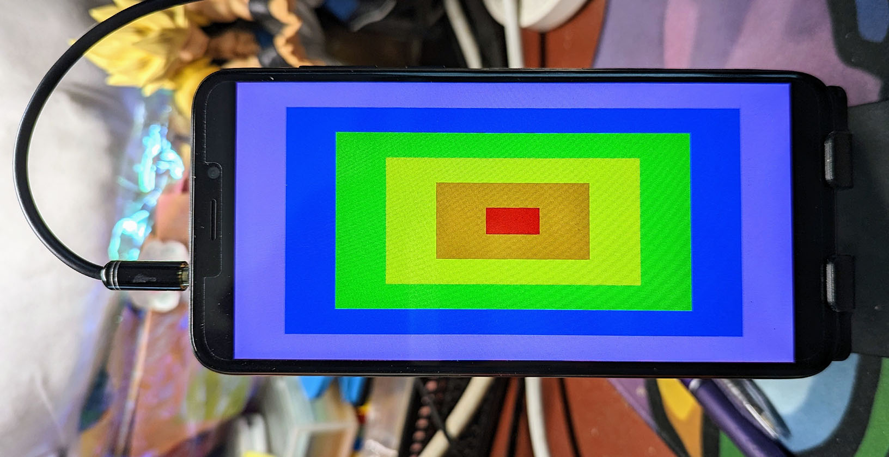
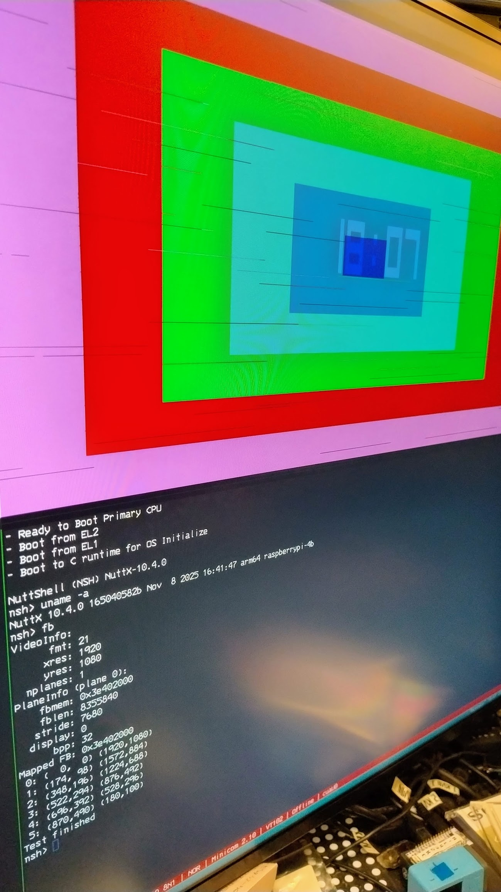

==================
``fb`` 帧缓冲区
==================

本应用程序是一个简单的演示程序，用于测试 :doc:`帧缓冲区字符驱动
</components/nxgraphics/framebuffer_char_driver>`。

该程序通过链接页面中描述的接口与帧缓冲区进行交互，渲染一幅非常简单的图像，包含 6 个同心的彩色矩形。请注意，每绘制一个矩形之间，程序会休眠 500 毫秒。矩形从最外层到最内层依次绘制，尺寸依次递减。

   ``fb`` 示例显示的图像，在 Pinephone 上展示。由 Lup Yuen Lee 提供。

.. warning::

   该应用程序直接渲染到字符驱动提供的帧缓冲区上。在某些设备上，整个渲染操作可能无法在视频同步完成前及时完成，导致画面撕裂或跳帧。:doc:`Raspberry Pi 4B
   </platforms/arm64/bcm2711/boards/raspberrypi-4b/index>` 就是这种情况，结果如下所示。

   帧缓冲区示例输出，但出现了像素跳过现象。

此类跳过问题通常可以通过先渲染到单独的缓冲区，然后一次性将该缓冲区复制到帧缓冲区来避免。

功能支持
--------

该应用程序忽略帧缓冲区字符驱动提供的像素格式，仅检查"每像素位数"（深度）字段。目前仅支持以下每像素位数（假定对应格式）：

* 1：单色
* 8：RGB_332
* 16：RGB_565
* 24：RGB
* 32：ARGB

程序根据帧缓冲区驱动的特性支持不同的功能。如果帧缓冲区需要 ``FB_UPDATE``，本示例会相应处理。

如果帧缓冲区支持 ``FB_OVERLAY``，则应用程序还支持获取和显示叠加层信息。

如果在初始查询帧缓冲区时虚拟 y 分辨率是 y 分辨率的两倍，应用程序将尝试使用双缓冲渲染，通过获取与 ``display + 1`` 对应的第二个帧缓冲区，其中 ``display`` 是与第一个帧缓冲区关联的显示编号。
