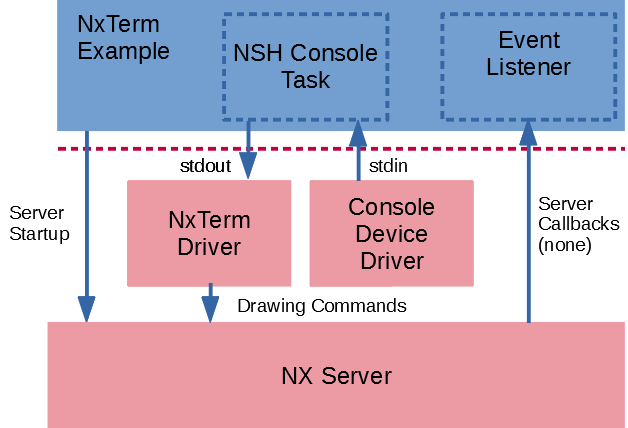

================================================
``nxterm`` 作为 NX 控制台显示 NuttShell (NSH)
================================================

.. note:: 本文档翻译自 NuttX 官方文档，如需查阅最新版本请访问 https://nuttx.apache.org/docs/latest/

此目录包含 NuttShell (NSH) 的另一个版本。此版本使用 ``include/nuttx/nx/nxterm.h`` 中
定义的 NX 控制台设备进行输出。结果是 NSH 输入仍然来自标准控制台输入（可能是串行控制台），
但文本输出将发送到 NX 窗口。此测试的前提配置设置包括：

- ``CONFIG_NX=y`` – 必须启用 NX 图形
- ``CONFIG_NXTERM=y`` – 必须构建 NX 控制台驱动
- ``CONFIG_DISABLE_MQUEUE=n`` – 必须提供消息队列支持。
- ``CONFIG_DISABLE_PTHREAD=n`` – 需要 pthreads
- ``CONFIG_NX_BLOCKING=y`` – pthread API 必须是阻塞的
- ``CONFIG_NSH_CONSOLE=y`` – 必须配置 NSH 使用控制台。

可以选择以下配置选项来自定义测试：

- ``CONFIG_EXAMPLES_NXTERM_BGCOLOR`` – 背景颜色。默认为较暗的皇家蓝。
- ``CONFIG_EXAMPLES_NXTERM_WCOLOR`` – 窗口颜色。默认为浅石板蓝。
- ``CONFIG_EXAMPLES_NXTERM_FONTID`` – 选择字体（参见 ``include/nuttx/nx/nxfonts.h`` 中的字体 ID 编号）。
- ``CONFIG_EXAMPLES_NXTERM_FONTCOLOR`` – 字体颜色。默认为黑色。
- ``CONFIG_EXAMPLES_NXTERM_BPP`` – 每像素位数。有效选项包括 ``2``、``4``、``8``、``16``、``24`` 和 ``32``。默认为 ``32``。
- ``CONFIG_EXAMPLES_NXTERM_TOOLBAR_HEIGHT`` – 工具栏高度。默认：``16``。
- ``CONFIG_EXAMPLES_NXTERM_TBCOLOR`` – 工具栏颜色。默认为中灰色。
- ``CONFIG_EXAMPLES_NXTERM_MINOR`` – NX 控制台设备次设备号。默认为 ``0``，对应 ``/dev/nxterm0``。
- ``CONFIG_EXAMPLES_NXTERM_DEVNAME`` – 与 ``CONFIG_EXAMPLES_NXTERM_MINOR`` 对应的带引号的 NX 控制台设备完整路径。默认：``/dev/nxterm0``。
- ``CONFIG_EXAMPLES_NXTERM_PRIO`` – NxTerm 任务的优先级。默认：``SCHED_PRIORITY_DEFAULT``。
- ``CONFIG_EXAMPLES_NXTERM_STACKSIZE`` – 为 NxTerm 任务分配的堆栈大小。默认：``2048``。
- ``CONFIG_EXAMPLES_NXTERM_STACKSIZE`` – 创建 NX 服务器时使用的堆栈大小。默认：``2048``。
- ``CONFIG_EXAMPLES_NXTERM_CLIENTPRIO`` – 客户端优先级。默认：``100``。
- ``CONFIG_EXAMPLES_NXTERM_SERVERPRIO`` – 服务器优先级。默认：``120``。
- ``CONFIG_EXAMPLES_NXTERM_LISTENERPRIO`` – 事件监听器线程的优先级。默认：``80``。

初始化
==============

NX 服务器
---------

NxTerm 示例通过以下步骤初始化 NX 服务器：

* 调用 ``boardctl(BOARDIOC_NX_START, 0)`` 启动 NX 服务器，然后
* 调用 ``nx_connect()`` 连接到 NX 服务器。
* 它还在入口 ``nxterm_listener()`` 创建一个单独的线程来监听 NX 服务器事件。

窗口创建
---------------

Nxterm 示例然后初始化窗口：

* 调用 ``nxtk_openwindow()`` 创建一个带边框的窗口，
* 调用 ``nxtk_setposition()`` 和 ``nxtk_setsize()`` 在显示器中定位窗口，
* 调用 ``nxtk_opentoolbar()`` 在主窗口上创建工具栏子窗口
  （此工具栏窗口未被示例使用，仅用于说明）。

更实际的用例，例如具有单个 NxTerm 显示的手持设备，将使用背景窗口。
背景是一个像其他窗口一样的窗口，具有以下特殊属性：它不能移动；始终位于 (0,0)。
它不能调整大小；始终是显示器的完整大小。它不能被提升，始终是 z 轴上最低的窗口。

NxTerm 驱动
-------------

并将 Nxterm 驱动绑定到允许在窗口中绘制。这是在以下操作中完成的：

* 调用 ``boardctl(BOARDIOC_NXTERM, (uintptr_t)&nxcreate)``

控制台任务
------------

最后，它设置 NxTerm 并启动控制台任务：

* 打开 NxTerm 驱动，
* 然后将 stdout 和 stderr 重定向到 NxTerm 驱动。这将导致所有标准输出被渲染到主窗口中，
* 然后启动一个继承了重定向输出的单独控制台守护进程并退出。

字符 I/O
=============

普通键盘输入
---------------------

键盘和鼠标输入通过窗口回调被应用程序接收，就像 Xorg X 服务器一样。
某些监听器需要通过 ``nx_kbdin()``（``libs/libnx/nx_kbdin.c``）注入键盘输入，
该函数将包含键盘输入的消息发送到 NX 服务器。NX 服务器将该键盘输入转发到具有焦点的窗口。

窗口应用程序通过在另一个监听器线程上调用 ``nx_eventhandler()``（``libs/libnx/nx_eventhandler``）
来监听 NX 服务器事件。如果窗口在按键输入时具有焦点，``nx_eventhandler()`` 将按键信息
转发到已注册的窗口事件处理器。

在 ``apps/examples/nxterm`` 中，``nxterm_listener.c`` 是驱动 ``nx_eventhandler()`` 的线程。
窗口 NX 键盘回调是 ``nxterm_wndo.c`` 中的函数 ``nxwndo_kbdin()``。
该回调函数只是一个将键盘数据写入 stdout 的存根。它是一个存根，因为在此示例中没有从 NxTerm 接收键盘输入。

apps/examples/nxterm 的变通方法
--------------------------------

``apps/examples/nxterm`` 没有以正常方式执行操作。NSH 不从 NX 接收键盘输入；
它直接从默认的 stdin 获取键盘输入，该输入可能根本不是键盘，而更可能是主机 PC 串行控制台。
这是可以的，因为只使用了一个窗口，并且该示例不需要 NX 帮助来选择具有焦点的窗口。

stdout 和 stderr 的重定向
---------------------------------

stdin 和 stderr 在启动控制台任务之前在 ``nxterm_main.c`` 中被重定向到 NxTerm 字符驱动。
该逻辑如下所示：

.. code-block:: C

   /* Now re-direct stdout and stderr so that they use the NX console driver.
    * Note that stdin is retained (file descriptor 0, probably the serial
    * console).
    */

    printf("nxterm_main: Starting the console task\n");

    fflush(stdout);
    fflush(stderr);
    fclose(stdout);
    fclose(stderr);

    dup2(fd, 1);
    dup2(fd, 2);

请注意，在此示例中 stdin 没有被重定向！这意味着键盘输入不来自 NxTerm 驱动，
而是来自之前为 stdin 配置的任何输入设备，通常是串行控制台。

有一个配置选项决定 NxTerm 是否接收键盘输入：``CONFIG_NXTERM_NXKBDIN``。
对于此 NxTerm 示例，可以禁用该选项。

什么是 BOARDIOC_NXTERM_IOCTL 以及在哪里使用？
---------------------------------------------------

``boardctl()`` 命令 ``BOARDIOC_NXTERM_IOCTL`` 允许应用程序将键盘数据注入 NX
以转发到具有焦点的窗口。在 ``apps/examples/nxterm`` 中，``BOARDIOC_NXTERM_IOCTL``
仅在重绘事件的情况下被调用。重绘事件可能在当前窗口上方的窗口被移动且文本被暴露时发生。

如果您仅为 NxTerm 示例使用单个窗口，则该窗口将始终具有焦点。它将始终具有焦点，
永远不会被重绘，``BOARDIOC_NXTERM_IOCTL`` 将永远不会被使用（除非您选择在
NxTerm 窗口顶部实现弹出错误消息或菜单）。

如果您使用每窗口帧缓冲，即使在多窗口配置中也不会收到重绘回调。
在这种情况下，系统将使用每窗口帧缓冲影子内存根据需要自动重绘窗口。
这由选项 ``CONFIG_NX_RAMBACKED`` 控制。如果有足够的内存支持，出于性能原因建议使用此选项。

字符数据流：键盘到显示器
=========================================

apps/examples/nxterm 中的字符数据流
-------------------------------------------

* 字符输入驱动接收输入
* NSH 在 stdin 上接收输入并处理它（stdin 未被重定向）
* 数据输出到 stdout（被重定向到 NxTerm 驱动）

在此简单的单窗口情况下，``BOARDIOC_NXTERM_IOCTL`` 将永远不会被使用。

通用窗口情况下的字符数据流
----------------------------------------------

参见 ``apps/graphics/nxwm/src/cnxterm.cxx`` 中的示例。在这种情况下，
行为将根据 ``CONFIG_NXTERM_NXKBDIN`` 的选择而变化：
如果未选择 ``CONFIG_NXTERM_NXKBDIN``，则行为将类似于 ``apps/examples/nxterm``；
stdin 不会被重定向，键盘输入将直接来自系统控制台。

但如果选择了 ``CONFIG_NXTERM_NXKBDIN``，NSH 的 stdin 将被重新重定向到 NxTerm 字符驱动。
键盘输入将从 NxTerm 驱动到达 stdin，而不是来自系统控制台。以下序列描述了后一种情况下的键盘输入：

* 字符输入驱动接收输入，
* 某些键盘监听器线程接收输入并通过调用 ``nx_kbdin()`` 将其注入 NX，
* NX 将事件发送到具有焦点的窗口的已注册 ``kbdin()`` 方法，向窗口应用程序提供键盘输入。
  在这种情况下，感兴趣的窗口应用程序是应用程序绑定到 NxTerm 字符驱动的窗口。
  ``kbin()`` 回调通过 ``boardctl(BOARDIOC_NXTERM_IOCTL, (uintptr_t)&iocargs)`` 将
  聚焦的键盘输入提供给 NxTerm 驱动，
* NxTerm 字符驱动接收键盘数据，进行缓冲，并为下一次读取操作提供该键盘输入，
* NSH 在被重定向到 NxTerm 字符驱动的 stdin 上接收输入。
  NSH 处理输入，以及
* NSH 将数据输出到被重定向到 NxTerm 字符驱动的 stdout。
