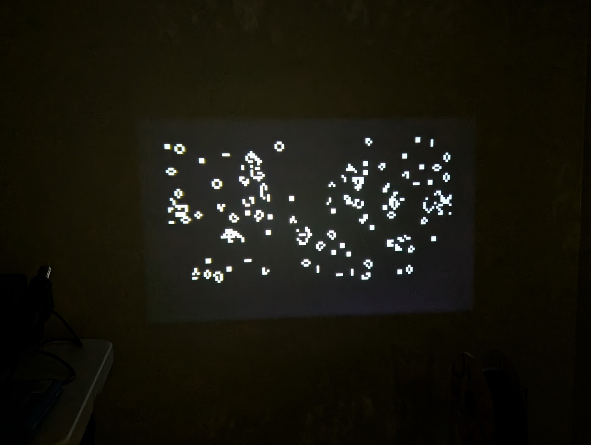

=====================
Conway 的生命游戏
=====================

.. note:: 本文档翻译自 NuttX 官方文档，如需查阅最新版本请访问 https://nuttx.apache.org/docs/latest/

一个经典的"游戏"是 Conway 的生命游戏（CGOL）。它不是可玩意义上的游戏，而是一种有趣的奇观。
CGOL 是一种细胞自动机：复杂的行为源于一套简单的规则。它已被广泛研究，尤其是数学家。
Conway 本人就是一位数学家。

   CGOL 游戏渲染输出示例。

要求
------------

NuttX 的 CGOL 实现依赖于帧缓冲驱动程序，即：:doc:`/components/nxgraphics/framebuffer_char_driver`。
如果您启用了 ``VIDEO_FB``，您应该能够使用该应用程序。游戏的视觉效果通过提供的帧缓冲区渲染到显示器上。

.. note::

   CGOL 目前仅支持 32、24、16 或 8 bpp 渲染的设备。
   由于游戏只有两种颜色，也可以支持 1 bpp 渲染，
   只是在编写应用程序结束时我不想再费心处理单个位操作了。
   请随时发送补丁！

   该实现仅在 32bpp 帧缓冲设备上进行了测试。

此游戏也适用于需要 ``FB_UPDATE`` 的帧缓冲区。它不会对叠加层做任何特殊处理。

用法
-----

只需在 NSH 控制台中运行游戏即可：

.. code:: console

   nsh> cgol

游戏将使用 ``CONFIG_GAMES_CGOL_FBDEV`` 指定的帧缓冲设备来渲染图像。
默认情况下，它是 ``/dev/fb0``。如果您希望在运行时使用不同的设备，
可以将帧缓冲设备路径作为第一个参数传递：

.. code:: console

   nsh> cgol /dev/fb1

请注意，游戏将永远循环并将输出渲染到屏幕。在某个时间点之后，
CGOL 达到"稳定"配置，实际上没有什么有趣的东西可看。
此时，您可以使用 ``CTRL + C`` 终止应用程序。
您也可以通过在 NSH 中的命令后添加 ``&`` 字符在后台运行该应用程序，
如果您想在运行后在控制台中做其他事情，建议这样做。

.. warning::

   此程序尚未使用 32 以外的 ``bpp`` 值进行测试。它可能有未知的错误。

   它也未在字大小（``sizeof(unsigned int)``）不是 32 位的设备上进行测试。

配置选项
---------------------

有几个选项可以自定义以修改游戏。前两个非常明显：地图宽度和地图高度。

* ``CONFIG_GAMES_CGOL_MAPWIDTH``
* ``CONFIG_GAMES_CGOL_MAPHEIGHT``

这些选项以单元格为单位选择游戏地图的宽度和高度。您必须选择 ``sizeof(unsigned int) * 8`` 的倍数作为宽度。
这是在嵌入式设备上高效实现 CGOL 的必要条件。通常，此值是设备的自然字大小（以位为单位）。
因此，如果您使用 32 位机器，请选择 32 的倍数作为地图宽度。地图高度没有这样的限制。

要更改最初用于填充地图的单元格数量，可以修改密度：``CONFIG_GAMES_CGOL_DENSITY``。
启动时生成的单元格数量为 ``TOTAL_CELLS * (1 / density)``，其中总单元格数是地图面积。

接下来可以更改的是帧之间的延迟（以微秒为单位），使用选项：``CONFIG_GAMES_CGOL_FRAMEDELAY``。
默认情况下，此值为 0（无延迟）。如果渲染太快而无法欣赏每一帧，请使用此选项。

纯粹出于渲染原因，您可以更改的最后一个选项是 ``CONFIG_GAMES_CGOL_DBLBUF``。
这启用了渲染的双缓冲，它分配了一个与实际帧缓冲区大小相等的 RAM 缓冲区。
所有渲染直接在 RAM 缓冲区上执行，完成后复制到帧缓冲区。
这只在某些设备上是必要的。例如，:doc:`Raspberry Pi 4b </platforms/arm64/bcm2711/boards/raspberrypi-4b/index>`
如果不使用双缓冲，会出现明显的伪影和完全不正确的渲染。

实现
--------------

游戏本身使用位域来表示活细胞和死细胞。``1`` 位表示活，``0`` 表示死。
我使用机器的自然字大小来存储位，这就是为什么我强制要求地图宽度必须是 ``unsigned int`` 位数的倍数。

一个字中的位越多意味着更多的并行性。在渲染活细胞时，如果一个字在 32 位机器上求值为 0，
我可以一次跳过 32 个单元格。这节省了 32 次迭代。与每个单元格使用 1 字节相比，
位域本身也是节省空间的。即使将活细胞表示为 (x, y) 对也会消耗更多内存，
并且在每一步推进游戏状态时也需要显著更多的 CPU 功率。

主循环由以下步骤组成：

1. 渲染活细胞
2. 如果用户配置了帧延迟则休眠
3. 显示渲染
4. 推进游戏状态
5. 清除渲染

地图使用 ``rand()`` 随机初始化活细胞，这是均匀分布。这对 CGOL 并不总是最好的；
需要达到一定的密度才能产生有趣的进化。我已经确定了地图 1/6 的密度。

游戏会自动缩放以尽可能填满帧缓冲区。最小分辨率为每个单元格一个像素。
如果配置的地图大小大于帧缓冲区，程序将以错误退出。

最后，地图从右到左环绕。它不会从上到下环绕，以便在计算时允许更节省内存的方法来缓冲下一个状态。

.. todo::

   此程序可以通过以下方式改进：

   * 1 位支持
   * 可选的输入设备支持以重新初始化游戏，也许可以绘制单元格
   * 可选的加载种子能力
   * 运行时速度控制
