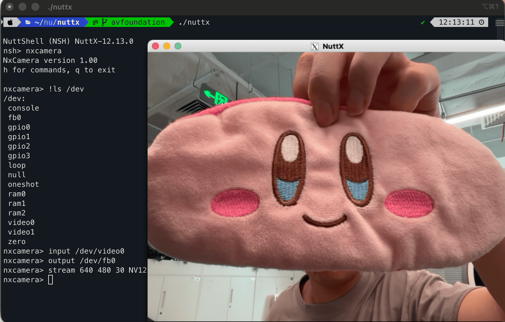

=============================================
``nxcamera`` 摄像头/视频流测试命令
=============================================

.. note:: 本文档翻译自 NuttX 官方文档，如需查阅最新版本请访问 https://nuttx.apache.org/docs/latest/

简介
============

``nxcamera`` 是一个用于测试 NuttX 中摄像头设备和视频流捕获的命令行工具。
它构建在 NuttX 视频子系统之上（使用 V4L2 风格的接口），通常用于：

- 枚举和打开视频设备节点，如 ``/dev/video0`` 和 ``/dev/video1``
- 配置捕获参数，包括分辨率和像素格式
- 根据平台支持和构建配置，捕获视频帧进行验证、调试或简单数据转储

用法
=====

``nxcamera`` 是一个交互式命令行程序。从 NSH 启动它，然后在 ``nxcamera>`` 提示符
下输入命令：

.. code-block:: console

   nsh> nxcamera
   nxcamera>

提示：执行 NSH 命令（隐藏功能）
==================================

在 ``nxcamera>`` 提示符下，您可以通过在命令前加上 ``!`` 来运行 NSH 命令。
这对于快速检查系统状态或调用其他工具而无需退出 ``nxcamera`` 非常有用。

.. code-block:: console

   nxcamera> !ls /dev
   /dev:
    console
    fb0
    gpio0
    gpio1
    gpio2
    gpio3
    loop
    null
    oneshot
    ram0
    ram1
    ram2
    video0
    video1
    zero
   nxcamera> !poweroff
   bash>

提示符下的典型工作流程是：

- ``input /dev/video0`` 设置输入视频节点。
- ``output /dev/fb0`` 设置输出节点，例如帧缓冲区。
- ``stream 640 480 30 NV12`` 开始流式传输，参数为 ``宽度 高度 帧率 格式``。
- ``stop`` 停止流式传输。

您可以复制粘贴以下命令来开始使用：

.. code-block:: console

  nxcamera
  input /dev/video0
  output /dev/fb0
  stream 640 480 30 YUYV # 或在 macOS 上使用 NV12

像素格式
============

对于 ``stream`` 命令，像素格式取决于平台。在 macOS ``sim`` 平台上可以使用 ``NV12``，
而在 Linux 系统上 ``YUYV`` 更常用。

示例
========

1. 启动 ``nxcamera`` 并配置典型的交互式捕获会话：

.. code-block:: console

   nsh> nxcamera
   nxcamera> input /dev/video0
   nxcamera> output /dev/fb0
   nxcamera> stream 640 480 30 NV12
   nxcamera> stop

   ``nxcamera`` 在 SIM 平台上使用 macOS AVFoundation 后端。

功能和更新
====================

- 支持多个摄像头实例，允许多个摄像头作为不同的设备节点暴露，
  如 ``/dev/video0`` 和 ``/dev/video1``。这使得在同一系统上选择和验证
  不同的视频输入源更加容易。
- 在 ``sim`` 平台上，已添加对 macOS AVFoundation 后端的支持。
  这使得在 macOS 主机上进行摄像头捕获和功能验证成为可能，
  取决于构建配置和主机权限设置。
