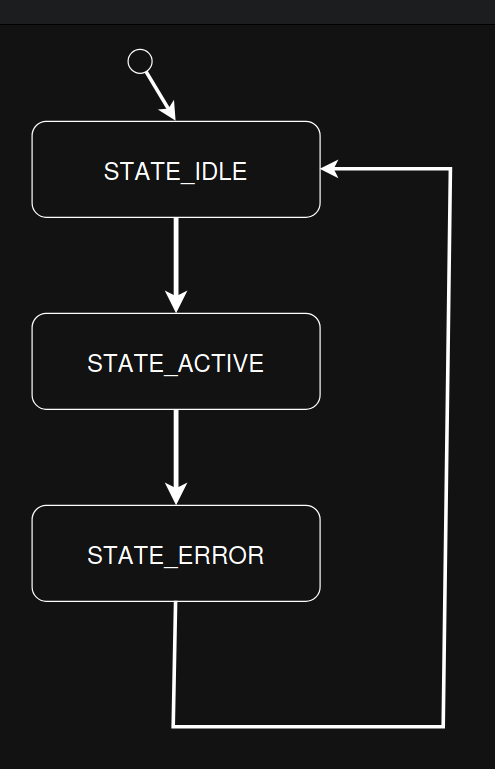
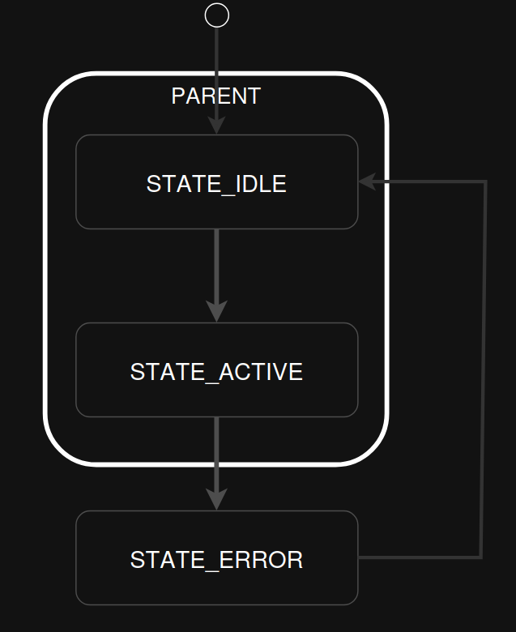

.. _smf:

=================================
``smf`` 状态机框架
=================================

.. note:: 本文档翻译自 NuttX 官方文档，如需查阅最新版本请访问 https://nuttx.apache.org/docs/latest/

概述
========

状态机框架（SMF）是一个轻量级、与应用无关的框架，用于在 NuttX 中实现有限状态机和层次状态机。

SMF 提供：

- 确定性的状态转移语义
- 可选的层次状态机（HSM）支持
- 明确的进入、运行和退出动作
- 无动态内存分配
- 应用程序对事件循环的完全控制

该框架适用于对可预测性、低开销和显式控制流有要求的深度嵌入式系统。

从概念上讲，此实现是 Zephyr RTOS 中最初引入的 SMF 的直接移植，已适配 NuttX 编码标准、构建系统和文档规范。

架构
============

SMF 明确分离了职责：

- **框架职责**

  - 状态转移
  - 进入/退出排序
  - 层次解析（最低公共祖先 LCA）
  - 终止处理

- **应用程序职责**

  - 事件获取
  - 事件分发
  - 状态机调度
  - 数据模型管理

这种分离确保 SMF 在应用程序和执行模型之间完全可复用。

状态模型
===========

每个状态由最多三个可选回调定义：

- **进入动作**
- **运行动作**
- **退出动作**

所有动作都操作在一个用户定义的对象上，该对象的第一个成员是 ``struct smf_ctx``。

.. code-block:: c

   struct app_object
   {
     struct smf_ctx ctx;
     /* Application-specific data */
     int counter;
     bool error;
   };

此布局通过 ``SMF_CTX()`` 宏实现零开销类型转换。

状态机创建
======================

通过定义一个由枚举索引的状态表来创建状态机。
例如，以下代码创建三个扁平状态：

.. code-block:: c

   enum demo_state
   {
     STATE_IDLE,
     STATE_ACTIVE,
     STATE_ERROR,
   };

   static const struct smf_state demo_states[] = {
     [STATE_IDLE]   = SMF_CREATE_STATE(idle_entry, idle_run, idle_exit, NULL, NULL),
     [STATE_ACTIVE] = SMF_CREATE_STATE(active_entry, active_run, active_exit, NULL, NULL),
     [STATE_ERROR]  = SMF_CREATE_STATE(error_entry, error_run, error_exit, NULL, NULL),
   };

下面的示例创建三个层次状态：

.. code-block:: c

   enum demo_state
   {
      STATE_IDLE,
      STATE_ACTIVE,
      STATE_ERROR,
    };
  
    static const struct smf_state demo_states[] =
    {
      [STATE_IDLE]   = SMF_CREATE_STATE(idle_entry, idle_run, idle_exit, parent_idle, NULL),
      [STATE_ACTIVE] = SMF_CREATE_STATE(active_entry, active_run, active_exit, parent_active, NULL),
      [STATE_ERROR]  = SMF_CREATE_STATE(error_entry, error_run, error_exit, parent_error, NULL),
    };

下一个示例创建一个三级层次状态机，包含从父状态 idle 到子状态 error 的初始转移：

.. code-block:: c

   enum demo_state
   {
      STATE_IDLE,
      STATE_ACTIVE,
      STATE_ERROR,
    };
  
    static const struct smf_state demo_states[] =
    {
      [STATE_IDLE]   = SMF_CREATE_STATE(idle_entry, idle_run, idle_exit, NULL, demo_states[STATE_ERROR]),
      [STATE_ACTIVE] = SMF_CREATE_STATE(active_entry, active_run, active_exit, demo_states[STATE_IDLE], NULL),
      [STATE_ERROR]  = SMF_CREATE_STATE(error_entry, error_run, error_exit, demo_states[STATE_IDLE], NULL),
    };

要设置状态机的初始状态，请调用 ``smf_set_initial()``。
要在状态之间转移，请从进入或运行动作中调用 ``smf_set_state()``。

.. note::

   如果未设置 ``CONFIG_SYSTEM_SMF_INITIAL_TRANSITION``，则 ``smf_set_initial()`` 和 ``smf_set_state()`` 函数
   不应传递父状态，因为父状态不知道要转移到哪个子状态。
   如果定义了到子状态的初始转移，则转移到父状态是可以的。
   一个格式良好的 HSM 应该为所有父状态定义初始转移。

.. note::
    在状态机运行期间，``smf_set_state()`` 只应从进入或运行函数中调用。从退出函数中调用 ``smf_set_state()`` 将在日志中生成警告，且不会发生转移。

状态机执行
=======================

要运行状态机，应以某种应用程序相关的方式调用 ``smf_run_state()`` 函数。
如果 ``smf_run_state`` 返回非零值，应用程序应停止调用。

状态机终止
=========================

要终止状态机，应调用 ``smf_set_terminate()`` 函数。
它可以从进入、运行或退出动作中调用。
该函数接受一个非零的用户定义值，该值将由 ``smf_run_state()`` 函数返回。

获取当前状态
========================

**叶子状态**：在层次状态机的上下文中，叶子状态是不包含任何子状态的状态。它表示层次中最细粒度的状态级别，无法进一步分解。

**执行状态**：执行状态是指状态机当前正在执行其进入、运行或退出动作的状态。根据当前操作，这可能是父状态或叶子状态。

要获取当前叶子状态，应调用 ``smf_get_current_leaf_state()`` 函数。
例如：

.. code-block:: c

   const struct smf_state *leaf_state;
   leaf_state = smf_get_current_leaf_state(SMF_CTX(&s_obj));

.. note::
   如果未启用 ``CONFIG_SYSTEM_SMF_INITIAL_TRANSITION``，或父状态的初始状态未定义，请始终将状态设置为叶子状态。否则，状态机可能直接进入父状态，而 ``smf_get_current_leaf_state()`` 可能返回父状态而非叶子状态。确保为所有父状态正确配置初始转移，以避免格式错误的层次状态机。

要获取当前正在执行其进入、运行或退出动作的状态，
请使用 ``smf_get_current_executing_state()`` 函数。

UML 状态机
==================

SMF 遵循 UML 层次状态机的转移规则，即在转移时不执行最低公共祖先的进入和退出动作，除非该转移是自转移。

UML 状态机规范可在 UML 规范的第 14 章中找到，访问地址：https://www.omg.org/spec/UML/

SMF 在以下方面偏离了 UML 规则：

1. 转移动作在源状态上下文中执行，而不是在退出动作执行之后。

2. 仅允许外部自转移，不允许到子状态的转移。从超状态到子状态的转移被视为局部转移。

3. 禁止在退出动作中使用 ``smf_set_state()`` 进行转移。

SMF 除了初始伪状态外，不提供任何伪状态。
终止伪状态可以通过从"终止"状态的进入动作中调用 ``smf_set_terminate()`` 来建模。
正交区域通过对每个区域调用 ``smf_run_state()`` 来建模。

状态机示例
======================

扁平状态机示例
--------------------------

此示例使用 SMF 将以下状态图转换为代码，其中初始状态为 STATE_IDLE。

   使用 SMF 实现的扁平状态机示例。

.. code-block:: c

  #include <system/smf.h>

  /* Forward declaration of state table */
  static const struct smf_state demo_states[];

  /* List of demo states */
     enum demo_state
   {
     STATE_IDLE,
     STATE_ACTIVE,
     STATE_ERROR,
   };

  /* User defined object */
  struct s_object {
          /* This must be first */
          struct smf_ctx ctx;

          /* Other state specific data add here */
  } s_obj;

  /* State idle */
  static void idle_entry(void *o)
  {
    /* Do something */
  }

  static enum smf_state_result idle_run(void *o)
  {
    smf_set_state(SMF_CTX(&s_obj), &demo_states[STATE_ACTIVE]);
    return SMF_EVENT_HANDLED;
  }

  static void idle_exit(void *o)
  {
    /* Do something */
  }

  /* State active */
  static void active_entry(void *o)
    {
      /* Do something */
    }

  static enum smf_state_result active_run(void *o)
  {
    smf_set_state(SMF_CTX(&s_obj), &demo_states[STATE_ERROR]);
    return SMF_EVENT_HANDLED;
  }

  static void active_exit(void *o)
  {
    /* Do something */
  }

  /* State error */
  static void error_entry(void *o)
  {
    /* Do something */
  }

  static enum smf_state_result error_run(void *o)
  {
    smf_set_state(SMF_CTX(&s_obj), &demo_states[STATE_IDLE]);
    return SMF_EVENT_HANDLED;
  }

  static void error_exit(void *o)
  {
    /* Do something */
  }

  /* Populate state table */
  static const struct smf_state demo_states[] = {
    [STATE_IDLE]   = SMF_CREATE_STATE(idle_entry, idle_run, idle_exit, NULL, NULL),
    /* State ACTIVE does not have an entry action */
    [STATE_ACTIVE] = SMF_CREATE_STATE(NULL, active_run, active_exit, NULL, NULL),
    /* State ERROR does not have an exit action */
    [STATE_ERROR]  = SMF_CREATE_STATE(error_entry, error_run, NULL, NULL, NULL),
  };

  int main(void)
  {
    int32_t ret;

    /* Set initial state */
    smf_set_initial(SMF_CTX(&s_obj), &demo_states[STATE_IDLE]);

    /* Run the state machine */
    while(1) {
      /* State machine terminates if a non-zero value is returned */
      ret = smf_run_state(SMF_CTX(&s_obj));
      if (ret) {
        /* handle return code and terminate state machine */
        break;
      }
      sleep(1);
    }
  }

层次状态机（HSM）
--------------------------------

当启用 ``CONFIG_SYSTEM_SMF_ANCESTOR_SUPPORT`` 时，状态可以定义父状态。
下面的示例使用 SMF 将以下状态图转换为代码，其中 IDLE 和 ACTIVE 共享一个父状态，IDLE 为初始状态。

   使用 SMF 实现的层次状态机示例。

代码

.. code-block:: c

  #include <system/smf.h>

  /* Forward declaration of state table */
  static const struct smf_state demo_states[];

  /* List of demo states */
  enum demo_state { PARENT, IDLE, ACTIVE, ERROR };

  /* User defined object */
  struct s_object {
    /* This must be first */
    struct smf_ctx ctx;

    /* Other state specific data add here */
  } s_obj;

  /* Parent State */
  static void parent_entry(void *o)
  {
    /* Do something */
  }
  static void parent_exit(void *o)
  {
    /* Do something */
  }

  /* State IDLE */
  static enum smf_state_result idle_run(void *o)
  {
    smf_set_state(SMF_CTX(&s_obj), &demo_states[ACTIVE]);
    return SMF_EVENT_HANDLED;
  }

  /* State ACTIVE */
  static enum smf_state_result active_run(void *o)
  {
    smf_set_state(SMF_CTX(&s_obj), &demo_states[ERROR]);
    return SMF_EVENT_HANDLED;
  }

  /* State ERROR */
  static enum smf_state_result error_run(void *o)
  {
    smf_set_state(SMF_CTX(&s_obj), &demo_states[IDLE]);
    return SMF_EVENT_HANDLED;
  }

  /* Populate state table */
  static const struct smf_state demo_states[] = {
    /* Parent state does not have a run action */
    [PARENT] = SMF_CREATE_STATE(parent_entry, NULL, parent_exit, NULL, NULL),
    /* Child states do not have entry or exit actions */
    [IDLE] = SMF_CREATE_STATE(NULL, idle_run, NULL, &demo_states[PARENT], NULL),
    [ACTIVE] = SMF_CREATE_STATE(NULL, active_run, NULL, &demo_states[PARENT], NULL),
    /* State ERROR do not have entry or exit actions and no parent */
    [ERROR] = SMF_CREATE_STATE(NULL, error_run, NULL, NULL, NULL),
  };

  int main(void)
  {
    int32_t ret;

    /* Set initial state */
    smf_set_initial(SMF_CTX(&s_obj), &demo_states[IDLE]);

    /* Run the state machine */
    while(1) {
      /* State machine terminates if a non-zero value is returned */
      ret = smf_run_state(SMF_CTX(&s_obj));
      if (ret) {
        /* handle return code and terminate state machine */
        break;
      }
      sleep(1);
    }
  }

设计层次状态机时，应考虑以下事项：

- 祖先进入动作在同级进入动作之前执行。例如，parent_entry 函数在 ``idle_entry`` 函数之前调用。

- 从一个同级转移到另一个具有共同祖先的同级时，不会重新执行祖先的进入动作或执行退出动作。例如，从 IDLE 转移到 ACTIVE 时不会调用 parent_entry 函数，也不会调用 parent_exit 函数。

- 祖先退出动作在当前状态的退出动作之后执行。例如，idle_exit 函数在 parent_exit 函数之前调用。

- parent_run 函数仅在 child_run 函数未调用 ``smf_set_state()`` 或未返回 ``SMF_EVENT_HANDLED`` 时执行。

- 当未启用 ``CONFIG_SYSTEM_SMF_INITIAL_TRANSITION`` 或父状态的初始状态未定义时，确保状态始终转移到叶子状态，以避免格式错误的层次状态机。

初始转移
===================

如果启用了 ``CONFIG_SYSTEM_SMF_INITIAL_TRANSITION``，父状态可以定义初始子状态。

.. code-block:: c

   static const struct smf_state demo_states[] =
   {
     [STATE_PARENT]  = SMF_CREATE_STATE(parent_entry, NULL, parent_exit, NULL, &demo_states[STATE_CHILD_A]),
     [STATE_CHILD_A] = SMF_CREATE_STATE(NULL, child_a_run, NULL, &demo_states[STATE_PARENT], NULL),
   };

当进入 ``STATE_PARENT`` 时，框架会自动转移到 ``STATE_CHILD_A``。

.. note::

   如果未启用初始转移支持，应用程序必须始终直接转移到叶子状态。

状态执行模型
=====================

应用程序显式控制执行。

1. 使用 ``smf_set_initial()`` 设置初始状态
2. 从事件循环中调用 ``smf_run_state()``
3. 当返回非零值时停止执行

.. code-block:: c

   smf_set_initial(SMF_CTX(&app), &demo_states[STATE_IDLE]);

   while (1)
     {
       int32_t rc = smf_run_state(SMF_CTX(&app));
       if (rc != 0)
         {
           break;
         }

       /* Block, poll, or wait for an event */
     }

状态运行语义
-------------------

运行动作返回：

- ``SMF_EVENT_HANDLED`` – 事件已消费
- ``SMF_EVENT_PROPAGATE`` – 传播到父状态（仅 HSM）

如果调用了 ``smf_set_state()``，传播立即停止。

状态转移
=================

转移通过从进入或运行动作中调用 ``smf_set_state()`` 来显式请求。

.. code-block:: c

   static enum smf_state_result active_run(void *obj)
   {
     struct s_object *s = (struct s_object *)obj;

     if (s->error)
       {
         smf_set_state(SMF_CTX(s), &demo_states[STATE_ERROR]);
         return SMF_EVENT_HANDLED;
       }

     return SMF_EVENT_HANDLED;
   }

从退出动作中调用 ``smf_set_state()`` 会在设计上被拒绝。

终止
===========

要终止状态机，请调用 ``smf_set_terminate()``。

.. code-block:: c

   smf_set_terminate(SMF_CTX(&app), -ECANCELED);

传递的值由 ``smf_run_state()`` 返回，可用于表示终止原因。

状态自省
===================

SMF 暴露两个辅助 API：

- ``smf_get_current_leaf_state()``
- ``smf_get_current_executing_state()``

这些函数主要用于诊断、日志记录和测试。

UML 合规性
==============

SMF 遵循 UML 层次状态机语义：

- 进入/退出动作根据最低公共祖先（LCA）执行
- 自转移执行完整的退出/进入序列
- 隐式支持局部转移

与 UML 的差异：

1. 转移动作在源状态上下文中执行
2. 仅支持外部自转移
3. 无显式终止伪状态

注意事项和约束
=====================

- SMF 不进行动态分配
- 状态表通常为 ``static const``
- 线程安全由应用程序负责
- 一个 SMF 实例代表一个执行区域
- 正交区域需要多个 SMF 实例

配置选项
=====================

- ``CONFIG_SYSTEM_SMF``
- ``CONFIG_SYSTEM_SMF_ANCESTOR_SUPPORT``
- ``CONFIG_SYSTEM_SMF_INITIAL_TRANSITION``

代码位置
=============

- ``apps/system/smf`` – 框架实现
- ``apps/include/system/smf.h`` – 公共 API
