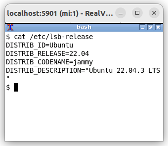
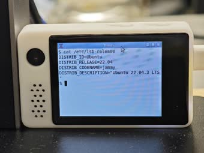

===========================
``vncviewer`` VNC 查看器
===========================

.. note:: 本文档翻译自 NuttX 官方文档，如需查阅最新版本请访问 https://nuttx.apache.org/docs/latest/

一个轻量级的 VNC 查看器，通过 NuttX LCD 字符设备接口 (``/dev/lcd0``) 在 LCD
显示屏上渲染远程桌面。

特性：

- RFB 3.8 协议，支持 VNC 认证（纯软件 DES，无外部库）
- 从 LCD 驱动程序自动检测像素格式
- 原始编码，逐行渲染 – 最小 RAM 使用
- 断开连接时自动重连

准备工作
==========================

- 启用 VNC 查看器应用程序（设备端）：

  .. code-block:: bash

     CONFIG_NET_TCP=y
     CONFIG_LCD=y
     CONFIG_SYSTEM_VNCVIEWER=y

- 确保设备有可用的 LCD 驱动程序 (``/dev/lcd0``) 和 TCP/IP 网络连接。

- 在主机上安装 VNC 服务器。例如，在 Ubuntu 上：

  .. code-block:: bash

     sudo apt install x11vnc xvfb openbox xterm

用法
==========================

.. code-block:: bash

   vncviewer [options] <host> [port]

选项：

- ``-p <password>`` – VNC 密码
- ``-d <devno>`` – LCD 设备号（默认：0）
- ``-h`` – 显示帮助

默认端口：5900

主机 VNC 服务器配置
==============================

支持三种服务器模式：

1. Xvfb 虚拟桌面（像素精确 1:1）
---------------------------------------------

创建与 LCD 分辨率匹配的虚拟帧缓冲区（例如 320×240）：

.. code-block:: bash

   # 启动虚拟显示
   Xvfb :1 -screen 0 320x240x16 &
   DISPLAY=:1 openbox &
   DISPLAY=:1 xterm -geometry 38x11+0+0 -fa Monospace -fs 10 &

   # 启动 VNC 服务器
   x11vnc -display :1 -rfbport 5901 -passwd mypasswd -shared -forever -xkb -add_keysyms -bg

在设备上：

.. code-block:: bash

   vncviewer -p mypasswd <host_ip> 5901

   Xvfb 虚拟桌面 – 主机端（320×240 xterm 在 VNC 查看器中）

   Xvfb 虚拟桌面 – 设备端（在 ST7789 LCD 上渲染）

2. 物理桌面裁剪（左上角区域）
-------------------------------------------

裁剪与 LCD 分辨率匹配的物理桌面区域：

.. code-block:: bash

   x11vnc -display :0 -rfbport 5901 -passwd mypasswd -shared -forever -xkb -add_keysyms -bg -clip 320x240+0+0

在设备上：

.. code-block:: bash

   vncviewer -p mypasswd <host_ip> 5901

3. 物理桌面缩放
-------------------------------------------

将完整桌面缩小到 LCD 分辨率：

.. code-block:: bash

   x11vnc -display :0 -rfbport 5901 -passwd mypasswd -shared -forever -xkb -add_keysyms -bg -scale 320x240

在设备上：

.. code-block:: bash

   vncviewer -p mypasswd <host_ip> 5901

示例
==========================

使用密码连接到 VNC 服务器：

.. code-block:: bash

   vncviewer -p mypasswd 192.168.1.100 5901

使用不同的 LCD 设备连接：

.. code-block:: bash

   vncviewer -d 1 -p mypasswd 192.168.1.100 5900
