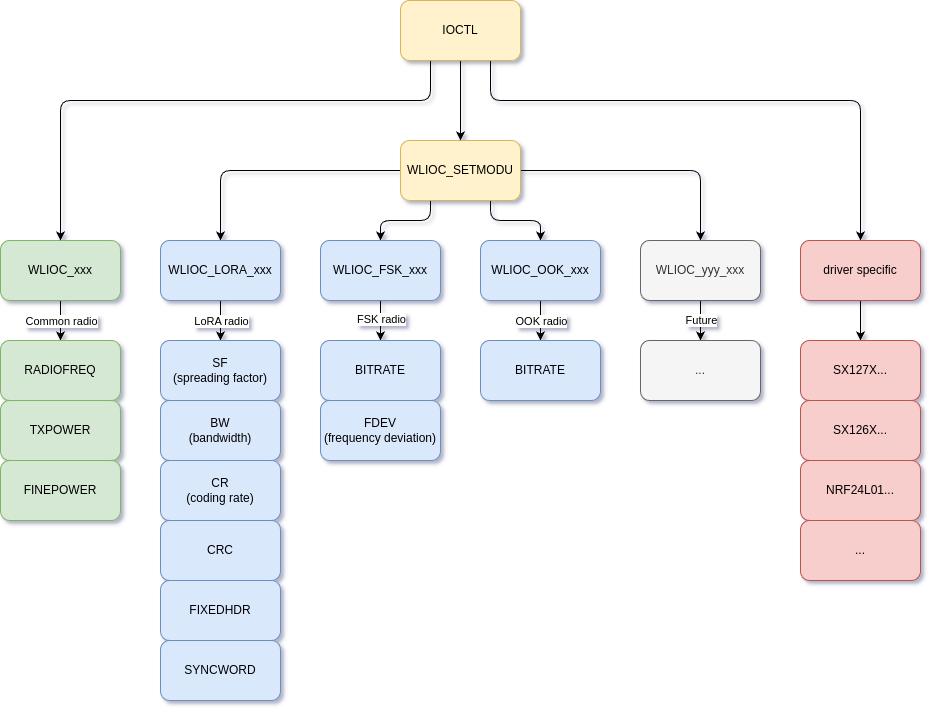

==========================
无线字符驱动程序
==========================

.. note:: 本文档翻译自 NuttX 官方文档，如需查阅最新版本请访问 https://nuttx.apache.org/docs/latest/

.. toctree::
  :maxdepth: 1

  lpwan/index.rst

IOCTL 接口
===============

在此接口之前，字符驱动的 RF 设备的 IOCTL API 缺乏跨不同调制技术（如 LoRa、FSK 和 OOK）的通用接口。结果是，即使可以在多个无线电之间共享，也创建了驱动程序特定的 IOCTL 命令。这种碎片化使得应用程序可移植性更难维护。

为了解决这个问题，创建了通过 ``WLIOC_SETMODU`` "选择"的命令组。参见下图的表示。

.. note:: 此图未显示所有功能。这纯粹是 WLIOC_SETMODU 下命令关系的表示。

read()
------

读取无线电将获取一个 ``wlioc_rx_hdr_s``，其中有效载荷的信息将被读取和写入。

- ``FAR uint8_t *payload_buffer`` 指向**用户缓冲区**的指针。有效载荷将被写入此处。
- ``size_t payload_length`` **初始**：用户必须将其设置为 ``payload_buffer`` 的大小。**读取后**：这将变为写入 ``payload_buffer`` 的字节数。
- ``uint8_t error`` 当大于 0 时，有效载荷中检测到错误。有效载荷仍可返回，允许用户在需要时修复它。
- ``int32_t rssi_dbm`` 接收信号的接收信号强度指示，以 1/100 分贝毫瓦为单位。不支持时返回 ``INT32_MIN``。
- ``int32_t snr_db`` 接收信号的信噪比，以 1/100 分贝为单位。不支持时返回 ``INT32_MIN``。

write()
-------

写入无线电将尝试发送给定的字节。无线电必须在此之前进行配置。与 ``read()`` 不同，这将简单地接收 uint8_t 字节作为有效载荷。
