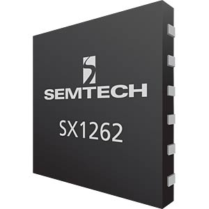
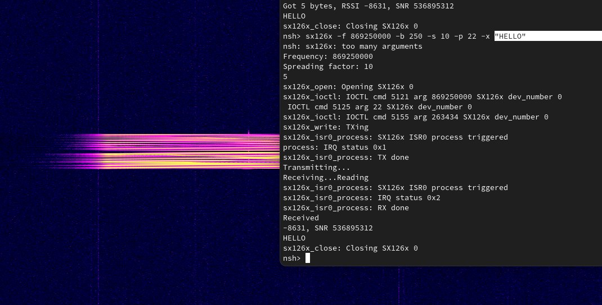

==================
SX126x LoRa 驱动程序
==================

.. note:: 本文档翻译自 NuttX 官方文档，如需查阅最新版本请访问 https://nuttx.apache.org/docs/latest/

**目前为实验性阶段。不久的将来可能会有变化**

SX126x 简介
=========================

SX126x 是 Semtech 的 LoRa 芯片。有时也可以在名称不同但底层硅片相同或相似的芯片中找到。较旧的变体是 SX127x，尽管其编号更高。SX126x 系列承诺改善链路预算。它们还添加了额外的扩频因子。

用户空间 API
=============
此驱动程序作为字符设备控制，使用 IOCTL 命令。在 2025 年 2 月 24 日撰写本文时，尚无用于 ``/lpwan`` 下 LoRa 设备和其他 RF 设备的通用 API。目前此驱动程序使用较旧的驱动程序特定 IOCTL 命令控制。

基本 RF IOCTL
--------------
参见 ``nuttx/wireless/ioctl.h``：``WLIOC_x`` 用于设置基本无线电参数，如频率和功率。请注意，频率和功率可能受板逻辑中的下半部分驱动程序限制。

驱动程序专用 IOCTL
----------------------
参见 ``nuttx/wireless/lpwan/sx126x.h``：``SX126XIOC_x`` 获取命令。

* 数据包类型使用 ``SX126XIOC_PACKETTYPESET`` 设置，它接受 ``sx126x_packet_type_e`` 枚举。**目前仅支持 LoRa 数据包类型。**

* LoRa 调制和 LoRa 数据包使用 ``SX126XIOC_LORACONFIGSET`` 配置，它接受指向 ``sx126x_lora_config_s`` 结构体的指针。该结构体包含两个独立的结构体，用于调制和数据包配置。建议参考 SX126x 数据手册 https://www.semtech.com/products/wireless-rf/lora-connect/sx1262，该手册提供了每个参数的更多详细信息。

读取 / 写入
-----------------
读取和写入使用 ``read`` 和 ``write`` 函数完成。

* ``write`` 使用 IOCTL 配置的参数直接传输给定的字节。**尚不支持轮询或超时。**

* ``read`` 接受指向 ``sx126x_read_header_s`` 的指针，其中包含有关接收数据包的信息。**RSSI 和 SNR 尚未实现**。*请注意，数据包始终被接收，即使 CRC（使用 ``.crc_error`` 检查）失败时也是如此。*

板实现
====================
驱动程序可以使用 ``sx126x_register`` 在板逻辑中注册，它接受 SPI 总线、下半部分驱动程序和路径。有关 ``struct sx126x_lower_s`` 参数的更多信息，请参见 ``nuttx/wireless/lpwan/sx126x.h``：``struct sx126x_lower_s``。

此驱动程序支持使用 ``sx126x_lower_s`` 中的 ``dev_number`` 的多个实例。这样做是为了多个 LoRa 通道可以同时工作。

**不要在 get_pa_values 中分配随机数。这可能会损坏设备，具体取决于型号。请参考手册**

测试
=======
制作了一个简单的乒乓测试来测试该设备。此代码可用作示例。它位于此处 https://pastebin.com/71CdKZvm
它接受以下参数：

* ``-f`` 设置频率（Hz）。范围取决于板。
* ``-b`` 设置带宽（kHz）并自动选择最接近的 sx126x 支持带宽。
* ``-s`` 设置 5 到 12 之间的扩频因子。
* ``-p`` 设置功率（dBm）。范围取决于板。还取决于 PA 设置。
* ``-t`` 执行传输。传输以下字节。
* ``-r`` 执行接收。接收并打印。
* ``-x`` 执行传输和接收。传输以下字节并尝试立即接收。与 ``-e`` echo 一起使用
* ``-e`` 执行回显。监听并重复。

