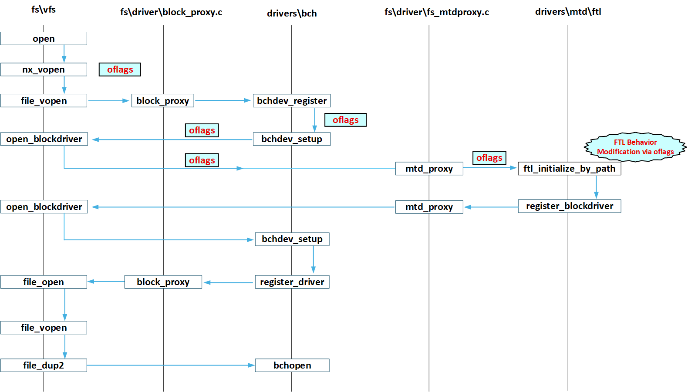

================================
Memory Technology Device Drivers
================================

.. note:: 本文档翻译自 NuttX 官方文档，如需查阅最新版本请访问 https://nuttx.apache.org/docs/latest/

MTD 是 "Memory Technology Devices"（存储技术设备）的缩写。此目录包含
用于操作各种存储技术设备并提供 MTD 接口的驱动程序。MTD 接口随后可被
上层逻辑用于控制对存储设备的访问。

更多信息请参见 include/nuttx/mtd/mtd.h。

-  ``include/nuttx/mtd/mtd.h``。此头文件提供了使用 MTD 驱动程序
   所需的所有结构体和 API。

-  ``struct mtd_dev_s``。每个 MTD 设备驱动程序必须实现一个
   ``struct mtd_dev_s`` 实例。该结构体定义了一个包含以下方法的
   调用表：

   擦除指定的擦除块（单位为擦除块）：

   从指定的读写块进行读写操作：

   某些设备可能支持面向字节的读取操作（可选）。大多数 MTD 设备
   本质上是面向块的，因此不支持面向字节的访问。建议底层驱动
   在需要缓冲的情况下不要支持 read()。

   某些设备也可能支持面向字节的写入操作（可选）。大多数 MTD 设备
   本质上是面向块的，因此不支持面向字节的访问。建议底层驱动
   在需要缓冲的情况下不要支持 read()。此接口仅在定义了
   ``CONFIG_MTD_BYTE_WRITE`` 时可用。

   支持其他不太常用的命令：

   -  ``MTDIOC_GEOMETRY``：获取 MTD 几何信息
   -  ``MTDIOC_BULKERASE``：擦除整个设备
   -  ``MTDIOC_ISBAD``：检查块是否为坏块

   通过单个 ``ioctl`` 方法提供（参见
   ``include/nuttx/fs/ioctl.h``）：

-  **绑定 MTD 驱动**。MTD 驱动通常不会被用户代码直接访问，
   而是绑定到另一个更高级别的设备驱动程序。一般来说，绑定
   顺序为：

   #. 从硬件特定的 MTD 设备驱动程序获取 ``struct mtd_dev_s`` 实例，
      以及

   #. 使用 ``register_mtddriver`` 接口注册 MTD 驱动程序。

-  **示例**：``drivers/mtd/m25px.c`` 和 ``boards/arm/sama5/sama5d4-ek/src/sam_at25.c``

注册方法
========

``register_mtddriver`` 函数提供了注册 MTD 设备的统一接口。注册时，
MTD 设备将在 ``open()`` 过程中自动集成 FTL（闪存转换层）和 BCH
（块到字符转换）包装器。这种自动包装使得用户代码中不再需要传统的
注册方法 ``ftl_initialize()`` 和 ``bchdev_register()``。用户可以在
注册后通过标准文件操作（如 ``open()``、``read()``、``write()``）
直接访问 MTD 设备。

- **字符设备模式**（通过 ``open()``）：
  启用面向字节的访问，同时应用 FTL 和 BCH 层
  （需要 ``CONFIG_BCH``）。

- **块设备模式**（通过 ``open_blockdriver()``）：
  提供块接口，仅启用 FTL 层

  函数 register_partition_with_mtd() 和 register_mtdpartition()
  实际上是建立在 register_mtddriver() 之上的包装器，
  它们可用于为 MTD 设备创建子分区设备。

  在 FTL 层不适合将 MTD 转换为块设备的场景中，可以使用
  Dhara 等替代方案。
  要注册基于 Dhara 的块设备：使用 ``dhara_initialize()`` 函数，
  将底层 ``struct mtd_dev_s *dev`` 作为参数传递以创建 Dhara 块
  设备实例。Dhara 初始化后，使用 ``register_blockdriver()`` 注册
  块设备，并使用 Dhara 设备的块操作：这种方法绕过了 FTL 层，
  直接将 Dhara 的块管理功能与 MTD 设备集成。Dhara 提供了针对
  特定用例的磨损均衡和坏块管理等功能。

通过 Open 标志控制 FTL 行为
============================

FTL 层将 MTD 操作转换为块设备语义，同时管理 NAND 特有的挑战
（如坏块、磨损均衡）。默认情况下，FTL 对写操作采用读-修改-写
周期：

1. 将整个擦除块读入缓存缓冲区。
2. 在内存中修改目标数据。
3. 擦除物理块。
4. 将整个缓冲区写回。

这种方法确保了数据一致性，但会引入延迟并需要足够的 RAM。
为了适应对性能敏感的应用，FTL 在 ``open()`` 期间支持以下标志：

- **``O_DIRECT``**：
  绕过读-修改-写周期，允许直接写入闪存。
  在以下情况下使用此标志：写入速度至关重要，或没有足够的
  RAM 用于缓存。

- **``O_SYNC``**：
  假定块已被预擦除，在写入期间跳过擦除步骤。
  此标志仅在与 ``O_DIRECT`` 配合使用时生效。

下图说明了通过 ``open()`` 函数打开 MTD 设备节点时的工作流程，
突出显示了 ``oflags``（如 ``O_DIRECT``、``O_SYNC``）如何通过各层
传播以控制 FTL 行为：

  *图 1：打开 MTD 设备节点和 oflag 传播的序列*

EEPROM
======

使用与 Microchip 25xxxx 系列相同命令的 SPI EEPROM，以及使用与
Microchip 24xxxx 系列相同命令的 I2C EEPROM，可以分别通过
`drivers/mtd/at25ee.c` 和 `drivers/mtd/at24xx.c` 驱动程序进行接口。

请参阅 :doc:`EEPROM 字符驱动参考 <../../character/eeprom>` 了解

-  EEPROM 和 FLASH 存储器之间的区别；
-  支持的 EEPROM 变体列表；
-  使用字符驱动接口 EEPROM。

在大多数情况下，应优先使用 MTD 接口而非字符驱动接口，除非需要对
EEPROM 操作进行更精细的控制。字符驱动接口也可能更适合减少代码
占用或对 EEPROM 的非常简单的使用（例如存储参数而无需依赖文件系统）。

25xxxx 系列 EEPROM 的 MTD 驱动是字符驱动的包装器，因此它们的性能
几乎相同。

CFI FLASH
=========

CFI，全称为 Common Flash Interface（通用闪存接口），是 JEDEC
（联合电子设备工程委员会）于 2003 年提出的标准。CFI（通用闪存接口）
的作用是通过统一的方法读取 NOR Flash 的信息。

该标准为符合 CFI 的 Flash 定义了一个查询接口，允许对 Flash 的读、写、
擦除等接口进行参数化和平台化。它允许程序员读取 Flash 相关设备的
电气特性，包括存储器大小、擦除速度、特殊功能等。换句话说，它相当于
将 Flash 的数据手册加载到 Flash 的物理设备中，可以在需要时由相关
人员读取和使用。

CFI 指令链接：
https://netwinder.osuosl.org/pub/netwinder/docs/nw/flash/29220403.pdf
CFI 支持 intel 和 amd 指令集，目前设备驱动已支持

NAND MEMORY
===========

文件
----

此目录还包括 NAND 存储器的驱动程序。包括::

    mtd_nand.c: "上半部分" NAND MTD 驱动程序
    mtd_nandecc.c、mtd_nandscheme.c 和 hamming.c：实现 NAND 软件 ECC
    mtd_onfi.c、mtd_nandmodel.c 和 mtd_modeltab.c：实现 NAND FLASH 识别逻辑。

文件系统
--------

NAND 支持目前仅是部分的，因为没有能与之正确配合的文件系统。
应将其视为正在进行中的工作。除非您有兴趣投入一些精力，
否则不建议使用 NAND。请参阅下面的"状态"部分。

NXFFS
~~~~~

NuttX FLASH 文件系统（NXFFS）与 NOR 类似 FLASH 配合良好，
但与 NAND 配合不佳。一些简单的可用性问题包括：

- NXFFS 可能非常慢。首次启动系统时，请做好等待的准备；NXFFS
  需要格式化 NAND 卷。由于调试信息较多，尚不清楚优化后的等待
  时间。但在开启调试、使用软件 ECC 且无 DMA 的情况下，等待
  时间长达数十分钟（如果启用许多调试选项，时间会更长）。

- 在后续启动中，NXFFS 文件系统创建完成后延迟会减少。当新文件
  系统为空时，速度会很快。但当 NAND 使用量较大时，与 NAND 相关
  的启动时间会变得很长。这是因为 NXFFS 需要扫描 NAND 设备并
  构建访问 NAND 所需的内存数据集，设备使用后需要扫描的内容更多。
  您可能希望在启动时创建一个单独的线程来启动 NXFFS，以避免在
  这些较长延迟的情况下过度延迟启动到提示符的时间。

- 还有另一个与 NXFFS 相关的性能问题：当 FLASH 完全使用时，
  NXFFS 将重构整个 FLASH，重构整个 FLASH 的延迟可能会更大。
  这种情况下的解决方案是实现一个 NXFSS 清理守护进程，逐步
  完成工作，以避免在 FLASH 满时进行大规模清理。

但 NXFFS 和 NAND 之间存在更严重的、阻碍性的问题：

- NXFFS 与 NAND 的不良行为：如果重启 NuttX，您写入 NAND 的
  文件将会丢失。为什么？因为多次写入破坏了 NAND ECC 位。
  请参阅下面的"状态"。NXFFS 需要进行重大改造才能与 NAND 一起
  使用。

NXFFS 无法与 NAND 配合使用有几个原因。NXFFS 是为与 NOR 类似
FLASH 配合使用而设计的，NAND 与该 FLASH 模型在几个方面不同。
首先，NAND 需要纠错（ECC）字节来处理位故障。这从两个方面影响
NXFFS：

- 首先，写入失败不是致命的。相反，它们应该被标记为坏块并简单
  忽略。这是因为不可恢复的位故障会在从 NAND 读取时导致读取失败。
  设置 CONFIG_EXPERIMENTAL+CONFIG_NXFFS_NAND 选项将启用此行为。

[CONFIG_NXFFS_NAND 仅在同时选择 CONFIG_EXPERIMENTAL 时可用。]

- 其次，NXFFS 会多次写入一个块。它试图保持位在擦除状态，并
  假设可以覆盖这些位以将它们从擦除状态更改为非擦除状态。这在
  NOR 类似 FLASH 上效果良好。NAND 也以这种方式工作。但 NAND
  的问题是 ECC 位不能以这种方式重写。因此，一旦块被写入，
  就无法修改。此行为在 NXFFS 中尚未修复。目前，NXFFS 将尝试
  重写 ECC 位，导致 ECC 被破坏，因为 ECC 位不能在不擦除整个
  块的情况下被覆盖。

这可能使 NXFFS 永远无法与 NAND 一起使用。

FAT
~~~

另一个选项是 FAT。如果启用了闪存转换层（FTL），则可以使用 FAT。
FTL 将 NAND MTD 接口转换为块驱动程序，然后可以与 FAT 一起使用。

但是，FAT 不会处理坏块，也不执行任何磨损均衡。因此，您可以使用
FAT 和新的、干净的 NAND FLASH 启动 NAND 文件系统，但您需要知道
最终会出现 NAND 位故障，FAT 将停止工作：如果遇到坏块，FAT 就
结束了。FAT 中没有标记和跳过坏块的机制。

FTL 写入在 NAND 上也特别低效。为了写入一个扇区，FTL 会将整个
擦除块读入内存，擦除 FLASH 上的块，修改扇区并将擦除块重新写回
FLASH。对于大型 NAND，这可能非常低效。例如，我目前使用的 NAND
具有 128KB 擦除块大小和 2K 页大小，因此每次写入可能导致 256KB
的数据传输！

请注意，FAT 和 FTL 内部有一些缓存逻辑，因此如果可能，可以重用
此缓存擦除块，并且写入将被尽可能延迟。

SMART FS
~~~~~~~~

我尚未尝试 SmartFS。它确实支持一些类似 NXFFS 的磨损均衡，
但与 FAT 一样，无法处理坏块，并且与 NXFFS 一样，它会尝试
重写擦除位。因此 SmartFS 也不是一个选项。

所需内容
~~~~~~~~

要正确使用 FAT，需要在 FTL 层和 NAND FLASH 层之间有另一个
MTD 层。该层将执行坏块检测和备用，以便 FAT 在 NAND 上透明
运行。

另一个不太通用的选项是在 FAT 中支持坏块。这样的解决方案
可能适用于 SLC NAND，但对所有 NAND 类型来说不够通用。

支持的设备
==========

NuttX 为以下 MTD 设备提供支持。

.. toctree::
  :maxdepth: 1
  :glob:

  devices/*
