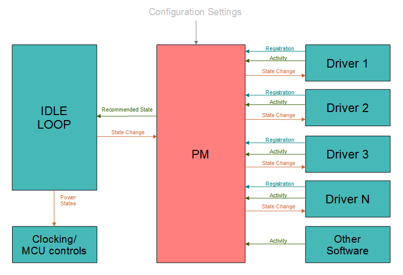

================
电源管理
================

.. note:: 本文档翻译自 NuttX 官方文档，如需查阅最新版本请访问 https://nuttx.apache.org/docs/latest/

.. todo::
  需要更新以考虑除基于活动的调节器之外的不同调节器。

NuttX 支持一个简单的电源管理（PM）子系统，它：

  - 监控来自驱动（和系统其他部分）的活动，并
  - 提供钩子将驱动（和整个系统）置于降低功耗的运行模式。

|figure|

PM 子系统将 MCU 空闲循环与一组设备驱动集成，以支持：

  - 相关驱动或其他系统活动的报告。
  - 与单个设备驱动接口的注册和回调机制。
  - 空闲时对整体驱动活动的轮询。
  - 协调的、全局的、系统范围的向更低功耗状态的转换。

**低功耗状态**。各种"睡眠"和低功耗状态有不同的名称，有时使用方式相互矛盾。在 NuttX PM 逻辑中，我们将使用以下术语：

  ``NORMAL``
     正常的全功率运行模式。
  ``IDLE``
     这基本上仍然是正常的运行模式，但系统处于 ``IDLE`` 状态，采取一些简单的步骤降低功耗，前提是不干扰正常运行。例如，简单地调暗背光可能是系统空闲时执行的操作。
  ``STANDBY``
     待机是更低功耗的模式，可能涉及更广泛的电源管理步骤，如禁用时钟或将处理器设置为降低功耗的模式。在此状态下，系统应仍能几乎立即恢复正常活动。
  ``SLEEP``
     最低功耗模式。应在此状态下采取最极端的功耗降低措施。从 ``SLEEP`` 恢复正常操作可能需要一些时间（某些 MCU 甚至可能需要经过复位）。

.. c:enum:: pm_state_e

  这些不同状态在 ``include/nuttx/power/pm.h`` 中以类型 :c:enum:`pm_state_e` 表示。

**电源管理域**。每个 PM 接口包含一个整数 *域* 编号。默认情况下，仅支持单个电源域 (``CONFIG_PM_NDOMAINS=1``)。但这是可配置的；可以支持任意数量的 PM 域。多个 PM 域可能有用，例如，如果您希望将与网络相关的电源状态与用户界面相关的电源状态分开控制。

接口
==========

所有 PM 接口在文件 ``include/nuttx/power/pm.h`` 中声明。

.. c:function:: void pm_initialize(void)

  在上电复位时由 MCU 特定的一次性逻辑调用，以初始化电源管理功能。此函数必须在初始化序列中 *非常* 早地调用，在任何其他设备驱动初始化 *之前*（因为它们可能尝试注册到电源管理子系统）。

.. c:function:: int pm_domain_register(int domain, FAR struct pm_callback_s *cb)

  由设备驱动调用，以注册从特定域接收电源管理事件回调。
  详情请参阅 `回调`_ 章节。

  :param domain: 标识目标注册域
  :param cb: 提供驱动回调函数的 :c:struct:`pm_callback_s` 实例。

  :return: 成功返回零 (``OK``)；否则返回取反的 ``errno`` 值。

.. c:function:: int pm_register(FAR struct pm_callback_s *callbacks)

  由设备驱动调用，以注册接收电源管理事件回调。
  详情请参阅 `回调`_ 章节。

  兼容性保留，仅通过宏注册到 PM_IDLE_DOMAIN。

  :param callbacks: 提供驱动回调函数的 :c:struct:`pm_callback_s` 实例。

  :return: 成功返回零 (``OK``)；否则返回取反的 ``errno`` 值。

.. c:function:: int pm_domain_unregister(int domain, FAR struct pm_callback_s *cb)

  由设备驱动调用，以注销先前从特定域注册的电源管理事件回调。
  详情请参阅 `回调`_ 章节。

  :param domain: 标识目标注销域
  :param cb: 提供驱动回调函数的 :c:struct:`pm_callback_s` 实例。

  :return: 成功返回零 (``OK``)；否则返回取反的 ``errno`` 值。

.. c:function:: int pm_unregister(FAR struct pm_callback_s *callbacks)

  由设备驱动调用，以注销先前注册的电源管理事件回调。
  详情请参阅 `回调`_ 章节。

  兼容性保留，仅通过宏注销 PM_IDLE_DOMAIN。

  :param callbacks: 提供驱动回调函数的 :c:struct:`pm_callback_s` 实例。

  :return: 成功返回零 (``OK``)；否则返回取反的 ``errno`` 值。

.. c:function:: void pm_activity(int domain, int priority)

  由设备驱动调用，表示正在执行有意义的活动（非空闲）。
  这会增加活动计数和/或重启空闲计时器，防止进入降低功耗的状态。

    :param domain: 标识新 PM 活动的域
    :param priority: 活动优先级，范围 0-9。较大的值对应较高的优先级。较高优先级的活动可以更长时间地防止系统进入降低功耗的状态。例如，按钮按下可能是较高优先级的活动，因为它意味着用户正在积极与设备交互。

  **假设**：此函数可从中断处理程序调用（这是唯一可从中断处理程序调用的 PM 函数！）。

.. c:function:: enum pm_state_e pm_checkstate(int domain)

  从 MCU 特定的 IDLE 循环调用，以监控电源管理条件。此函数基于 PM 配置和上一个采样周期报告的活动返回"推荐的"电源管理状态。但电源管理状态不会自动更改。IDLE 循环必须调用 :c:func:`pm_changestate` 以进行状态更改。

  将这两个步骤分开是因为平台特定的 IDLE 循环可能拥有 PM 子系统不可用的额外情境信息。例如，IDLE 循环可能知道电池电量非常低，即使有活动也可能强制进入更低功耗状态。

  注意：这两个步骤在时间上是分开的，因此在调用 :c:func:`pm_checkstate` 和 :c:func:`pm_changestate` 之间 IDLE 循环可能会被挂起很长时间。IDLE 循环可能需要通过禁用中断直到状态更改完成来使这些调用原子化。

    :param domain: 标识要检查的 PM 域
    :return: 推荐的电源管理状态。

.. c:function::  int pm_changestate(int domain, enum pm_state_e newstate)

  此函数由平台特定的电源管理逻辑使用。它将向所有已注册电源管理事件回调的驱动宣布电源管理状态更改。

  :param domain: 标识新 PM 状态的域
  :param newstate: 标识新的 PM 状态

  :return: 0 (``OK``) 表示所有已注册驱动的回调函数返回 ``OK``（表示它们接受状态更改）。非零表示某个驱动拒绝了状态更改。在这种情况下，系统将恢复到之前的状态。

  **假设**：假定调用此函数时中断已禁用。此函数可能从 IDLE 循环调用...系统中优先级最低的任务。更改驱动电源管理状态可能导致新的系统活动，因此在状态更改完成之前除非禁用中断，否则可以在 IDLE 线程完成整个状态更改之前将其挂起。

.. c:function:: void pm_idle(pm_idle_handler_t handler)

  此函数为 up_idle 提供标准的 pm 空闲工作流程。从芯片 BSP 调用，应仅专注于处理系统状态更改。

  :param handler: PM_IDLE_DOMAIN 状态更改后的执行

.. c:function:: void pm_idle_unlock(void)

  此函数辅助 SMP pm 空闲工作流程，对于 pm 序列，其他核心将在持有 cpu 锁的核心释放之前不会释放。调用此函数以释放 SMP 空闲 cpu 锁。

.. c:function:: bool pm_idle_lock(int cpu)

  此函数辅助 SMP pm 空闲工作流程，对于 pm 序列，其他核心将在持有 cpu 锁的核心释放之前不会释放。调用此函数以确保其他核心在释放之前不会运行。

  :param cpu: 当前 CPU，用于更新 cpu_set_t

  :return: true，当前 CPU 是第一个从睡眠中唤醒的，也应处理系统域恢复过程。false，当前 CPU 不是从睡眠中唤醒的第一个，应仅处理 cpu 域恢复过程。

  **假设**：恢复操作 pm_changestate(, PM_RESTORE) 将在 pm_idle 内部完成。处理程序不必关心它。

回调
=========

.. c:type:: pm_idle_handler_t

  此类型声明为 pm_idle 接口提供。处理 pm 低功耗操作和执行。由于内部的 WFI，可能长时间执行。

  - 非 SMP 情况。

  .. code-block:: c
    typedef void (*pm_idle_handler_t)(enum pm_state_e systemstate);

  :param systemstate: 指示新的系统电源状态。

  - SMP 情况。

  .. code-block:: c
    typedef bool (*pm_idle_handler_t)(int cpu,
                                      enum pm_state_e cpustate,
                                      enum pm_state_e systemstate);

  :param cpu: 指示当前工作的 cpu。
  :param cpustate: 指示当前 cpu 电源状态。
  :param systemstate: 指示新的系统电源状态。如果不是最后一个核心进入空闲，systemstate 始终为 PM_RESTORE。如果不是 PM_RESTORE，处理程序应覆盖系统 pm 操作。

.. c:struct:: pm_callback_s

  此结构包含驱动回调函数的指针。此结构定义在 ``include/nuttx/power/pm.h`` 中。这些回调函数可用于向驱动提供电源管理信息。

.. c:var:: int (*prepare)(FAR struct pm_callback_s *cb, int domain, enum pm_state_e pmstate)

  请求驱动为新的电源状态做准备。这是系统即将进入新电源状态的警告。驱动应开始进入电源状态所需的任何操作。驱动可以通过从回调函数返回非零值来中止状态更改。

    :param cb: 返回给驱动。回调结构的驱动版本可能在结构末尾包含额外的驱动特定状态数据。
    :param domain: 标识状态更改的活动域
    :param pmstate: 标识新的 PM 状态

    :return: 零 (``OK``) 表示事件已成功处理，驱动已为 PM 状态更改做好准备。非零表示驱动未准备好执行此电源设置所需的任务，将导致状态更改被中止。注意：当从更低功耗模式恢复到更高功耗模式时（例如因为另一个驱动拒绝了更低功耗状态更改），也会调用 ``prepare()`` 方法。当恢复到更高功耗模式时，驱动不允许返回非零值！

.. c:var:: void (*notify)(FAR struct pm_callback_s *cb, int domain, enum pm_state_e pmstate)

  通知驱动新的电源状态。在所有驱动有机会为新的电源状态做准备后调用此回调。

    :param cb: 返回给驱动。回调结构的驱动版本可能在结构末尾包含额外的驱动特定状态数据。
    :param domain: 标识状态更改的活动域
    :param pmstate: 标识新的 PM 状态

  当驱动在 :c:var:`prepare` 调用中返回 ``OK`` 时，它已同意转换到低功耗状态。

