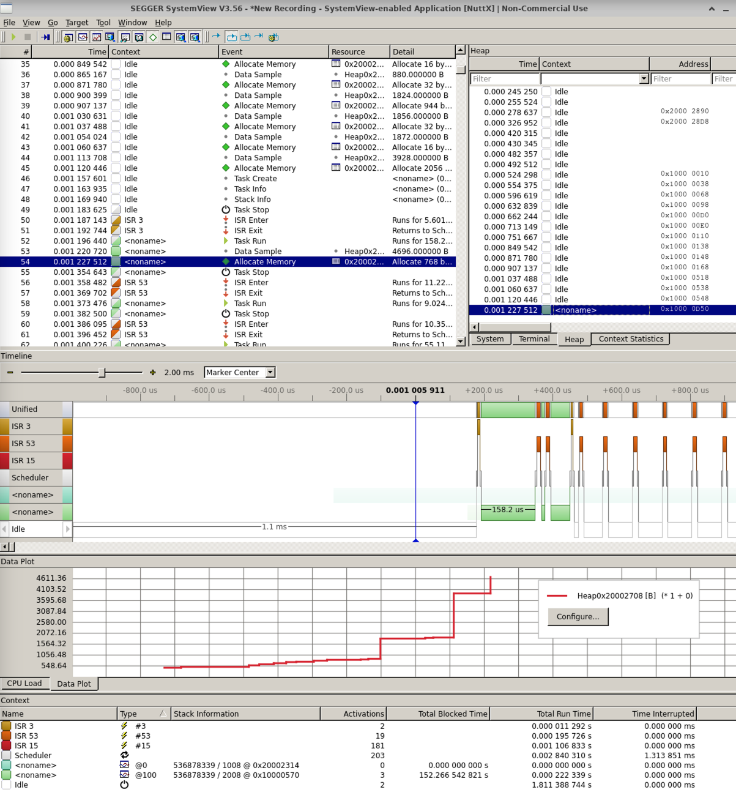

==================
Segger RTT 驱动
==================

.. note:: 本文档翻译自 NuttX 官方文档，如需查阅最新版本请访问 https://nuttx.apache.org/docs/latest/

.. note:: Segger 驱动仅适用于 J-Link 调试探针。
          有时可以用 J-Link OB 固件替换厂商特定的调试接口。详情请参阅
          `Segger 网站 <https://www.segger.com/downloads/jlink>`_

支持的 Segger 驱动：

* 基于 RTT 的串口 - ``CONFIG_SERIAL_RTTx``，
* 基于 RTT 的控制台 - ``CONFIG_SERIAL_RTT_CONSOLE_CHANNEL``
* Segger SystemView - ``CONFIG_SEGGER_SYSVIEW``
* Note RTT - ``CONFIG_NOTE_RTT``

Segger SystemView
=================

1. 启用 SystemView 支持的步骤：

#. 确保您的架构支持高性能计数器。在大多数情况下是：

   :menuselection:`CONFIG_ARCH_PERF_EVENTS=y`

   在这种情况下，架构逻辑必须使用 ``up_perf_init()`` 初始化性能计数器。

#. 启用检测支持：

   :menuselection:`CONFIG_SCHED_INSTRUMENTATION=y`

#. 配置检测支持。SystemView 的可用选项有：

   :menuselection:`CONFIG_SCHED_INSTRUMENTATION_SWITCH=y`

   :menuselection:`CONFIG_SCHED_INSTRUMENTATION_SYSCALL=y`

   :menuselection:`CONFIG_SCHED_INSTRUMENTATION_IRQHANDLER=y`

#. 确保 ``CONFIG_TASK_NAME_SIZE > 0``，否则任务/线程名称将无法正确显示。

#. 启用 Note 驱动支持并禁用 Note RAM 驱动：

   :menuselection:`CONFIG_DRIVERS_NOTE=y`

   :menuselection:`CONFIG_DRIVERS_NOTERAM=n`

#. 启用 Note RTT 和 Segger SystemView 支持：

   :menuselection:`CONFIG_NOTE_RTT=y`

   :menuselection:`CONFIG_SEGGER_SYSVIEW=y`

#. 配置 SystemView 的 RTT 通道和 RTT 缓冲区大小：

   :menuselection:`CONFIG_SEGGER_SYSVIEW_RTT_CHANNEL=0`

   :menuselection:`CONFIG_SEGGER_SYSVIEW_RTT_BUFFER_SIZE=1024`

   如果 SystemView 返回缓冲区溢出错误，应增加 ``CONFIG_NOTE_RTT_BUFFER_SIZE_UP``。

2. 使用 SystemView 进行堆跟踪：

参见 ``stm32f429i-disco/configs/systemview`` 中的示例配置。
确保 ``CONFIG_SCHED_INSTRUMENTATION_HEAP`` 已启用。

SystemView 截图示例：

