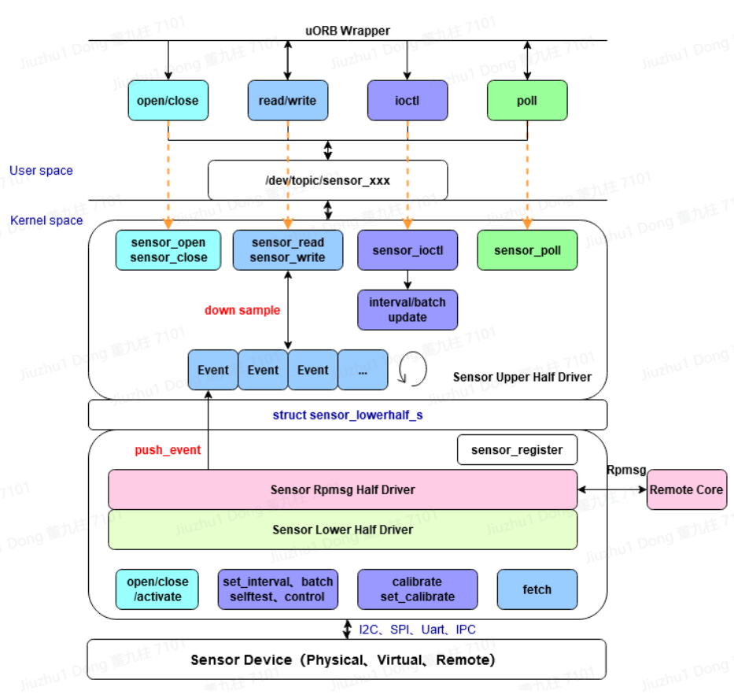

.. _new_sensor_framework:

=====================
Sensor "uORB" Drivers
=====================

.. note:: 本文档翻译自 NuttX 官方文档，如需查阅最新版本请访问 https://nuttx.apache.org/docs/latest/

NuttX 为了统一管理所有传感器、重用公共代码和减少空间占用，将所有
传感器驱动程序的公共部分提取到提供通用功能的**上半部分层**中。
**下半部分层**负责与传感器寄存器的实际交互。

NuttX 传感器驱动程序更侧重于物理传感器。对于通过集成生成的虚拟
融合传感器，它们通过应用程序广播或订阅自动创建。对于像 IMU 这样
将多个传感器集成到一个单元中的设备，需要在驱动程序中实例化多个
下半部分，并通过上半部分提供的 API（sensor_register）分别注册设备
节点。

.. note::

   为 GNSS/GPS 设备编写 uORB 驱动程序时，请使用 :doc:`GNSS 下半部分
   驱动程序 </components/drivers/special/sensors/gnss_lowerhalf>`。
   此驱动程序抽象了 NMEA 信息的解析和发布。

命名
======

NuttX 中用于此组件的名称可能具有误导性，因为此传感器框架不以任何
方式依赖于"uORB"。以此方式实现的传感器可以用作具有标准化接口的
通用字符驱动程序。

**驱动程序模型**
================

NuttX 传感器上半部分驱动程序主要负责注册设备节点、实现 struct
file_operations、多用户访问、环形缓冲区管理、低功耗和降采样逻辑。
下半部分驱动程序分为 rpmsg 半部分和通用下半部分。rpmsg 半部分负责
与远程 CPU 的跨核心订阅和发布，而通用下半部分负责与传感器硬件
交互。通用下半部分执行的主要操作包括一组传感器操作，如
``activate``、``set_interval``、``batch``、``selftest``、
``set_calibvalue``、``calibrate`` 和 ``control``。在中断或轮询
机制下，传感器事件被发送到上层的环形缓冲区。

传感器数据类型
================

框架支持两种类型的传感器数据：

#. ``float`` 如果 ``CONFIG_SENSORS_USE_FLOAT=y``，不建议用于没有
   FPU 的目标。

#. ``b16_t`` 如果 ``CONFIG_SENSORS_USE_B16=y``，建议用于没有 FPU
   的目标。

目前所有传感器都支持 ``float``，``b16_t`` 的支持正在进行中。

.. warning::
   使用定点数学而不是浮点可能会导致传感器测量在之前不会饱和的地方
   饱和。验证定点数据类型是否足以满足您的应用。仅仅因为驱动程序
   支持定点**并不意味着**它可以支持传感器的完整范围。

要创建支持两种数据类型的通用驱动程序，应使用专用的传感器数据类型：

.. code:: C

   /* 传感器的数据类型 */

   #ifdef CONFIG_SENSORS_USE_B16
   typedef b16_t sensor_data_t;
   #else
   typedef float sensor_data_t;
   #endif

对此类型的数学运算应仅使用专用宏执行：

- ``sensor_data_ftof(f1)`` - 将浮点数转换为传感器数据数字。
  应仅用于编译时常量。

- ``sensor_data_itof(i)`` - 将整数转换为传感器数据数字。

- ``sensor_data_inv(i)`` - 求倒数并转换为传感器数据数字

- ``sensor_data_add(f1, f2)`` - 两个传感器数据数字相加

- ``sensor_data_sub(f1, f2)`` - 两个传感器数据数字相减

- ``sensor_data_subi(f1, i)`` - 从传感器数据数字中减去整数

- ``sensor_data_mul(f1, f2)`` - 两个传感器数据数字相乘

- ``sensor_data_muli(f1, i)`` - 传感器数据与整数相乘

- ``sensor_data_div(f1, f2)`` - 两个传感器数据数字相除

- ``sensor_data_divi(f1, i)`` - 传感器数据与整数相除

- ``sensor_data_abs(f1)`` - 获取传感器数据数字的绝对值

- ``sensor_data_sqrt(f1)`` - 获取传感器数据数字的平方根

- ``sensor_data_usat(f1)`` - 传感器数据的无符号饱和。

**代码**
========

::

  nuttx/driver/sensor/sensor.c               传感器上半部分实现
  nuttx/driver/sensor/sensor_rpmsg.c         传感器 rpmsg 下半部分实现
  nuttx/driver/sensor/usensor.c              用户空间传感器注册实现
  nuttx/include/nuttx/sensors/sensor.h       传感器统一结构头文件
  nuttx/include/nuttx/sensors/ioctl.h        传感器 ioctl 命令头文件

  CONFIG_SENSORS                             开启传感器驱动程序配置
  CONFIG_USENSORS                            开启用户传感器驱动程序配置
  CONFIG_SENSORS_RPMSG                       开启 rpmsg 传感器驱动程序配置

**数据结构**
===================

**传感器类型**
----------------

NuttX 定义了 50 多种类型的传感器，涵盖大多数物理传感器。所有类型
定义位于 include/nuttx/uorb.h。如果需要添加新类型，必须为新类型
提供注释，说明传感器的用途和单位。

**SENSOR_TYPE_CUSTOM**

这是用于不规则传感器设备的自定义类型，其中事件结构发生变化或动态
改变。它使用 ``sensor_custom_register`` 注册。

**SENSOR_TYPE_ACCELEROMETER**

加速度计，用于测量设备的加速度向量。单位：m/s=2。
事件数据结构：（这表示加速度计事件有特定的数据结构，但实际结构
未在提供的文本中给出。）

（由于数量众多，不逐一介绍）

**传感器主题定义**
---------------------------

传感器的数据结构，也是 uORB 的主题结构，定义在
``include/nuttx/uorb.h`` 中。

**下半部分结构**
------------------------

此结构作为传感器驱动程序上半部分和下半部分之间的桥梁。上半部分和
下半部分都填充此结构，下半部分负责同步配置信息，上半部分负责暴露
数据报告接口。

红色突出显示的下半部分由下半部分驱动程序填充，其余由上半部分填充。

``type`` 表示传感器类型：``SENSOR_TYPE_XXX``

``nbuffer`` 指定上半部分驱动程序中环形缓冲区的长度；

``ops`` 表示下半部分驱动程序实现的传感器操作集。

``push_event`` 和 ``notify_event`` 不同时使用，由上半部分填充。

``push_event`` 与环形缓冲区配合使用，用于下半部分向环形缓冲区
报告数据；

``notify_event`` 与 fetch 配合使用，在主动拉取数据的阻塞操作中
通知上半部分数据已就绪。

``sensor_lock`` 和 ``sensor_unlock`` 由上半部分填充并导出到下半
部分，以避免递归死锁问题。目前，它们仅用于 sensor_rpmsg。

``priv`` 由上半部分填充，表示上层上下文。

``persist`` 表示主题是否为通知型主题。

.. code:: C

  struct sensor_lowerhalf_s
  {
    int type;
    unsigned long nbuffer;
    FAR const struct sensor_ops_s *ops;

    union
      {
        sensor_push_event_t push_event;
        sensor_notify_event_t notify_event;
      };

    CODE void (*sensor_lock)(FAR void * priv);
    CODE void (*sensor_unlock)(FAR void * priv);

    FAR void *priv;
    bool persist;
  };

**API**
-------

NuttX 传感器上半部分驱动程序为下半部分提供了一组 API，包括注册和
时间戳获取。

**注册和注销**
~~~~~~~~~~~~~~~~~~~~~~~~~~~~~~~~~~~

对于 50 多种类型的传感器，可以使用 sensor_register 函数注册字符
设备。参数 dev 表示下半部分的句柄，devno 是设备名称的索引。
如果注册成功，将在 ``/dev/{topic}`` 下创建节点，例如：
``/dev/topic/sensor_accel0``。如果失败，将返回错误代码。

对于自定义特殊类型的驱动程序，需要使用 ``sensor_custom_register``
函数注册字符设备。参数 dev 是下半部分的句柄，path 是字符设备的
路径，esize 是传感器报告的数据的元素大小。如果注册成功，将在指定
路径创建字符设备节点。如果失败，将返回错误代码。

.. code:: C

  int sensor_register(FAR struct sensor_lowerhalf_s *dev, int devno);
  void sensor_unregister(FAR struct sensor_lowerhalf_s *dev, int devno);

  int sensor_custom_register(FAR struct sensor_lowerhalf_s *dev,
                             FAR const char *path, unsigned long esize);
  void sensor_custom_unregister(FAR struct sensor_lowerhalf_s *dev,
                                FAR const char *path);

**获取时间戳**
~~~~~~~~~~~~~~~~~~~~~~~~

函数返回微秒精度的时间戳。

.. code:: C

  static inline uint64_t sensor_get_timestamp(void);

**传感器驱动程序操作集**
-------------------------------

不同系统和平台的传感器驱动程序框架总是围绕传感器特性展开，NuttX
传感器也不例外。对于传感器，常见操作包括：打开/关闭、初始化量程/
分辨率/滤波、设置采样率（ODR）/硬件 FIFO/操作模式以及中断控制。
根据实际应用和对其他系统的参考，选择了几个关键点形成传感器操作集。
对于不需要动态更改的，可以简单地作为参数传递给初始化函数。

**打开/关闭**
~~~~~~~~~~~~~~~~~~~

当调用者调用 open 和 close 时，下半部分中相应的 open 和 close
将被调用，参数分别为 lower 和 filep。filep 包含用户信息，因此驱动
程序可以区分不同的用户。目前，此接口仅由 sensor_rpmsg 下半部分
使用。

.. code:: C

  CODE int (*open)(FAR struct sensor_lowerhalf_s *lower,
                   FAR struct file *filep);

  CODE int (*close)(FAR struct sensor_lowerhalf_s *lower,
                    FAR struct file *filep);

**激活/停用传感器**
~~~~~~~~~~~~~~~~~~~~~~~~~~~~~~~~~~~~~~

当调用者调用 open 时，如果是订阅者，将调用下半部分中的 activate
来激活传感器。当调用 close 时，调用 deactivate 来关闭传感器。

.. code:: C

  CODE int (*activate)(FAR struct sensor_lowerhalf_s *lower,
                       FAR struct file *filep, bool enable);

**设置采样率**
~~~~~~~~~~~~~~~~~~~~~~~~~~~~~

应用程序（包括传感器服务）通过系统调用 ioctl 设置传感器的采样率。

调用流程：

  #. ``ioctl(fd, SNIOC_SET_INTERVAL, &interval)``
  #. vfs
  #. ``sensor_ioctl``
  #. ``set_interval()``.

传感器连续样本之间的采样间隔以微秒为单位设置。如果 period_us
超过 min_delay 和 max_delay 的范围，将被调整。修改采样率时，应
确保已准备好的数据不会丢失。

.. code:: C

  CODE int (*batch)(FAR struct sensor_lowerhalf_s *lower,
                    FAR struct file *filep,
                    FAR unsigned long *latency_us);

**主动拉取数据**
~~~~~~~~~~~~~~~~~~~~~~~~~~~~

要主动获取传感器数据，如果使用中断或轮询方法则设置为 NULL。

.. code:: C

  CODE int (*fetch)(FAR struct sensor_lowerhalf_s *lower,
                    FAR struct file *filep,
                    FAR char *buffer, size_t buflen);

**自检**
~~~~~~~~~~~~~

传感器自检主要用于工厂测试和老化目的。

.. code:: C

  CODE int (*selftest)(FAR struct sensor_lowerhalf_s *lower,
                       FAR struct file *filep,
                       unsigned long arg);

**校准**
~~~~~~~~~~~~~~~

使用 calibrate 触发校准并将校准数据返回到 arg。使用 set_calibvalue
将校准数据设置到底层传感器。

.. code:: C

  CODE int (*calibrate)(FAR struct sensor_lowerhalf_s *lower,
                        FAR struct file *filep,
                        unsigned long arg);

  CODE int (*set_calibvalue)(FAR struct sensor_lowerhalf_s *lower,
                             FAR struct file *filep,
                             unsigned long arg);

**传感器信息**
~~~~~~~~~~~~~~~~~~~~~~

使用 get_info 主动获取传感器信息数据，返回值为 ``sensor_device_info_s``。

.. code:: C

  struct sensor_device_info_s
  {
    uint32_t      version;
    sensor_data_t power;
    sensor_data_t max_range;
    sensor_data_t resolution;
    int32_t       min_delay;
    int32_t       max_delay;
    uint32_t      fifo_reserved_event_count;
    uint32_t      fifo_max_event_count;
    char          name[SENSOR_INFO_NAME_SIZE];
    char          vendor[SENSOR_INFO_NAME_SIZE];
  };

  CODE int (*get_info)(FAR struct sensor_lowerhalf_s *lower,
                       FAR struct file *filep,
                       FAR struct sensor_device_info_s *info);

**自定义控制**
~~~~~~~~~~~~~~~~~~

除了上述控制之外，如果某些传感器控制需求仍未满足，可以使用带有
自定义控制的 control 命令。

调用流程：

  #. ``ioctl(fd, custom macro cmd, custom parameters)``
  #. vfs
  #. ``sensor_ioctl``
  #. ``control()``.

.. code:: C

  CODE int (*control)(FAR struct file *filep,
                      FAR struct sensor_lowerhalf_s *lower,
                      int cmd, unsigned long arg);

**降采样**
----------------

Vela Sensor 的降采样能力由驱动程序层的传感器上半部分提供，支持
对齐和非对齐降采样机制。当发布者每次推送主线索引时，订阅者从自己
的索引中检索数据。如果两个索引之间的差异超过内部队列的长度，数据
将丢失。否则，根据订阅频率、发布频率因子和当前索引计算下一个
理论数据点。

**多核机制**
------------------------

Vela Sensor 的跨核心能力由驱动程序层的传感器 rpmsg 下半部分提供，
主要负责发送或接收来自其他核心的订阅和广播消息。

**发布主题**
---------------------

当本地应用程序首次发布主题时，它会向所有核心广播消息。如果其他
核心上存在订阅，它们会相互绑定。在本地创建一个存根来表示远程核心
上的订阅，在远程核心上创建一个代理来表示本地发布者。它们之间的
所有后续通信由存根和代理的上下文确定。

**订阅主题**
-------------------------

当本地应用程序首次订阅主题时，如果消息广播到所有核心并且其他核心
上存在发布者，它们会相互绑定并通过存根和代理进行通信。

**远程控制**
------------------

当本地订阅者修改采样率且该主题的发布者是远程的时，本地代理将此
采样率发布到远程存根。收到此控制信息后，存根将其设置为实际物理
硬件。其他控制同理。

**远程消息发布**
-----------------------------

当本地数据发布时，传感器 rpmsg 下半部分收集采样间隔内不超过最快
主题间隔一半的所有消息，并将它们一起发送到其他核心，减少 IPC 发生
并节省功耗。

**订阅和发布顺序**
--------------------------------------

主题的广播和订阅没有顺序限制。对于通知型主题，即使在数据发布后
立即取消广播，其他核心仍然可以成功获取最新数据。对于通用主题，
在发布后订阅将只允许读取订阅后发布的数据。

**编程模式**
=====================

NuttX 传感器驱动程序支持三种数据检索方法：主动、中断驱动和轮询。
主动方法允许使用应用程序传递的缓冲区填充传感器事件，减少内存复制
操作。中断驱动和轮询方法打开一个内部循环缓冲区，每个事件在生成时
自动推送。缓冲区大小由 sensor_lowerhalf_s::buffer_size 设置。对于
高采样率传感器，建议将缓冲区大小设置为 2-3 个事件，对于低采样率
传感器，设置为 1 个事件即可。

**主动检索**
-----------------------

此方法建议用于低采样率和小数据量的传感器。必须实现
``sensor_ops_s::fetch`` 函数。

调用流程为：

  #. ``read(fd, buf, len)``
  #. vfs
  #. ``sensor_read``
  #. ``fetch()``

不建议使用 fetch 方法检索传感器数据。当调用者调用 read 时，访问
总线获取数据有两个缺点：总线速度低，可能会阻塞上层；检索到的数据
可能是旧的，不能代表当前状态。

使用 fetch 函数时，上层将自动禁用循环缓冲区，并可以直接使用用户
空间缓冲区存储寄存器数据，减少内存复制操作。当以非阻塞模式打开
字符设备节点时，fetch 操作将直接通过 I2C/SPI 总线读取寄存器，poll
操作将始终成功。以阻塞模式打开时，如果调用 read 时没有就绪数据，
可以使用 poll 函数监控它。如果发生 POLLIN 事件，应立即调用 read
函数检索数据。

**中断驱动检索**
------------------------------

对于具有硬件中断的传感器，可以在中断的下半部分通过总线读取传感器
数据，并使用 ``sensor_lowerhalf_s::push_event`` 将事件推送到上层
的循环缓冲区。使用内部循环缓冲区时，每个中断下半部分生成的数据
被推送到上层的循环缓冲区。上层应用程序直接从缓冲区读取数据。当
缓冲区没有数据时，将取决于 f_oflags 中的阻塞标志来决定是否等待。
常见传感器以中断模式运行。当中断发生时，调度一个 worker 来启动
下半部分，然后通过 I2C 或 SPI 等总线检索传感器数据，并调用
push_event 接口将数据推送到上半部分的缓冲区。建议为采样率高于
25Hz 的传感器配置中断引脚。

**轮询检索**
---------------------

对于没有硬件中断的传感器，可以通过定期轮询收集传感器生成的数据，
轮询周期通常根据采样率而变化。

已实现的驱动程序
===================

- :doc:`adxl362`
- :doc:`adxl372`
- bh1749nuc
- bme680
- bmi088
- bmi160
- bmi270
- bmm150
- bmp180
- bmp280
- ds18b20
- fakesensor
- fs3000
- gnss
- goldfish_gnss
- goldfish_sensor
- hyt271
- l3gd20
- :doc:`lis2mdl`
- lsm9ds1
- ltr308
- mpu9250
- ms56xx
- :doc:`nau7802`
- :doc:`qmi8658`
- :doc:`sht4x`
- :doc:`lsm6dso32`
- wtgahrs2
