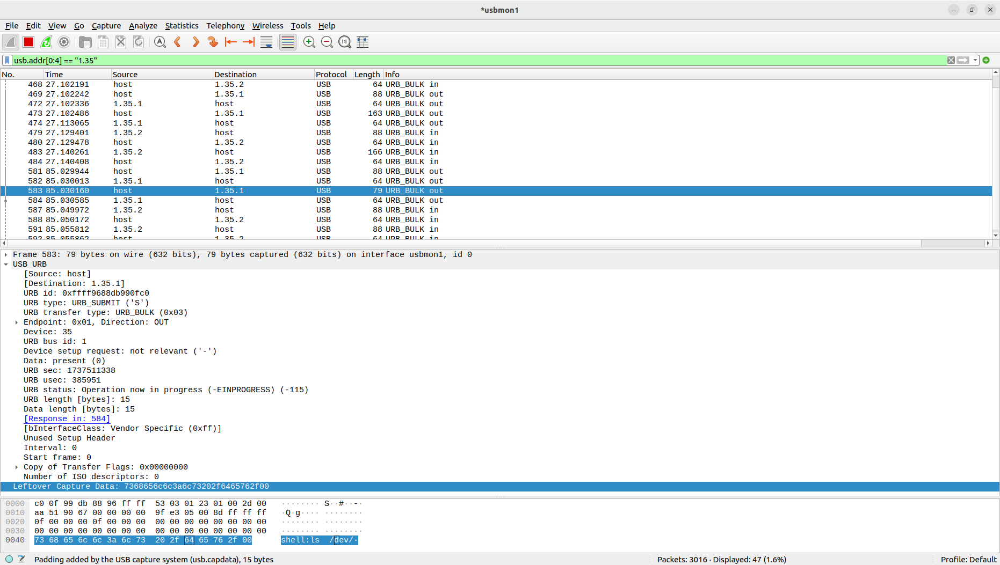

===================
USB 监控支持
===================

.. note:: 本文档翻译自 NuttX 官方文档，如需查阅最新版本请访问 https://nuttx.apache.org/docs/latest/

Wireshark
=========

当设备直接连接到主机时，Wireshark 软件 USB 捕获可以捕获 URB（USB 请求块）而不是原始 USB 数据包。要捕获原始 USB 数据包，需要嗅探器。

Linux
-----

1. 安装 Wireshark::

    sudo apt update
    sudo apt install wireshark

2. （可选）配置 Wireshark

  Wireshark 官方文档：https://wiki.wireshark.org/CaptureSetup/USB

3. 加载 usbmon 内核模块并运行 Wireshark::

    sudo modprobe usbmon
    sudo wireshark

4. 查找设备连接的总线::

    $ adb devices -l
    List of devices attached
    1234                   device usb:1-9.4 product:adb dev model:adb_board device:NuttX device transport_id:1000

    $ dmesg
    [3713722.861582] usb 1-9.4: New USB device found, idVendor=18d1, idProduct=4e11, bcdDevice= 1.01

    $ lsusb
    Bus 001 Device 035: ID 18d1:4e11 Google Inc. Nexus One

5. 过滤地址

  - 选择 usbmon (Bus 001)：usbmon1
  - Wireshark 过滤器 (Bus 001 Device 035)：usb.addr[0:4] == "1.35"

6. 示例

  使用过滤器 (usb.addr[0:4] == "1.35") 捕获 ADB 数据包，在开发板 `ESP32S3-DevKit:ADB <https://nuttx.apache.org/docs/latest/platforms/xtensa/esp32s3/boards/esp32s3-devkit/index.html#adb>`_ 上::

    adb -s 1234 shell ls /dev/

  示例 PcapNg（Packet CAPture Next Generation）文件可从 :download:`此处 <./usbmonitor_wireshark_linux_example_adb.pcapng>` 下载。

   Wireshark 捕获

