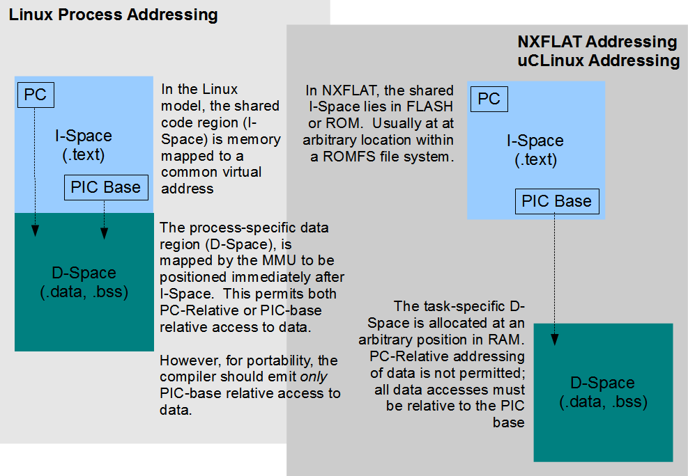

=================================
NuttX FLAT 二进制格式 (NXFLAT)
=================================

.. note:: 本文档翻译自 NuttX 官方文档，如需查阅最新版本请访问 https://nuttx.apache.org/docs/latest/

.. warning::
    迁移自:
    https://cwiki.apache.org/confluence/pages/viewpage.action?pageId=139630111

概述
========

NuttX 支持可配置的 :doc:`二进制加载器 <../binfmt>` 。
此二进制加载器支持从文件系统加载和执行二进制对象。
NuttX 二进制加载器能够支持多种二进制格式。
其中一种二进制格式就是 NXFLAT，即本 Wiki 页面的主题。

NXFLAT 是几年前实现的称为 XFLAT 的二进制格式的定制和简化版本。
使用 NXFLAT 二进制格式，您将能够执行以下操作：

* 将单独链接的程序放置在文件系统中，并且

* 通过将它们动态链接到基础 NuttX 代码来执行这些程序。

这允许您在将 NuttX 基础代码写入 FLASH 后对其进行扩展。
实现 NXFLAT 的一个动机是在 HTTPD 服务器下支持干净的 CGI。

此功能与 NuttX ROMFS 支持结合使用时特别有吸引力：
ROMFS 允许您在闪存中就地执行程序（XIP），除了将 .data 段复制到 RAM 外，不需要复制任何其他内容。
事实上，最初的 NXFLAT 版本只能在 ROMFS 上工作。
后来的扩展也支持从 SRAM 副本执行 NXFLAT 二进制文件。

此 NuttX 功能包括：

* 内置于 NuttX 核心的动态加载器（参见 SVN）。
* 对 RTOS 进行少量更改以支持位置无关代码，以及
* 一个链接器，用于将 ELF 二进制文件绑定以产生 NXFLAT 二进制格式（参见 SVN）。

工具链兼容性问题
===============================

描述
-----------

NXFLAT 平坦格式需要特定类型的位置无关性。
ARM 系列 GCC 工具链历来支持这种位置无关性方法：所有代码地址都相对于程序计数器（PC）访问，一个特殊的 `PIC 寄存器`（通常是 ``r10``）用于访问所有数据。要加载或存储数据值，``r10``（PIC 基址）的内容加上一个常量位置无关偏移量来产生数据的绝对地址。

`全局偏移表`（GOT）是一个位于 D-Space 中的特殊数据结构。因此，PIC 基址相对寻址也可以被指定为 GOT 相对寻址（或 ``GOTOFF``）。例如，较旧的 GCC 4.3.3 GCC 编译器生成 ``GOTOFF`` 重定位到常量字符串，如：

.. code-block:: asm

    .L3:
            .word   .LC0(GOTOFF)
            .word   .LC1(GOTOFF)
            .word   .LC2(GOTOFF)
            .word   .LC3(GOTOFF)
            .word   .LC4(GOTOFF)

其中 ``.LC0``、``.LC1``、``.LC2``、``.LC3`` 和 ``.LC4`` 是对应于 ``.rodata.str1.1`` 段中字符串的标签。其结果之一是 ``.rodata`` 必须位于 D-Space 中，因为它将相对于 GOT 寻址（参见此处标题为"RAM 中的只读数据"的部分）。

然而，较新的 4.6.3 GCC 编译器生成了对这些相同字符串的 PC 相对重定位：

.. code-block::

    .L2:
        .word   .LC0-(.LPIC0+4)
        .word   .LC1-(.LPIC1+4)
        .word   .LC2-(.LPIC2+4)
        .word   .LC3-(.LPIC4+4)
        .word   .LC4-(.LPIC5+4)

这些是 `PC 相对` 重定位。这意味着字符串数据不是通过相对于 PIC 寄存器（``r10``）的偏移量来寻址，而是相对于程序计数器（PC）来寻址。这既有好处也有坏处。好处是 ``.rodata.str1.1`` 现在可以与 ``.text`` 一起位于 FLASH 中，可以使用 PC 相对寻址来访问。这可以通过在链接器脚本中简单地将 ``.rodata`` 从 ``.data`` 段移动到 ``.text`` 段来实现。NXFLAT 链接器脚本位于 ``nuttx/binfmt/libnxflat/gnu-nxflat-?.ld``。**注意**：在 ``nuttx/binfmt/libnxflat/`` 中有两个链接器脚本：

1. ``binfmt/libnxflat/gnu-nxflat-gotoff.ld.`` 较旧版本的 GCC（至少到 GCC 4.3.3），使用 GOT 相对寻址来访问 RO 数据。在这种情况下，只读数据（``.rodata``）必须位于 D-Space 中，应使用此链接器脚本。
2. ``binfmt/libnxflat/gnu-nxflat-pcrel.ld.`` 较新版本的 GCC（至少从 GCC 4.6.3 起），使用 PC 相对寻址来访问 RO 数据。在这种情况下，只读数据（``.rodata``）必须位于 I-Space 中，应使用此链接器脚本。

但这非常糟糕，因为 NXFLAT 的很多部分现在都坏了。
因为似乎不仅仅是常量字符串，所有数据现在都可能使用 PC 相对寻址来引用 .bss 和 .data 值。我还不知道这个问题的范围或 GCC 的发展方向，但 4.6.3 版本肯定不能与 NXFLAT 一起使用。

目前的解决方法是使用较旧的 4.3.3 OABI 编译器。从长远来看，这可能意味着 NXFLAT 的终结。

更新：恢复了 GCC 支持
----------------------------

此帖子由 Michael Jung 指出：

.. code-block:: bash

    MCU: STM32F4 (ARM Cortex M4)
    Build environment: arm-none-eabi-gcc 4.8.4 20140725

    My goal is to build an image that can be run from any properly-aligned
    offset in internal flash (i.e., position-independent).  I found the
    following set of gcc flags that achieves this goal:

        # Generate position independent code.
        -fPIC

        # Access bss via the GOT.
        -mno-pic-data-is-text-relative

        # GOT is not PC-relative; store GOT location in a register.
        -msingle-pic-base

        # Store GOT location in r9.
        -mpic-register=r9

参考：https://gcc.gnu.org/ml/gcc-help/2015-07/msg00027.html

Michael 已验证 ``-mno-pic-data-is-text-relative`` 确实是解决上述较新编译器中 NXFLAT 问题的方案。您只需修改 board Make.defs 文件，如下：

1. ARCHPICFLAGS = -fpic -msingle-pic-base -mpic-register=r10

.. code-block:: bash

    +ARCHPICFLAGS = -fpic -msingle-pic-base -mpic-register=r10 -mno-pic-data-is-text-relative

注意与帖子的微小差异：NuttX 在所有配置中默认使用 ``r10`` 作为 PIC 基址寄存器。

参见此 `帖子 <https://groups.google.com/forum/>`_ 获取更多信息。

参考
----------

* :doc:`NXFLAT <../nxflat>`
* `XFLATFLAT <http://xflat.sourceforge.net/>`_
* `FLAT <http://retired.beyondlogic.org/uClinux/bflt.htm>`_
* `ROMFS <http://romfs.sourceforge.net/>`_