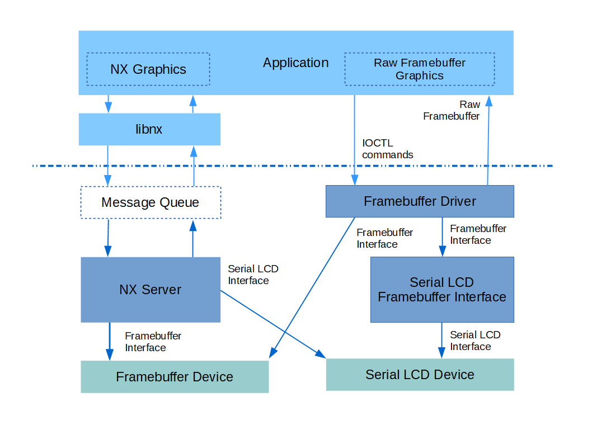

============================
Framebuffer Character Driver
============================

.. note:: 本文档翻译自 NuttX 官方文档，如需查阅最新版本请访问 https://nuttx.apache.org/docs/latest/

.. warning::
    迁移自：
    https://cwiki.apache.org/confluence/display/NUTTX/Framebuffer+Character+Driver

NX 图形
===========

NuttX 已经通过操作系统的 :doc:`/components/nxgraphics/index` 和面向应用的 :doc:`NxWidgets </applications/graphics/nxwidgets/index>` 以及小型窗口管理器 :doc:`NxWM </applications/graphics/nxwm/index>` 支持高级图形一段时间了。这些是高级的，因为其主要图形功能是支持窗口化以及窗口中工具和工具栏的控制。这些图形工具通常不能满足具有非常低端图形和最小显示需求的开发者的需要。

图 1
========

帧缓冲区字符驱动以及可选的 LCD 帧缓冲区接口是一个可选的更轻量级的图形接口。

帧缓冲区字符驱动详情
====================================

最近添加了一个 `帧缓冲区字符驱动` 以绕过 `NX` 的复杂性，并提供直接的应用程序到帧缓冲区图形设备的接口。帧缓冲区字符设备与所有字符设备一样，通过标准 POSIX VFS 命令（``open()``、``close()``、``read()``、``write()``、``seek()`` ...）、IOCTL 命令以及通过 ``mmap()`` 函数提供对图形设备的接口。这些接口在下面描述。

帧缓冲区字符驱动位于 NuttX 源代码树的 ``drivers/video/fb.c``。使用 ``CONFIG_VIDEO_FB=y`` 在构建中启用它。为了注册帧缓冲区驱动，您需要在板特定的启动函数中包含调用 ``fb_register()`` 的逻辑。该代码序列可能如下所示：

.. code-block:: c

    #include <nuttx/video/fb.h>

    #ifdef CONFIG_VIDEO_FB
    /* 初始化并注册模拟帧缓冲区驱动 */

    ret = fb_register(0, 0);
    if (ret < 0)
        {
        syslog(LOG_ERR, "ERROR: fb_register() failed: %d\n", ret);
        }
    #endif

``fb_register()`` 函数接受两个参数：

* `display`。对于支持多个显示器的板或支持多个图层（每个图层视为一个显示器）的硬件，此为显示器编号。通常为零。
* `plane`。标识在支持每个颜色分量单独帧缓冲区"平面"的硬件上的颜色平面。应为零，因为 NuttX 当前不支持平面硬件。

``fb_register()`` 将在 ``/dev/fbN`` 注册帧缓冲区字符设备，其中 `N` 是显示器编号（如果设备仅支持单个平面）。如果硬件支持多个颜色平面，则设备将注册在 ``/dev/fbN-M``，其中 `N` 再次是显示器编号，但 `M` 是显示平面。

在 ``apps/examples/fb`` 有一个简单的示例，提供了以下大部分接口方法的说明。

POSIX 接口
================

通过 POSIX VFS 接口调用与帧缓冲区字符驱动的交互与其他字符驱动相同。唯一可能需要额外讨论的方面是 ``read()``、``write()`` 和 ``seek()`` 的使用。

* ``read()`` 从帧缓冲区内存返回数据，并根据读取的字节数更新文件位置。
* ``write()`` 将数据放入帧缓冲区内存，并同时更新文件位置。

文件位置最初设置为位置零，表示帧缓冲区的开始。每次从帧缓冲区 ``read()`` 或 ``write()`` 时都会推进。``seek()`` 也会更新它：

* ``seek()`` 将文件位置设置为帧缓冲区内的任何期望位置。

文件位置以 `字节` 为单位。这可能会令人困惑，因为其他位置数据可能以 `像素` 为单位。不同显示器中的像素具有不同的 `深度`，即不同的图形硬件可能支持不同的每像素位数。像素深度可以使用下面列出的 IOCTL 命令之一获取。由于文件位置以字节为单位，在使用 ``read()``、``write()`` 和 ``seek()`` 时必须考虑每像素位数。从像素到字节的通常转换是：

.. code-block:: C

    start_byte = (start_pixel * bits_per_pixel) >> 3;
    end_byte   = (end_pixel * bits_per_pixel + 7) >> 3;

虽然可以使用这些 POSIX 接口访问帧缓冲区，但从应用程序与帧缓冲区交互的更典型方式是使用 ``mmap()``，如下所述。

IOCTL 命令
==============

* ``FBIOGET_VIDEOINFO``。获取颜色平面信息。其参数是指向 ``struct fb_videoinfo_s`` 的可写实例的指针：

  .. code-block:: c

    struct fb_videoinfo_s
    {
        uint8_t    fmt;         /* 参见 FB_FMT_*  */
        fb_coord_t xres;        /* 水平分辨率，像素列数 */
        fb_coord_t yres;        /* 垂直分辨率，像素行数 */
        uint8_t    nplanes;     /* 支持的颜色平面数 */
    };

* ``FBIOGET_PLANEINFO``。获取视频平面信息。它接收指向 ``struct fb_planeinfo_s`` 的可写实例的指针作为参数：

  .. code-block:: C

    struct fb_planeinfo_s
    {
        FAR void  *fbmem;       /* 帧缓冲区内存起始 */
        uint32_t   fblen;       /* 帧缓冲区内存长度（字节） */
        fb_coord_t stride;      /* 一行的长度（字节） */
        uint8_t    display;     /* 显示器编号 */
        uint8_t    bpp;         /* 每像素位数 */
    };

* ``FBIOGET_CMAP`` 和 ``FBIOPUT_CMAP``。获取/设置 RGB 颜色映射。这些命令仅在硬件和帧缓冲区驱动支持颜色映射（``CONFIG_FB_CMAP=y``）时可用。它们各自接收指向 ``struct fb_cmap_s`` 实例的指针作为参数（``FBIOGET_CMAP`` 可写，``FBIOPUT_CMAP`` 只读）。

  .. code-block:: c

    #ifdef CONFIG_FB_CMAP
    struct fb_cmap_s
    {
        uint16_t  first;        /* 表中第一个颜色条目的偏移 */
        uint16_t  len;          /* 表中颜色条目数 */

        /* 颜色分量表。未使用的可以为 NULL */

        uint8_t *red;           /* 8 位红色值表 */
        uint8_t *green;         /* 8 位绿色值表 */
        uint8_t *blue;          /* 8 位蓝色值表 */
    #ifdef CONFIG_FB_TRANSPARENCY
        uint8_t *transp;        /* 8 位透明度表 */
    #endif
    };
    #endif

* ``FBIOGET_CURSOR``。获取光标属性。此命令仅在硬件和帧缓冲区驱动支持光标（``CONFIG_FB_HWCURSOR=y``）时可用。它接收指向 ``struct fb_cursorattrib_s`` 的可写实例的指针：

  .. code-block:: c

    #ifdef CONFIG_FB_HWCURSOR
    #ifdef CONFIG_FB_HWCURSORIMAGE
    struct fb_cursorimage_s
    {
        fb_coord_t     width;    /* 光标图像宽度（像素） */
        fb_coord_t     height    /* 光标图像高度（像素） */
        const uint8_t *image;    /* 指向图像数据的指针 */
    };
    #endif

    struct fb_cursorpos_s
    {
        fb_coord_t x;            /* X 位置（像素） */
        fb_coord_t y;            /* Y 位置（行） */
    };

    #ifdef CONFIG_FB_HWCURSORSIZE
    struct fb_cursorsize_s
    {
        fb_coord_t h;             /* 高度（行） */
        fb_coord_t w;             /* 宽度（像素） */
    };
    #endif

    struct fb_cursorattrib_s
    {
    #ifdef CONFIG_FB_HWCURSORIMAGE
        uint8_t fmt;                   /* 光标的视频格式 */
    #endif
        struct fb_cursorpos_s  pos;    /* 当前光标位置 */
    #ifdef CONFIG_FB_HWCURSORSIZE
        struct fb_cursorsize_s mxsize; /* 最大光标大小 */
        struct fb_cursorsize_s size;   /* 当前大小 */
    #endif
    };
    #endif

* ``FBIOPUT_CURSOR``。设置光标属性。此命令仅在硬件和帧缓冲区驱动支持光标（``CONFIG_FB_HWCURSOR=y``）时可用。它接收指向 ``struct fb_setcursor_s`` 的可写实例的指针：

  .. code-block:: c

    #ifdef CONFIG_FB_HWCURSOR
    struct fb_setcursor_s
    {
        uint8_t flags;                /* 参见 FB_CUR_* 定义 */
        struct fb_cursorpos_s pos;    /* 光标位置 */
    #ifdef CONFIG_FB_HWCURSORSIZE
        struct fb_cursorsize_s  size; /* 光标大小 */
    #endif
    #ifdef CONFIG_FB_HWCURSORIMAGE
        struct fb_cursorimage_s img;  /* 光标图像 */
    #endif
    };
    #endif

* ``FBIO_UPDATE``。此 IOCTL 命令更新帧缓冲区中的矩形区域。某些硬件要求在对帧缓冲区进行更改时有此通知（参见下面关于 LCD 驱动的讨论）。如果定义了 ``CONFIG_NX_UPDATE=y`` 则可用此 IOCTL 命令。它接收指向描述要更新区域的 ``struct nxgl_rect_s`` 的只读实例的指针：

  .. code-block:: c

    struct nxgl_rect_s
    {
        struct nxgl_point_s pt1; /* 左上角 */
        struct nxgl_point_s pt2; /* 右下角 */
    };

* ``FBIOGET_PANINFOCNT``。检索当前 pan info 结构的数量。此 IOCTL 命令需要 overlay 索引作为参数。

``mmap()``
==========

上面我们讨论了使用 ``read()``、``write()`` 和 ``seek()`` 来访问帧缓冲区。然而，访问帧缓冲区最简单的方法是使用 ``mmap()`` 将帧缓冲区内存映射到应用程序内存空间。例如，以下 ``mmap()`` 命令可用于获取指向帧缓冲区的可读、可写副本的指针：

.. code-block:: c

    FAR void *fbmem;

    fbmem = mmap(NULL, fblen, PROT_READ|PROT_WRITE, MAP_SHARED|MAP_FILE, fd, 0);
    if (state.fbmem == MAP_FAILED)
    {
        /* 处理失败 */
        ...
    }

    printf("Mapped FB: %p\n", fbmem);

其中 fd 是打开的帧缓冲区字符驱动的文件描述符，``fblen`` 是通过上述 IOCTL 命令获取的。注意帧缓冲区指针也可在 IOCTL 命令返回的值中获得。该地址是内核内存地址，在所有构建配置中可能无效。因此，``mmap()`` 是获取帧缓冲区地址的首选、可移植方式。

帧缓冲区 vs. LCD 图形驱动
====================================

帧缓冲区图形驱动在高端 CPU 中非常常见，但大多数低端嵌入式硬件不支持帧缓冲区。

帧缓冲区图形驱动支持一个由软件和图形硬件共享的内存区域。对帧缓冲区内存的任何修改都会导致显示器上的相应修改，无需中间软件交互。某些显存是双端口的，以支持视频处理器和应用程序处理器的并发访问；或者 LCD 外设只是不断将帧缓冲区内存 DMA 到图形硬件。

大多数低端嵌入式 MCU 具有更简单的硬件接口：与 LCD 的接口可能通过简单的并行接口，或者更常见的是通过较慢的串行接口（如 SPI）。为了用帧缓冲区字符驱动支持此类低端硬件，开发了一个称为 `帧缓冲区 LCD 前端` 的特殊软件层。这是下一段的主题。

LCD 帧缓冲区前端
=========================

`LCD 帧缓冲区前端` 提供标准的 NuttX 帧缓冲区接口，但工作在标准并行或串行 LCD 驱动之上。它提供帧缓冲区、帧缓冲区接口以及适配 LCD 驱动的钩子。LCD 帧缓冲区前端可在 NuttX 源代码树的 ``drivers/lcd/lcd_framebuffer.c`` 中找到。

为了在更新帧缓冲区后向 LCD 硬件提供更新，当帧缓冲区发生重大更改时，必须通知 LCD 帧缓冲区前端。当在配置中定义了 ``CONFIG_NX_UPDATE=y`` 时支持此通知。在这种情况下，LCD 帧缓冲区前端将支持特殊的 OS 内部接口函数 ``nx_notify_rectangle()``，该函数定义帧缓冲区中已更改的矩形区域。响应 ``nx_notify_rectangle()`` 的调用将使用低级 LCD 接口仅更新显示器上的该矩形区域。

这种对标准 LCD 驱动的更新非常高效：更新显示器上的区域通常比用文本和绘图形成复杂图像更高效；因此更新区域看起来更新得非常快。事实上，许多低端 LCD 驱动已经包含内部帧缓冲区以支持这种 LCD 更新风格。

当与 LCD 字符驱动一起使用时，``nx_notify_rectangle()`` 函数将由字符驱动在响应 ``FBIO_UPDATE IOCTL`` 命令时调用。

帧缓冲区的另一个优势，包括 LCD 内部帧缓冲区和帧缓冲区字符驱动，是超高效的 LCD 显示内存读取：完全不读取 LCD 显示内存！读取来自帧缓冲区中的副本。

当然，同时使用 LCD 内部帧缓冲区和帧缓冲区字符驱动是浪费的；一个帧缓冲区就够了！

需要注意的是，帧缓冲区可能相当大。例如，480x320 显示器使用 16 位 RGB 像素需要分配 300 KiB 大小的帧缓冲区。这不适合大多数小型 MCU（除非它们支持外部内存）。对于小型显示器，如 128x64 1 位单色显示器，帧缓冲区内存使用量并不大：该示例中为 1 KiB。

帧缓冲区图形库
============================

现在缺少的是一种应用空间帧缓冲区图形库。NuttX 帧缓冲区驱动表面上类似于 Linux 帧缓冲区驱动，因此有很多 Linux 帧缓冲区图形支持应该很容易移植到 NuttX -- 也许 DirectFB 会是一个 GPL 选项？具有 MIT 许可证的 SDL 可能是此类移植的更兼容来源。
