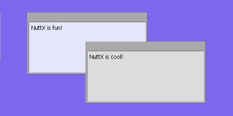
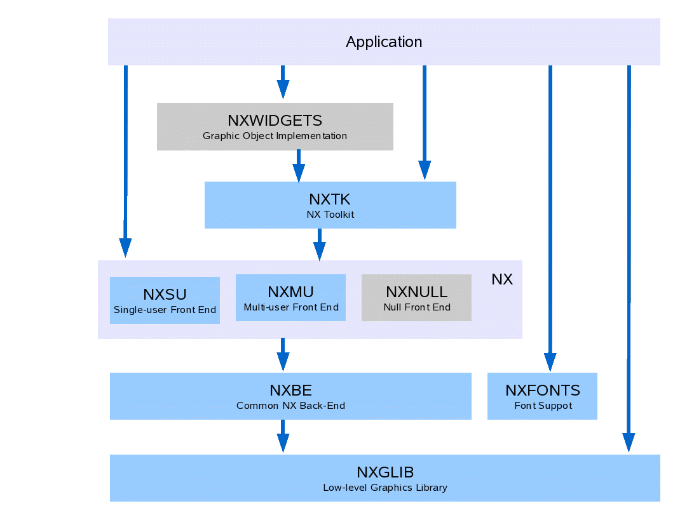

.. _nxgraphics:

=====================
.. note:: 本文档翻译自 NuttX 官方文档，如需查阅最新版本请访问 https://nuttx.apache.org/docs/latest/

NX 图形子系统
=====================

本文档描述 the tiny graphics 支持 included in NuttX. It
includes an overview description of that graphics 支持, detailed
descriptions of the NuttX graphics APIs, and discussion of code
organization, and OS 配置 选项s.



  **Figure 1**. This 屏幕shot shows the final frame for the NuttX example
  at ``apps/examples/nx`` 运行ning on the simulated, Linux x86 platform with
  simulated frame缓冲区 输出 to an X 窗口. This picture shows to framed 窗口
  with (blank) toolbars. Each 窗口 has 显示ed 文本 as 接收d from the
  NX keyboard 接口 The second 窗口 has just been raised to the top of the 显示.

目标
==========

The objective of this development was to provide a tiny 窗口ing system
in the spirit of X, but greatly scaled down and appropriate for most
resource-limited embedded environments. The current NX implementation
支持s the general following, high-level 特性s:

-  **Virtual Vertical Graphics Space**. 窗口s that reside in a
   virtual, *vertical* space so that it makes sense to talk about one
   窗口 being on top of another and obscuring the 窗口 below it.
-  **Client/Server Model**. A standard client server/model was adopted.
   NX may be considered a server and other logic that presents the
   窗口s are NX clients.
-  **Multi-User 支持**. NX includes *front-end* logic to 支持 a
   separate NX server th读取 that can serve multiple NX client th读取s.
   The NX is a server th读取/daemon the serializes graphics 操作s
   from multiple clients.
-  **Minimal Graphics Tool设置**. The actual implementation of the
   graphics 操作s is performed by common, *back-end* logic. This
   back-end 支持s only a primitive 设置 of graphic and rendering
   操作s.
-  **设备 接口**. NX 支持s any graphics 设备 either of two
   设备 接口s:

   -  Any 设备 with random access video 内存 using the NuttX
      frame缓冲区 驱动 接口 (see ``include/nuttx/video/fb.h``).
   -  Any LCD-like 设备 than can accept raster line *运行s* through a
      parallel or serial 接口 (see ``include/nuttx/lcd/lcd.h``). By
      默认, NX is configured to use the frame 缓冲区 驱动 unless
      ``CONFIG_NX_LCDDRIVER`` 定义 =y in your NuttX 配置
      文件.

-  **Transparent to NX Client**. The 窗口 client on "sees" the
   sub-窗口 that is operates in and does not need to be concerned with
   the virtual, vertical space (other that to respond to *redraw*
   requests from NX when needed).
-  **Framed 窗口s and Toolbars**. NX also 添加s the capability to
   支持 窗口s with frames and toolbars on top of the basic
   窗口ing 支持. These are 窗口s such as those shown in the
   `屏幕shot <#屏幕shot>`__ above. These framed 窗口s sub-divide
   one one 窗口 into three relatively independent sub窗口s: A frame,
   the contained 窗口 and an (选项al) toolbar 窗口.
-  **Mouse 支持**. NX provides 支持 for a mouse or other X/Y
   pointing 设备s. APIs 提供 to allow external 设备s to give
   X/Y position information and mouse button presses to NX. NX will then
   provide the mouse 输入 to the relevant 窗口 clients via callbacks.
   Client 窗口s only 接收 the mouse 输入 callback if the mouse is
   positioned over a visible portion of the client 窗口; X/Y position
   提供 to the client in the relative coordinate system of the
   client 窗口.
-  **Keyboard 输入**. NX also 支持s keyboard/keypad 设备s. APIs
   提供 to allow external 设备s to give keypad information to
   NX. NX will then provide the mouse 输入 to the top 窗口 on the
   显示 (the 窗口 that has the *focus*) via a callback 函数.

组织结构
============

NX is organized into 6 (and perhaps someday 7 or 8) logical modules.
These logical modules also correspond to the 目录 organization.
That NuttX 目录 organization is discussed in `Appendix
B <#grapicsdirs>`__ of this document. The logic modules are discussed in
以下 sub-paragraphs.



NX Graphics Library (``NXGL``)
------------------------------

NXGLIB is a standalone library that contains low-level graphics
utilities and direct frame缓冲区 or LCD rendering logic. NX is built on
top NXGLIB.

NX (``NXSU`` and ``NXMU``)
--------------------------

NX is the tiny NuttX 窗口ing system for raw 窗口s (i.e., simple
regions of graphics 内存). NX includes a small-footprint, multi-user
implementation (NXMU as described below). NX 可用于 without
NxWid获取s and without NXTOOLKIT for raw 窗口 显示s.

:sup:`1`\ NXMU and NXSU are interchangeable other than (1) certain
启动-up and initialization APIs (as described below), and (2) timing.
With NXSU, NX APIs 执行 immediately; with NXMU, NX APIs defer and
serialize the 操作s and, hence, introduce different timing and
potential race conditions that you would not experience with NXSU.

**NXNULL?** At one time, I also envisioned a *NULL* front-end that did
not 支持 窗口ing at all but, rather, simply provided the entire
frame缓冲区 or LCD 内存 as one dumb 窗口. This has the advantage
that the same NX APIs 可用于 on the one dumb 窗口 as for the
other NX 窗口s. This would be in the NuttX spirit of scalability.

However, the same end result can be obtained by using the
```nx_requestbkgd()`` <#nxrequestbkgd>`__ API. It still may be possible
to reduce the footprint in this usage case by developing and even
thinner NXNULL front-end. That is a possible future development.

NX Tool Kit (``NXTK``)
----------------------

NXTK is a s 设置 of C graphics tools that provide higher-level 窗口
drawing 操作s. 这是 the module where the framed 窗口s and
toolbar logic is implemented. NXTK is built on top of NX and does not
depend on NxWid获取s.

NX Fonts Support (``NXFONTS``)
------------------------------

A 设置 of C graphics tools for present (位map) font 图像s. The font
implementation is at a very low level or graphics 操作, comparable
to the logic in NXGLIB. NXFONTS does not depend on any NX module other
than some utilities and 类型s from NXGLIB.

NX Widgets (``NxWidgets``)
--------------------------

:ref:`NxWid获取s <nxwid获取s>` is a higher level, C++, object-oriented
library for object-oriented access to graphical "wid获取s." NxWid获取s is
provided as a separate library in the ``apps/`` repository NxWid获取s is
built on top of the core NuttX graphics subsystem, but is part of the
application space rather than part of the core OS graphics subsystems.

Terminal Driver (``NxTerm``)
----------------------------

NxTerm is a 写入-only character 设备 (not shown) that is built on top
of an NX 窗口. This character 设备 可用于 to provide ``stdout``
and ``stderr`` and, hence, can provide the 输出 side of NuttX console.
).

NX 头文件
===============

``include/nuttx/nx/nxglib.h``
   Describes the NXGLIB C 接口s
``include/nuttx/nx/nx.h``
   Describes the NX C 接口s
``include/nutt/nxtk.h``
   Describe the NXTOOLKIT C 接口s
``include/nutt/nxfont.h``
   Describe sthe NXFONT C 接口s

.. toctree::
  :Caption: User APIs

  nxgl.rst
  nx.rst
  nxtk.rst
  nxfonts.rst
  nxcursor.rst
  nxwm_th读取ing.rst
  frame缓冲区_char_驱动.rst
  sample.rst
  appendix.rst

