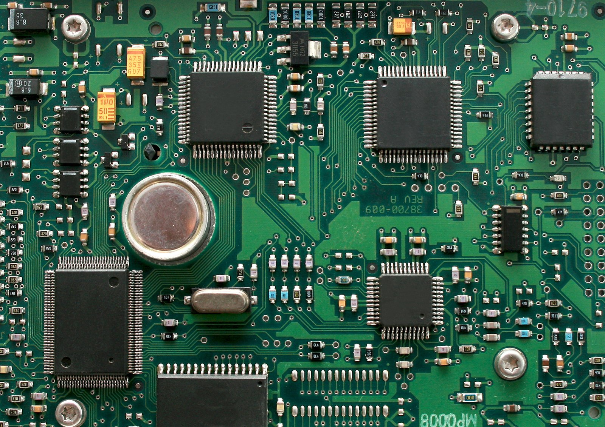

===========================
板级文档示例
===========================

.. tags:: chip:example, arch:example, vendor:example

.. 在页面最顶部放置您的标签部分！您应该包含适用于您板的
   任何标签，例如它使用的芯片、架构、任何外设（即 ``ethernet``）等。

   这是图像说明。替换为您的板的图像和名称！

在标签之后，编写关于板的简短描述。这应该包括
制造商、它通常用于什么，或它的一些主要功能（例如
专门为温室监控制作的板）。您还可以在此处链接到
外部网页，例如板的制造商文档页面。

功能
========

.. 在此处应列出板的一些关键功能。下面包含了一些示例
   供您开始，或查看其他现有板级文档。这些信息大部分
   可以从制造商网站复制。

* 芯片名称
* 关键芯片功能 1 (FPU)
* 关键芯片功能 2 (4 核)
* 可访问的 GPIO 引脚数量
* 板载传感器
* 可访问的 UART 接口数量
* WiFi 支持
* 等等

如果您的 NuttX 实现中此板有任何不支持的功能，
请在此处提及。

.. warning::

   如果某些功能部分实现但属于实验性的，请添加警告。
   如果您只支持 2/3 个 SPI 接口或无法配置频率等，
   不要说"支持 SPI"来让用户失望。

.. todo::

   如果您希望帮助实现某些重要功能（例如 WiFi 芯片的 WiFi 驱动程序），
   您也可以添加 TODO 请求贡献者帮助。

.. note::

   不要列出板使用的芯片的大量特定功能。那是芯片文档
   要涵盖的内容（以及列出未实现的芯片功能）。
   例如，不要列出"此板有 I2C"，如果它不是用户可访问的，
   而只是用于与外设通信。

按钮和 LED
================

如果板有任何用户按钮，请在此处描述。

如果板有任何 LED，请在此处描述。如果您的 NuttX 实现
使用特定 LED 来显示状态，您可以在此处进一步解释。
示例："标记为 'LED1' 的红色 LED 将以 1Hz 闪烁表示内核 panic"。

一些重要功能
======================

您可以添加像这样的章节来描述您的板支持的重要功能。
一个示例可能是网络支持（它使用 WiFi 吗，什么频率，
什么芯片，哪些协议，有什么限制等）。

引脚映射
===========

告诉用户板的默认引脚映射。如果您的板使用通常有 ``n`` 个 GPIO
引脚的芯片，但其中一些现在保留给板外设（例如 RP2040
有两个 SPI 接口，但现在其中一个保留，因为它连接到板载以太网芯片），
这一点尤其关键。

您需要制作一个类似下表的表格。至少包含引脚号、
GPIO 号（如果与引脚号不同）和有关引脚功能的一些注释。

===== ========== ==========
引脚   信号       备注
===== ========== ==========
1     GPIO0      UART0 串行控制台默认 TX
2     GPIO1      UART0 串行控制台默认 RX
3     Ground
4     GPIO2
5     GPIO3
6     GPIO4      I2C0 默认 SDA
7     GPIO5      I2C0 默认 SCL
8     Ground
9     GPIO6      I2C1 默认 SDA
10    GPIO7      I2C1 默认 SCL
11    VCC        3V3
===== ========== ==========

电源
============

任何关于电源的重要信息。如果您愿意，可以链接到
制造商文档。解释有效的输入电压范围并提及电源系统的
任何特殊问题应该就足够了。

如果板逻辑有一些电源管理实现，您也可以在此处解释。

安装
============

在此处告诉用户如何安装在此板上构建 NuttX 所需的任何工具。
您不需要重新解释安装 NuttX，但您需要列出如何获取
任何额外工具链的信息。

尽可能链接到现有文档。您的板基于某个芯片，
需要安装的工具链与使用此芯片的所有板相同？
链接到该芯片的文档页面，其中包含安装说明。
您的板需要 OpenOCD 来烧录？链接到 OpenOCD
安装指南。

.. 注意：您可以使用 :doc:`文本 <path/to/docpage>` 指令链接到现有文档。
   不要在文件路径末尾包含 `.rst`。

如果有任何可以给用户的简单命令，请创建一个像这样的控制台代码块：

.. code:: console

   $ mkdir somedir
   $ cd some-dir
   $ git clone --recursive <somerepo>
   $ make build
   $ make install

用户可以复制粘贴这些命令以使设置过程更容易。请记住，
NuttX 支持在不仅仅是 Linux 系统上构建，因此如果适用/可能，
请包含其他操作系统的额外安装信息。

构建 NuttX
==============

告诉用户如何为此板构建 NuttX。这应该包括任何不是
仅使用 ``./tools/configure.sh`` 和运行 ``make`` 的特殊过程。

.. 如果构建过程对于使用此芯片的所有板都相同，请链接到芯片文档页面。

如果您的板在 Kconfig 中有任何用户应该了解的特定配置选项，
请描述它们！

* ``CONFIG_ENABLE_COOL_FEATURE``：启用此板最酷的功能
* ``CONFIG_SOMETHING_ELSE``：在板上启用其他功能

烧录
========

向用户解释如何将 NuttX 映像烧录到板上。如果有多种方法，
请全部列出。

.. 如果烧录信息对于使用此芯片的所有板都相同，请链接到芯片文档页面。
   您可能只需要告诉用户需要使用板上的哪个连接器。

如果您的烧录过程有步骤，请编号！

1. 准备 SD 卡
2. 将文件复制到 SD 卡
3. 插入 SD 卡
4. 开机

配置
==============

板带有一个或多个配置预设以让用户开始使用。
通常它们包括某种到 NSH 的 shell 接口，当板有主要功能
（如 WiFi 或特定传感器）时，也有利用该功能的配置。

您应该提到 ``tools/configure.sh`` 命令的板"标识符"（名称），
以便用户知道如何访问配置。

.. code:: console

   $ ./tools/configure.sh <your-board-name>:<config-name>

nsh
---

在子标题下，列出可用的配置。一个常见的是 ``nsh``，
它通过 UART 提供对 NSH shell 的一些基本访问。

配置描述应该告诉用户使用它所需的一切。
shell 的波特率是多少？什么接口？他们需要特殊的调试探针
来与之交互吗？LED 应该亮起来吗？

告诉用户您在配置中包含的任何特定应用程序。在这种情况下，
他们有 NSH 可以使用。也许他们可以运行
:doc:`getprime </applications/testing/getprime/index>` 来测试处理速度？
尽可能链接到这些应用程序的文档。

usbnsh
------

同样的，但是基于 USB 的 shell。

wifi
----

一些主要功能，在这种情况下是 WiFi。告诉用户如何使用
您在配置中包含的示例或应用程序来使用它。

许可证例外
==================

如果板依赖于任何非 NuttX 贡献者编写的代码，
并且它受不同许可证约束，您应在此处标识。
列出文件名并说明适用的许可证。

* ``some/file/driver.c``：BSD 许可的驱动程序代码
* ``some/file/blob.bin``：GPLv3 许可的专有芯片驱动程序二进制文件

.. 如果这些许可证例外中的任何一个是特定于芯片支持代码的，而不仅仅是
   这一个板，请链接回芯片文档页面而不是重复。
