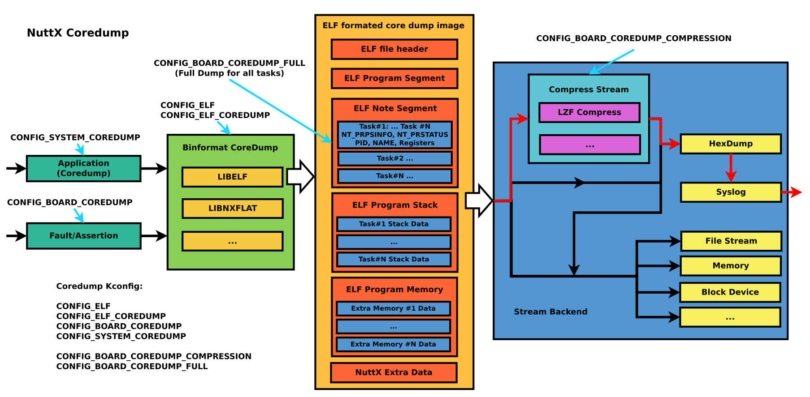

=========
核心转储
=========

.. note:: 本文档翻译自 NuttX 官方文档，如需查阅最新版本请访问 https://nuttx.apache.org/docs/latest/

概述
========

使用方法
-----------

1. 启用 NuttX 核心转储

启用 Kconfig 配置项

    .. code-block:: console

      CONFIG_COREDUMP=y                   /* 启用 Coredump */

      CONFIG_BOARD_COREDUMP_SYSLOG=y      /* 启用板级 Coredump，当发生异常和断言时， */

      CONFIG_SYSTEM_COREDUMP=y            /* 启用用户命令中的 coredump，可以在系统运行时捕获一个或所有线程的当前状态，
                                             输出可以重定向到控制台或文件 */

      CONFIG_BOARD_COREDUMP_COMPRESSION=y /* 默认为 y，启用 Coredump 压缩以
                                             减少原始核心镜像的大小 */

      CONFIG_BOARD_COREDUMP_FULL=y        /* 默认为 y，保存所有任务信息 */

2. 在 nsh 中运行 Coredump（CONFIG_SYSTEM_COREDUMP=y）

coredump 工具的参数

    .. code-block:: console

      $ coredump <pid>        /* 如果指定了 pid，coredump 将只捕获指定 pid 的线程，
                                 否则将捕获所有线程 */

      $ coredump <filename>   /* 如果指定了文件名，则 coredump 默认输出到指定文件，
                                 否则将重定向到 stdout 流 */

3. 从 stdout 捕获 coredump

将图中红色框部分的输出保存为文件

    .. image:: image/coredump-hexdump.png

    .. code-block:: console

      $ cat elf.dump
      [CPU0] [ 6] 5A5601013D03FF077F454C4601010100C0000304002800C00D003420036000070400053400200008200A4000000420030034C024200001D8092004E00200601A
      ...
      [CPU0] [ 6] 401B018D37814720005A5601000800090100006000010000

4. 转换转储文件

如果核心文件经过了 lzf 压缩和 hexdump 流的后处理，执行 coredump 脚本（`tools/coredump.py
<https://github.com/apache/nuttx/blob/master/tools/coredump.py>`_）将十六进制转换为二进制并进行 lzf 解压缩。如果命令行中未添加 -o 参数，将自动生成 <原始文件名>.core 的输出：

    .. code-block:: console

      $ ./nuttx/tools/coredump.py elf.dump
      Core file conversion completed: elf.core

5. 使用 gdb 分析

生成 elf.core 后，结合编译好的 nuttx.elf，可以直接通过 gdb 查看所有线程的调用栈和相关寄存器信息：

（注意：工具链版本必须高于 11.3）

    .. code-block:: console

      $ prebuilts/gcc/linux/arm/bin/arm-none-eabi-gdb -c elf.core nuttx

    .. image:: image/coredump-gdb.png
