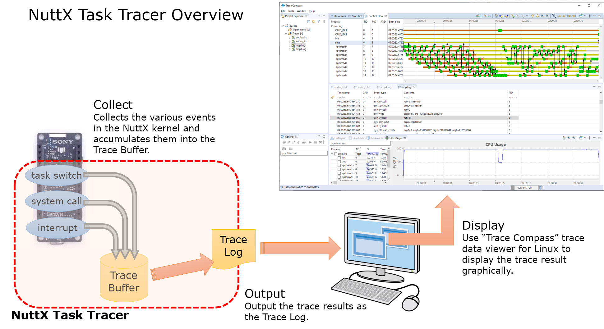

==========
Task Trace
==========

.. note:: 本文档翻译自 NuttX 官方文档，如需查阅最新版本请访问 https://nuttx.apache.org/docs/latest/

Task Trace is the tool to collect the various events in the NuttX kernel and display the result graphically.

It can collect the following events.

  - Task execution, termination, switching
  - System call enter/leave
  - Interrupt handler enter/leave

.. toctree::
  :maxdepth: 1
  :caption: Contents:

  tasktraceuser.rst
  tasktraceinternal.rst

