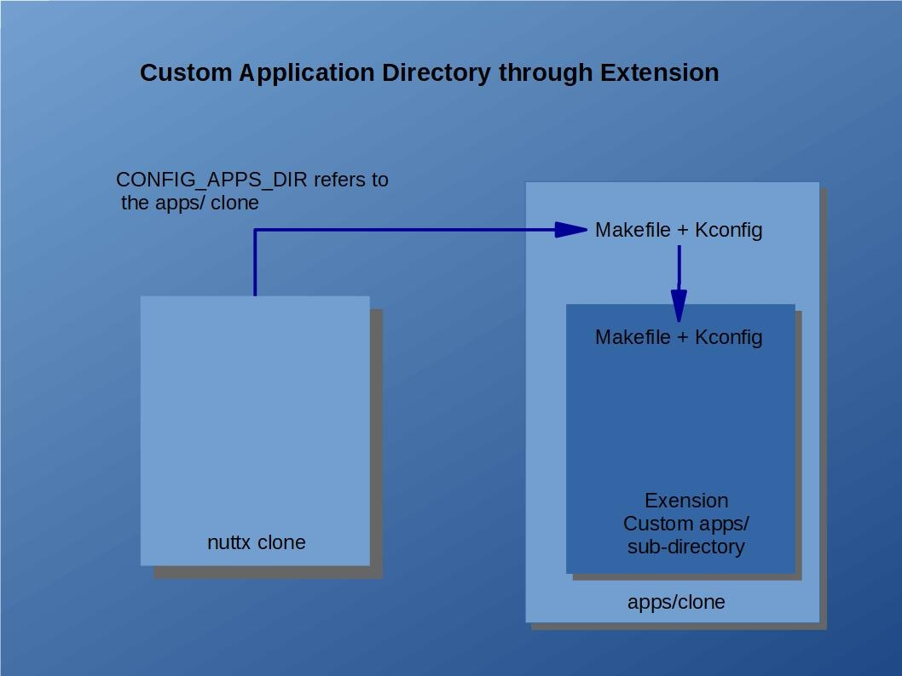
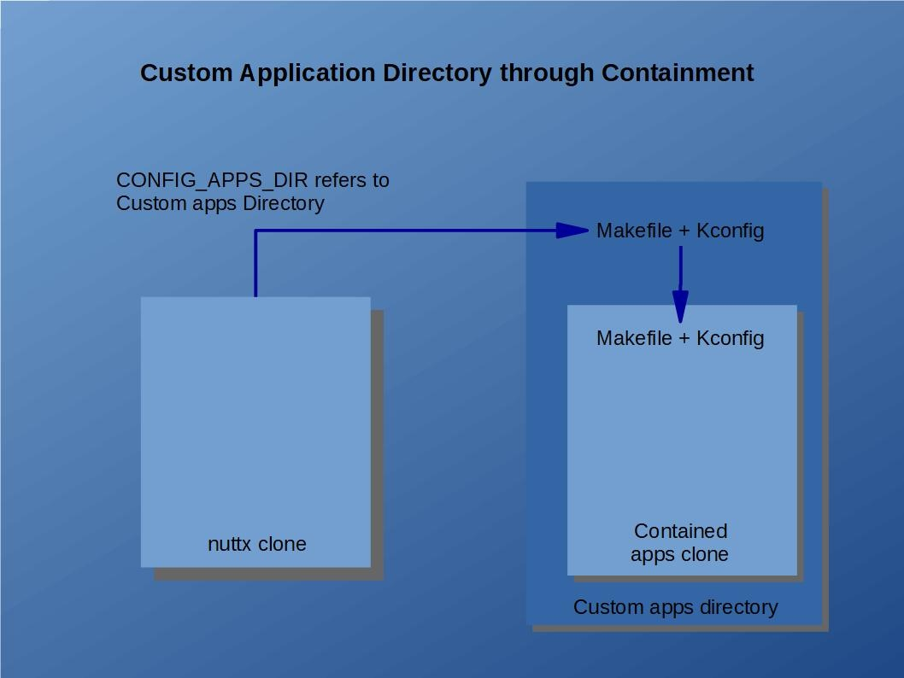

========================================================
在源码树外构建 NuttX 及应用程序
========================================================

.. warning:: 
    迁移自: 
    https://cwiki.apache.org/confluence/display/NUTTX/Building+NuttX+with+Applications+Outside+of+the+Source+Tree

问：是否有人找到了在源码树外构建 NuttX 及板级特定部分的简洁方法？
========================================================================================================

答：以下是四种方法：
============================

1. Make export
--------------

有一个名为 ``make export`` 的 make 目标。它将构建 NuttX，然后将所有头文件、库、启动对象和其他构建组件打包到一个 ``.zip`` 文件中。您可以将该 ``.zip`` 文件移动到任何您想要的构建环境中。您甚至可以在 DOS CMD 窗口下构建 NuttX。

该 ``make target`` 在顶层 :doc:`Legacy README </introduction/resources>` 中有文档说明。搜索 ``Build Targets``

1. 替换 apps/ 目录
------------------------------

您可以替换整个 ``apps/`` 目录。它不是操作系统的关键部分。``apps/`` 只是为了帮助您进行应用程序开发而提供的。它不应该决定您做的任何事情。

要使用不同的 ``apps`` 目录，只需在顶层 ``nuttx/`` 目录中执行 ``make menuconfig``，并在 ``.config`` 文件中重新定义 ``CONFIG_APPS_DIR`` 使其指向不同的自定义应用程序目录。请注意，``CONFIG_APPS_DIR`` 是从顶层 ``nuttx/`` 目录的 `相对` 路径。

您可以根据需要将旧 ``apps/`` 目录中的任何内容复制到自定义 ``apps`` 目录中。这在 `NuttX 移植指南 <https://cwiki.apache.org/confluence/display/NUTTX/Porting+Guide>`_ 和 `apps/README.md <https://github.com/apache/nuttx-apps/blob/master/README.md>`_ 文件中有文档说明。

1. 扩展 apps/ 目录
-----------------------------

如果您喜欢 ``apps/`` 目录中的随机集合，但只想用自己的外部子目录扩展现有组件，那么也有一个简单的方法：在 ``apps/`` 目录中创建一个符号链接，重定向到您的应用程序子目录（或将代码复制到 ``apps/`` 的子目录中）。

Makefile 和 Make.defs
^^^^^^^^^^^^^^^^^^^^^^

为了被纳入构建，您在 ``apps/`` 目录下链接的目录应包含：

1. 一个支持 ``clean`` 和 ``distclean`` 目标的 ``Makefile``（参见其他 Makefile 获取示例）。
2. 一个小型的 ``Make.defs`` make 文件片段，简单地将构建目录添加到变量 ``CONFIGURED_APPS`` 中，如下所示：

.. code-block:: shell

   CONFIGURED_APPS += my_directory1 my_directory2

自动子目录包含
^^^^^^^^^^^^^^^^^^^^^^^^^^^^^^^^^

``apps/Makefile`` 将始终自动检查包含 ``Makefile`` 和 ``Make.defs`` 文件的子目录是否存在。``Makefile`` 仅用于支持清理操作。``Make.defs`` 文件提供要构建的目录的相对路径集合；这些目录也必须包含一个 ``Makefile``。该 ``Makefile`` 可以构建源文件并将目标文件添加到 ``apps/libapps.a`` 归档中（参见其他 Makefile 获取示例）。它应支持 ``all``、``install``、``context`` 和 ``depend`` 目标。

``apps/Makefile`` 不依赖于任何硬编码的目录列表。相反，它进行通配符搜索以找到所有适当的目录。这意味着要安装新应用程序，您只需将目录复制（或链接）到 ``apps/`` 目录中。如果新目录包含 ``Makefile`` 和 ``Make.defs`` 文件，则它将被自动发现并在 ``make`` 时包含在构建中。

Kconfig
^^^^^^^

如果您添加的目录还包含 ``Kconfig`` 文件，那么它也将被自动包含在 NuttX 配置系统中。``apps/Makefile`` 使用 ``apps/tools/mkkconfig.sh`` 中的工具在预配置时动态构建 ``apps/Kconfig`` 文件。

.. note::

   原生 Windows 构建将使用名为 ``apps/tools/mkconfig.bat`` 的相应工具。

安装脚本
^^^^^^^^^^^^^^

例如，您可以创建一个名为 ``install.sh`` 的脚本来安装自定义应用程序、配置和板级特定目录：

1. 将 ``MyBoard`` 目录复制到 ``boards/MyBoard``。
2. 在 ``apps/external`` 添加指向 ``MyApplication`` 的符号链接
3. 配置 NuttX：

.. code-block:: shell

   tools/configure.sh MyBoard:MyConfiguration

特殊 ``apps/external`` 目录
^^^^^^^^^^^^^^^^^^^^^^^^^^^^^^^^^^^^

建议使用名称 ``apps/external``，因为该名称包含在 ``.gitignore`` 文件中，在使用 GIT 时将为您省去一些麻烦。

4. 包含 apps/ 目录
------------------------------

一种简单、最小侵入性的方法是将 ``apps/`` GIT 克隆包含在您的自定义应用程序目录中。在这种情况下，``apps/`` 将作为自定义应用程序目录下的目录出现，而不是您的应用程序目录作为 ``apps/`` 的子目录插入。它甚至可以作为自定义应用程序目录的子模块实现。

Kconfig 和 Makefile
^^^^^^^^^^^^^^^^^^^^

您的自定义应用程序目录只有几个最低要求。它只需要有自己的 ``Makefile`` 和 ``Kconfig`` 文件。该 ``Kconfig`` 需要包含 ``apps/Kconfig``。``Makefile`` 同样需要为所有相关的构建目标调用 ``apps/Makefile``。例如，``clean`` 目标：

.. code-block:: shell

  $(MAKE) -c apps clean TOPDIR=$(TOPDIR)

库问题
^^^^^^^^^^^^^^

包含的目录将在 ``nuttx/staging`` 目录中创建并安装名为 ``libapps($LIBEXT)`` 的静态库。您的自定义逻辑也必须出现在 ``nuttx/staging`` 目录中。以下是两种可能的方法：

1. **与 ``libapps($LIBEXT)`` 合并。**  
   自定义应用程序目录的 ``Makefile`` 可以在 ``nuttx/staging`` 目录中创建并安装最终的 ``libapps($LIBEXT)``。
   ``<custom-dir>/apps/libapps($LIBEXT)`` 可以将其自定义目标文件与 ``<custom-dir>/libapps($LIBEXT)`` 合并，然后将库重新安装到 ``nuttx/staging``。
2. **使用 EXTRA_LIBS 功能。**  
   构建系统支持两个特殊的 make 相关变量，称为 ``EXTRA_LIBS`` 和 ``EXTRA_LIBPATHS``。这些可以在您的板级特定 ``Make.defs`` 文件中定义。``EXTRA_LIBS`` 提供自定义库的名称。如果您创建 ``<custom-dir>/libcustom.a``，则 ``EXTRA_LIBS`` 的值为 ``-lcustom``，``EXTRA_LIBPATHS`` 的值为 ``-L <custom-dir>``（假设使用 GNU ld 链接器）。

相对工作量和收益
^^^^^^^^^^^^^^^^^^^^^^^^^^^^

包含的 ``apps/`` 目录方法比扩展的 ``apps/`` 方法需要更多工作，但优点是不会因 ``.gitignore`` 问题而产生奇怪的行为，从而提供更清洁的用户体验。

树外构建
^^^^^^^^^^^^^^^^^^

此配置还支持使用 ``fusefs`` 进行树外构建的可能性。假设您有一个项目目录，其中包含 ``apps/`` 目录和三个平台构建目录。使用 ``fusefs``，您可以将其中一个平台构建目录覆盖在项目目录之上。然后构建生成的所有文件将写入覆盖的平台构建目录。当 ``fusefs`` 被拆除时，项目目录将保持干净，构建结果仍在平台构建目录中。然后可以对其他两个平台构建目录重复此操作。

在这种情况下，您可能还想将 ``nuttx/`` 目录也包含在项目目录中，以便整个系统在树外构建。

将外部应用程序接入配置系统
-----------------------------------------------------------

假设您选择使用自定义外部应用程序目录扩展 ``apps/`` 目录，并且还希望在外部应用程序中支持配置变量。没问题！感谢 Sebastien Lorquet，您安装到 ``apps/`` 中的任何外部应用程序（无论是通过符号链接还是目录复制）都将被包含在 NuttX 配置系统中。

``apps/`` 目录中的顶层 ``Kconfig`` 文件是根据每个 ``apps/`` 子目录的内容自动生成的。如果您安装的子目录包含 ``Kconfig``、``Makefile`` 和 ``Make.defs`` 文件，那么在生成顶层 ``Kconfig`` 文件时，它将被纳入 NuttX 配置系统。
