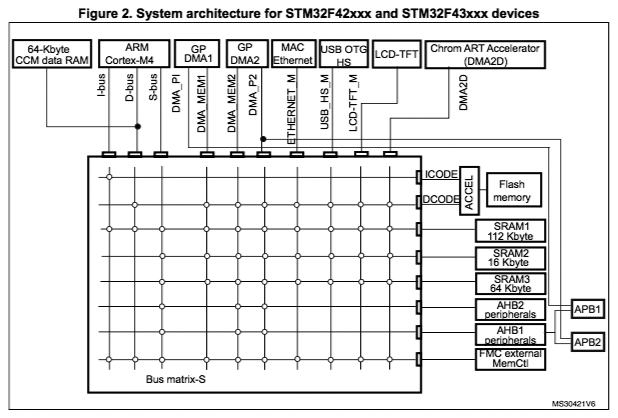
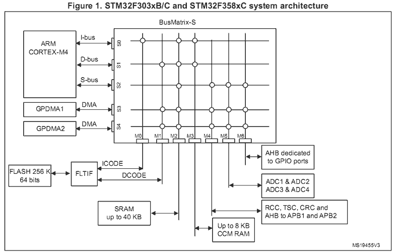

=================================
ELF 程序 — 带符号表
=================================

你可以通过文件系统提供的 ELF 程序轻松扩展已发布的嵌入式系统中的固件。
例如，通过 SD 卡或下载到板载 SPI FLASH 中。

为了支持这种发布后的更新，你发布的固件必须支持执行加载到 RAM 中的 ELF 程序，
以及同样通过文件系统提供的符号表（参见 `apps/examples/elf`）。

创建符号表
=======================

有几种方法可以创建应用程序符号表。只有两种与此处提供的示例兼容：

1. **板特定启动逻辑**
   将符号表构建到基础固件中，并将其添加到你的板特定启动逻辑中。
   此技术通常在内核模式下与 ``CONFIG_USER_INITPATH=y`` 一起使用。

   在此设置中，系统不使用标准的 C 调用（如 ``nsh_main()``）进行初始化。
   相反，它以 ``init`` ELF 程序启动，类似于 Linux 的初始化方式。
   配置选项 ``CONFIG_EXECFUNCS_SYMTAB_ARRAY`` 使用 ``init`` 程序
   所需的最小符号集初始化系统。初始化后，``init`` 程序通常会调用
   ``boardctl()`` 来设置最终的符号表。

   要启用此方法，你必须：

   - 在配置中设置 ``CONFIG_EXECFUNCS_HAVE_SYMTAB=y``。
   - 提供一个全局名称为 ``CONFIG_EXECFUNCS_SYMTAB_ARRAY`` 的符号表，
     其中变量名 ``CONFIG_EXECFUNCS_NSYMBOLS_VAR`` 保存符号条目数。
     默认符号表名称为 ``g_symtab``，其长度为 ``g_nsymbols``。

   在此示例中，我们将使用 STM32F4-Discovery 配置进行说明。
   我们假设你已修改了
   ``boards/arm/stm32/stm32fdiscovery/src/stm32_bringup.c`` 文件，
   添加了以下内容：

   .. code-block:: c

      #include <nuttx/compiler.h>
      #include <nuttx/symtab.h>

      const struct symtab_s g_symtab[] = {
         { "printf", (FAR const void *)printf }
      };

      int g_nsymbols = 1;

   这是一个简单的符号表，仅包含符号字符串 "printf"，
   其值是函数 ``printf()`` 的地址。

   此示例保持简单以便专注于核心功能，但当然，关于生成符号表还有很多可以说的。
   NuttX 在 ``tools/`` 目录中提供了专门的工具来生成更广泛的符号表：
   你可以先看看 ``tools/mksymtab.c``。
   该工具的示例调用可能是：
   ``./tools/mksymtab -d ./libs/libc/libc.csv <path_to_generated_symtab.c>``。

2. **应用程序逻辑**
   或者，符号表可以由应用程序本身使用 ``boardctl()`` 系统接口动态提供。
   要使用的特定 ``boardctl()`` 命令是 ``BOARDIOC_APP_SYMTAB``。
   此命令以与板特定逻辑相同的方式提供符号表，但允许应用程序级控制。

   要使用此方法，你需要：
   - 启用配置 ``CONFIG_BOARDCTL=y`` 和 ``CONFIG_BOARDCTL_APP_SYMTAB=y``。
   - 包含提供符号表的应用程序逻辑。
   如果设置了 ``CONFIG_EXAMPLES_NSH_SYMTAB=y``，NSH 可以自动处理此操作。

创建导出包
===========================

在固件发布时，你应该创建并保存一个导出包。
此导出包包含为你的嵌入式系统创建发布后附加模块所需的所有必要文件。

出于演示目的，我们将使用具有网络 NSH 配置的 STM32F4-Discovery。
此设置假设你拥有 STM32F4DIS-BB 底板。演示还需要对可外部修改的介质的支持，
例如：

- 可移动介质，如 SD 卡或 USB 闪存驱动器。
- 通过 USB MSC、FTP 或其他协议可远程访问的内部文件系统。
- 远程文件系统，如 NFS。

在此演示中，网络 NSH 配置使用 STM32 底板上的 SD 卡。
其他 NSH 配置也可以使用，前提是它们提供必要的文件系统支持。

.. tip::
   没有底板？你可以按照以下说明为基本 STM32F4-Discovery 板添加文件系统支持：
   `USB FLASH 驱动器 <https://www.youtube.com/watch?v=5hB5ZXpRoS4>`__
   或 `SD 卡 <https://www.youtube.com/watch?v=H28t4RbOXqI>`__。

初始化环境：

.. code-block:: console

   $ make distclean
   $ tools/configure.sh -c stm32f4discovery:netnsh
   $ make menuconfig

编辑配置：

- 禁用网络（此示例中不需要）：``# CONFIG_NET is not set``。
- 启用带有外部符号表的 ELF 二进制支持：
  ``CONFIG_ELF=y``、
  ``CONFIG_LIBC_EXECFUNCS=y``、
  ``CONFIG_EXECFUNCS_HAVE_SYMTAB=y``、
  ``CONFIG_EXECFUNCS_SYMTAB_ARRAY=\"g_symtab\"``、
  ``CONFIG_EXECFUNCS_NSYMBOLS_VAR=\"g_nsymbols\"``。
- 启用 PATH 变量支持：
  ``CONFIG_LIBC_ENVPATH=y``、
  ``CONFIG_PATH_INITIAL=\"/addons\"``、
  ``# CONFIG_DISABLE_ENVIRON not set``。
- 启用从 NSH 执行 ELF 文件：``CONFIG_NSH_FILE_APPS=y``。

然后，构建 NuttX 固件镜像和导出包：

.. code-block:: console

   $ make
   $ make export

当 ``make export`` 完成后，你将在顶层 NuttX 目录中找到一个名为
``nuttx-export-x.y.zip`` 的 ZIP 包（其中 ``x.y`` 对应于同目录下
``.version`` 文件确定的版本）。
此 ZIP 文件的内容组织如下：

.. code-block:: text

   nuttx-export-x.x
   |- arch/
   |- include/
   |- libs/
   |- registry/
   |- scripts/
   |- startup/
   |- tools/
   |- System.map
   `- .config

准备附加构建目录
====================================

要创建附加 ELF 程序，你需要：

1. 导出包。
2. 用于构建程序的 Makefile。
3. 用于 Makefile 的链接器脚本。

下面显示的示例 Makefile 假设使用 GNU 工具链。
请注意，非 GNU 工具链可能需要截然不同的 Makefile 和链接器脚本。

Hello 示例
=============

为了保持可管理性，让我们使用一个具体的示例。
假设我们要添加到发布代码中的 ELF 程序是简单的源文件 ``hello.c``：

.. code-block:: c

   #include <stdio.h>

   int main(int argc, char **argv)
   {
     printf("Hello from a partially linked Add-On Program!\n");
     return 0;
   }

假设我们有一个名为 ``addon`` 的目录，包含以下内容：

1. ``hello.c`` 源文件。
2. 用于构建 ELF 程序的 Makefile。
3. 导出包 ``nuttx-export-x.y.zip``。

构建 ELF 程序
========================

创建 ELF 程序的第一步是解压导出包。
从 ``addon`` 目录开始：

.. code-block:: console

   $ cd addon
   $ ls
   hello.c Makefile nuttx-export-x.y.zip

其中：
- ``hello.c`` 是示例源文件。
- ``Makefile`` 构建 ELF 程序。
- ``nuttx-export-x.y.zip`` 是 NuttX 版本 ``x.y`` 的导出包。

解压导出包并重命名文件夹以便于使用：

.. code-block:: console

   $ unzip nuttx-export-x.y.zip
   $ mv nuttx-export-x.y nuttx-export

这将创建一个名为 ``nuttx-export`` 的新目录，
包含构建 ELF 程序所需的所有已发布 NuttX 代码内容。

Makefile
============

要构建 ELF 程序，只需运行：

.. code-block:: console

   $ make

这使用以下 Makefile 生成多个文件：

- ``hello.o``：``hello.c`` 的编译对象文件。
- ``hello``：部分链接的 ELF 程序。

用于创建 ELF 程序的 Makefile 如下：

.. note::

   复制以下内容时，请记住 Makefile 缩进必须使用正确的制表符，
   而不仅仅是空格。

.. code-block:: makefile

   include nuttx-export/scripts/Make.defs

   # Long calls are needed to call from RAM into FLASH

   ARCHCFLAGS += -mlong-calls

   # You may want to check these options against the ones in "nuttx-export/scripts/Make.defs"

   ARCHWARNINGS = -Wall -Wstrict-prototypes -Wshadow -Wundef
   ARCHOPTIMIZATION = -Os -fno-strict-aliasing -fno-strength-reduce -fomit-frame-pointer
   ARCHINCLUDES = -I. -isystem nuttx-export/include

   CFLAGS = $(ARCHCFLAGS) $(ARCHWARNINGS) $(ARCHOPTIMIZATION) $(ARCHCPUFLAGS) $(ARCHINCLUDES) $(ARCHDEFINES) $(EXTRADEFINES)

   # Setup up linker command line options

   LDELFFLAGS = --relocatable -e main
   LDELFFLAGS += -T nuttx-export/scripts/gnu-elf.ld

   # This is the generated ELF program

   BIN = hello

   # These are the sources files that we use

   SRCS = hello.c
   OBJS = $(SRCS:.c=$(OBJEXT))

   # Build targets

   .PHONY: clean

   all: $(BIN)

   $(OBJS): %$(OBJEXT): %.c
      $(CC) -c $(CFLAGS) -o $@ $<

   $(BIN): $(OBJS)
      $(LD) $(LDELFFLAGS) -o $@ $^
      $(STRIP) $@
      #$(CROSSDEV)objdump -f $@

   clean:
      rm -f $(BIN)
      rm -f $(OBJS)

链接器脚本
=================

此示例中使用的链接器脚本来自导出的 NuttX 包：
``nuttx-export/scripts/gnu-elf.ld``。

.. admonition:: 这是一个替代的最小（且可能过时的）版本

   .. collapse:: 显示内容：

      .. code-block:: text

         SECTIONS
         {
         .text 0x00000000 :
            {
            _stext = . ;
            *(.text)
            *(.text.*)
            *(.gnu.warning)
            *(.stub)
            *(.glue_7)
            *(.glue_7t)
            *(.jcr)
            _etext = . ;
            }

         .rodata :
            {
            _srodata = . ;
            *(.rodata)
            *(.rodata1)
            *(.rodata.*)
            *(.gnu.linkonce.r*)
            _erodata = . ;
            }

         .data :
            {
            _sdata = . ;
            *(.data)
            *(.data1)
            *(.data.*)
            *(.gnu.linkonce.d*)
            _edata = . ;
            }

         .bss :
            {
            _sbss = . ;
            *(.bss)
            *(.bss.*)
            *(.sbss)
            *(.sbss.*)
            *(.gnu.linkonce.b*)
            *(COMMON)
            _ebss = . ;
            }

            .stab 0 : { *(.stab) }
            .stabstr 0 : { *(.stabstr) }
            .stab.excl 0 : { *(.stab.excl) }
            .stab.exclstr 0 : { *(.stab.exclstr) }
            .stab.index 0 : { *(.stab.index) }
            .stab.indexstr 0 : { *(.stab.indexstr) }
            .comment 0 : { *(.comment) }
            .debug_abbrev 0 : { *(.debug_abbrev) }
            .debug_info 0 : { *(.debug_info) }
            .debug_line 0 : { *(.debug_line) }
            .debug_pubnames 0 : { *(.debug_pubnames) }
            .debug_aranges 0 : { *(.debug_aranges) }
         }

替换 NSH 内置函数
================================

只要满足以下要求，就可以通过简单键入 ELF 程序的名称从命令行
通过 NSH 执行文件：

1. 使用 ``CONFIG_NSH_FILE_APP=y`` 启用该功能。
2. 使用 ``CONFIG_LIBC_ENVPATH=y`` 启用 PATH 变量支持。
3. 将可能包含 ELF 程序的文件系统的挂载点设置在 ``CONFIG_PATH_INITIAL`` 中。

在此示例中，基础固件中没有名为 ``hello`` 的应用程序。
因此尝试运行 ``hello`` 将失败：

.. code-block:: text

   nsh> hello
   nsh: hello: command not found
   nsh>

但如果我们挂载包含上面创建的 ``hello`` 二进制文件的 SD 卡，
那么我们可以成功执行 ``hello`` 命令：

.. code-block:: text

   nsh> mount -t vfat /dev/mmcsd0 /addons
   nsh> ls /addons
   /addons:
    hello
   nsh> hello
   Hello from a partially linked Add-On Program!
   nsh>

这表明你可以在不修改基础固件的情况下向产品添加新的 NSH 命令，
但你也可以替换或更新现有的内置应用程序：在上面的配置中，
NSH 将首先尝试从文件系统运行名为 ``hello`` 的程序；
这将失败，因为自定义的 ``hello`` ELF 程序尚不可用。
因此，NSH 将回退并执行名为 ``hello`` 的内置应用程序。
这样，NSH 已知的任何命令都可以从安装在 PATH 环境变量指定的
挂载文件系统目录中的 ELF 程序替换：
将自定义 ``hello`` 二进制文件添加到文件系统后，
NSH 在尝试运行名为 ``hello`` 的程序时将优先使用它而不是内置版本。

紧耦合存储器
========================

大多数基于 ARMv7-M 系列处理器的 MCU 支持某种紧耦合存储器（TCM）。
这些 TCM 在专用操作中具有略有不同的属性。根据处理器的总线矩阵，
你可能无法从 TCM 执行程序。例如，STM32F4 支持核心耦合存储器（CCM），
但由于它直接连接到 D-bus，因此不能用于执行程序。
另一方面，STM32F3 有一个 CCM，可以被 D-Bus 和 I-Bus 访问，
在这种情况下，应该可以直接从该 TCM 执行程序。

当 ELF 程序加载到内存中时，此类内存通过标准内存分配器从堆中分配。
使用 STM32F4 时，CCM 默认包含在堆中，通常会首先被分配。
如果 CCM 内存被分配用于保存加载的 ELF 程序，
那么在你尝试执行它时会立即发生硬故障。
因此，在 STM32F4 平台上，有必要包含 ``CONFIG_STM32_CCMEXCLUDE=y``
配置设置。有了它，CCM 内存将从堆中排除，永远不会被分配给 ELF 程序内存。
