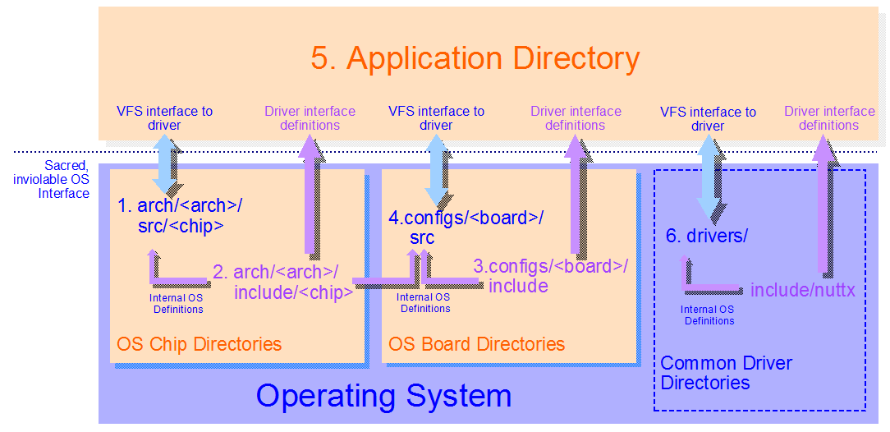

====================
平台目录
====================

.. warning:: 
    迁移自： 
    https://cwiki.apache.org/confluence/display/NUTTX/Platform+Directories

假设你不是要更改操作系统本身，而是要实现或扩展平台特定代码。
在这种情况下，有六个，也许七个地方可以提供平台代码。

待更新：此内容已过时。最近对板相关目录进行了重组：
``configs/`` 目录已重命名为 ``boards/``，
新 ``boards/`` 目录下的结构有显著不同。
``<board>`` 目录现在位于 ``boards/<arch>/<chip>/<board>``。
概念上该图是正确的，只是与当前命名不一致。

每个目录都有略微不同的属性，下面将更详细地讨论：

* `<arch>` 代表你使用的芯片架构。
  例如，`<arch>` 可能代表 ``arm`` 或 ``mips``。
* `<chip>` 代表你使用的特定芯片系列。
  例如，`<chip>` 可能代表 ``stm32`` 或 ``efm32``。
* `<board>` 代表你使用的特定开发板。
  例如，`<board>` 可能是 ``stm32f4discovery`` 或 ``dk-tm4c129x``。

1. arch/<arch>/src/<chip>
=========================

``arch/<arch>/src/<chip>`` 目录应包含所有芯片相关逻辑。
几乎所有芯片特定的头文件也应位于此处。
这包括与设备相关的头文件。例如，GPIO 头文件应放在这里，不放在其他地方。

2. arch/<arch>/include/<chip>
=============================

``arch/<arch>/include/<chip>`` 目录的目的是保存应用程序访问
``arch/<arch>/src/<chip>`` 目录中芯片特定逻辑注册的驱动
所需的驱动相关定义。这将包括：

* 与驱动 ``ioctl()`` 接口调用一起使用的 IOCTL 命令，
* 与 IOCTL 命令一起传递的参数的结构定义，以及
* 可能通过驱动 ``read()`` 或 ``write()`` 方法传输的二进制数据的结构定义。

``arch/<arch>/include/<chip>`` 目录目前没有被正确使用，
你在其中找到的大多数定义实际上属于
``arch/<arch>/src/<chip>`` 目录，但仅因历史原因在此处。

``arch/<arch>/include/<chip>`` 目录中的头文件与
``arch/<arch>/src/<chip>`` 目录中的头文件的区别在于，
前者可以使用以下包含路径被应用程序包含：

.. code-block:: c

    #include <arch/chip/someheader.h>

``arch/<arch>/src/<chip>`` 中的头文件不能被应用程序使用。
这些头文件只能在 ``arch/<arch>/src/<chip>`` 和 ``configs/<board>`` 目录中使用。

此目录中的头文件 `绝不` 应在应用程序和操作系统之间引入 `临时的`
非标准函数调用接口。操作系统接口受到高度控制，不接受 `临时` 扩展。

NuttX 构建系统强制执行此规则，我尽一切努力将所有芯片特定功能的使用
限制在这些目录中。实际上，你当然可以自由地以任何你喜欢的方式
在你的个人项目中颠覆这一意图；但任何对这一意图的颠覆
都不会被提交到上游 NuttX 仓库中。

3. configs/<board>/include
==========================

``configs/<board>/include`` 目录是板的
``arch/<arch>/include/<chip>`` 目录的等价物：
``arch/<arch>/include/<chip>`` 目录保存可被所有逻辑
（甚至应用程序代码）访问的芯片特定定义。
类似地，``configs/<board>/include`` 目录保存可被应用程序代码
访问的板特定定义。并且相同类型的驱动接口数据应出现在这些文件中
（参见上面的列表）。

类似地，``configs/<board>/include`` 目录的目的是保存应用程序访问
``configs/<board>/src`` 目录中板特定逻辑注册的驱动
所需的驱动相关定义。``configs/<board>/include`` 目录中的头文件
可以使用以下包含路径包含：

.. code-block:: c

    #include <arch/board/someheader.h>

此目录中的头文件 `绝不` 应在应用程序和操作系统之间引入 `临时的`
非标准函数调用接口。操作系统接口受到高度控制，不接受 `临时` 扩展。

4. configs/<board>/src
======================

所有板特定初始化逻辑和 `所有` 自定义板设备驱动逻辑应放在
`内置的` ``configs/<board>/src`` 目录或外部的自定义板目录中。
这些板目录是你所有板特定硬件接口工作应完成的地方。
至少，一个内置板目录必须包含以下文件/目录：

* ``Kconfig`` 用于将自定义板配置选项包含到 NuttX 配置系统中。
* ``src/Makefile`` 包含自定义板构建逻辑。
* ``include/board.h`` 提供系统所需的板特定信息。

大多数人最终会想要创建自己的自定义板目录。
如果你执行 ``make menuconfig``，你会发现在板菜单下
可以启用和配置自定义板目录。
其中一个配置选项是自定义板目录的路径。
这就是你想要实现所有产品特定设备驱动逻辑的地方。
至少，你的自定义板目录必须包含以下文件/目录：

* ``src/Makefile`` 包含自定义板构建逻辑。
* ``include/board.h`` 提供系统所需的板特定信息。

注意：配置定义文件 ``Kconfig`` 目前在自定义板配置目录中不受支持。

在任何类型的 ``board/src`` 目录中，你可以自由访问整个系统中的
所有头文件，甚至包括 ``arch/<arch>/src/<chip>`` 目录中的头文件。
没有任何限制；所有包含路径都受支持。

5. 应用程序目录
========================

有很多方法可以实现你的应用程序构建。如何做并不是 NuttX 的一部分，
该主题超出了此 Wiki 页面的范围。NuttX apps 包确实提供了一个
应用程序目录的示例，你可以选择使用或不使用。
该 apps/ 目录旨在为你提供一些指导。但如果你搜索论坛中的消息，
你可以获得很多关于如何构建应用程序的其他想法。

应用程序逻辑可以包含来自 ``arch/<arch>/include/<chip>`` 目录
或 ``configs/<board>/include`` 目录的头文件，
目的仅在于支持标准驱动接口。
这些目录中的头文件不得将不受控制的 `临时` 接口引入操作系统。

在应用程序目录中，你不能包含来自 ``arch/<arch>/src/<chip>`` 目录
或 ``configs/<board>/src`` 目录的头文件。
这是一个有意的限制，我试图强制执行以支持 NuttX 的功能分离模型。
但同样，你可以在自己的仓库中随意颠覆这一点。
你的应用程序中不应有设备级代码。
无需访问 GPIO 或寄存器或类似的东西。
这些都应在芯片目录或板目录中完成。

我倡导的模型是在 ``configs/<board>/src`` 或自定义板目录中
创建和注册标准设备驱动，然后你可以在应用程序目录中
使用标准的 ``open()`` / ``close()`` / ``read()`` / ``write()`` 函数
访问设备。

但我崇尚自由。请完全按照你想要的方式做事。
确保项目首先满足你的所有需求；按你喜欢的方式做事。
但是，当然，我不能提交任何不符合这些架构规则的内容到上游。

6. drivers/
===========

上面我说过，板特定资源的所有设备驱动应放在
``configs/<board>/src`` 目录中。但是，如果你的板上装满了
需要设备驱动的标准外部部件——如 LCD、触摸屏、串行 FLASH、
加速度计等——那么你将希望重用或实现这些部件的标准驱动，
以便可以被不同的板共享。在这种情况下，``drivers/`` 目录
是这些实现的正确位置。与这些公共驱动关联的头文件
应放在 ``include/nuttx/`` 下的适当位置。

7. apps/platform/<board>（也许）
================================

你可以放置应用程序特定数据的最后一个位置是
``apps/platform/<board>`` 目录。如果你使用 NuttX ``apps/`` 包，
这实际上是 `5. 应用程序目录` 的一部分。但由于它有略微不同的目的，
值得单独讨论。

``apps/platform/`` 目录结构与 ``nuttx/configs/`` 目录非常相似，
每个板一个目录。在上下文创建时，``apps/platform/board`` 处的
符号链接被设置为链接到 ``apps/platform/<board>`` 中的板特定目录。

``apps/platform/<board>`` 目录是放置板特定应用程序逻辑的地方。
此目录不常使用。在正常的 `flat` NuttX 构建中，
``nuttx/configs/<board>`` 板目录和 ``apps/platform/<board>`` 板目录
之间确实没有太大区别。因此前者通常就足够了。

两个板目录之间的根本区别在于，
``nuttx/configs/<board>`` 板目录在操作系统内部，
而 ``apps/platform/<board>`` 目录在操作系统外部。
这种区别在 `flat` 构建（``CONFIG_BUILD_FLAT``）中意义不大，
因为在那种情况下没有强制执行 `内部` 或 `外部`。
但这种区别在受保护构建（``CONFIG_BUILD_PROTECTED``）
和 `内核` 构建（``CONFIG_BUILD_KERNEL``）中非常重要，
因为在操作系统 `内部` 运行的代码是有特权的内核模式逻辑；
而在操作系统 `外部` 的代码则是无特权的用户模式代码。
两者不能混用。
