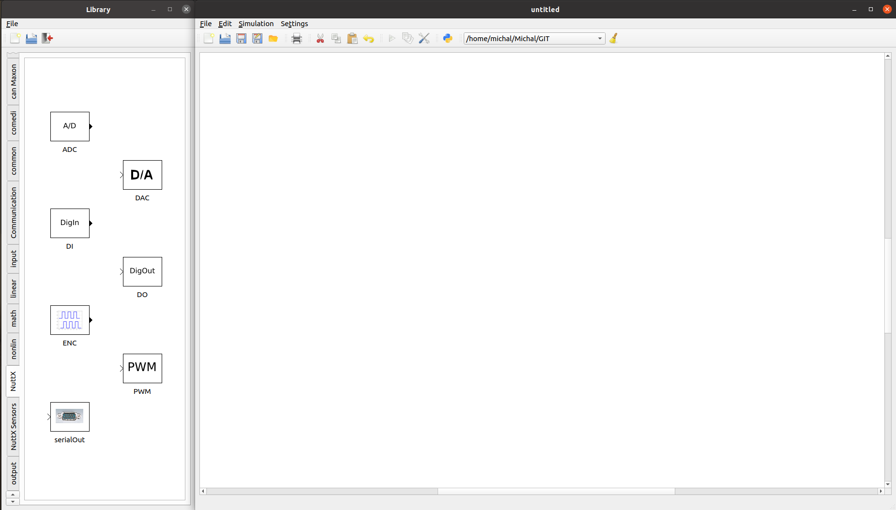
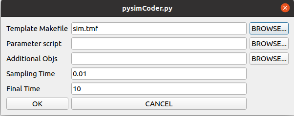

.. include:: /substitutions.rst
.. _pysimcoder:

=================================
pysimCoder 与 NuttX 集成
=================================

`PysimCoder <https://github.com/robertobucher/pysimCoder>`__ 是一个开源的
快速控制应用开发工具，能够将框图转换为 C 代码。
结合 NuttX，它可以用于实时控制应用，作为昂贵的许可程序和原型平台的替代方案。
`DC 电机控制应用 <https://www.youtube.com/watch?v=6HlGk3ecPNQ>`_ 的示例，
使用 PID 控制器以及编码器、PWM、GPIO 和通过 TCP 发送数据到实时绘图仪的模块，
可以在 `NuttX Channel <https://www.youtube.com/channel/UC0QciIlcUnjJkL5yJJBmluw>`_ 上查看。

本文档描述了在 NuttX 上运行由 pysimCoder 生成的应用程序所需的步骤，
并跟踪 pysimCoder 为 NuttX RTOS 支持的外设。

外设支持
==================

以下列表显示了 pysimCoder 为 NuttX RTOS 支持的外设和功能。

==========  =======================
外设        说明
==========  =======================
ADC
CAN         包括 SocketCAN
DAC
ENC
GPIO
PWM         多通道支持
UART        串口输出
传感器      DHTXX 基本支持
TCP
UDP
==========  =======================

请注意，如果在向 pysimCoder 添加新功能时本文档未更新，
NuttX 外设的实际支持可能比此处提到的更广泛。

NuttX 配置
===================

为了成功编译带有 NuttX 的 pysimCoder，需要设置多个配置选项。
列表如下：

==================================== =====================================
``CONFIG_ARCH_RAMVECTORS=y``         ``CONFIG_NSH_FILE_APPS=y``
``CONFIG_BOARDCTL_APP_SYMTAB=y``     ``CONFIG_LINE_MAX=64``
``CONFIG_BOARDCTL_OS_SYMTAB=y``      ``CONFIG_NSH_READLINE=y``
``CONFIG_BUILTIN=y``                 ``CONFIG_ETC_ROMFS=y``
``CONFIG_ELF=y``                     ``CONFIG_PSEUDOTERM=y``
``CONFIG_FS_BINFS=y``                ``CONFIG_TLS_NCLEANUP=1``
``CONFIG_FS_PROCFS=y``               ``CONFIG_PTHREAD_MUTEX_TYPES=y``
``CONFIG_FS_PROCFS_REGISTER=y``      ``CONFIG_PTHREAD_STACK_MIN=1024``
``CONFIG_FS_ROMFS=y``                ``CONFIG_LIBM=y``
``CONFIG_FS_TMPFS=y``                ``CONFIG_RR_INTERVAL=10``
``CONFIG_IDLETHREAD_STACKSIZE=2048`` ``CONFIG_SCHED_WAITPID=y``
``CONFIG_LIBC_EXECFUNCS=y``          ``CONFIG_SERIAL_TERMIOS=y``
``CONFIG_LIBC_STRERROR=y``           ``CONFIG_SYMTAB_ORDEREDBYNAME=y``
``CONFIG_MAX_TASKS=16``              ``CONFIG_SYSTEM_NSH=y``
``CONFIG_NSH_BUILTIN_APPS=y``        ``CONFIG_SYSTEM_NSH_STACKSIZE=4096``
``CONFIG_NSH_FILEIOSIZE=512``        ``CONFIG_INIT_ENTRYPOINT=\"nsh_main\"``
==================================== =====================================

请注意，对于已包含标准数学库的工具链，``CONFIG_LIBM=y`` 可能不是必需的。
但是建议添加 ``CONFIG_LIBM=y`` 以确保包含数学库。
随后，如果要在终端上打印 double 值，则需要 ``CONFIG_LIBC_FLOATINGPOINT=y``。

如果你想使用网络和 TCP 或 UDP 等模块，则需要以下配置选项：

============================== ==================================
``CONFIG_NET=y``               ``CONFIG_NET_ROUTE=y``
``CONFIG_NETDB_DNSCLIENT=y``   ``CONFIG_NET_SOLINGER=y``
``CONFIG_NETDEV_LATEINIT=y``   ``CONFIG_NET_STATISTICS=y``
``CONFIG_NETDEV_STATISTICS=y`` ``CONFIG_NET_TCP=y``
``CONFIG_NETINIT_DHCPC=y``     ``CONFIG_NET_TCPBACKLOG=y``
``CONFIG_NETINIT_NOMAC=y``     ``CONFIG_NET_TCP_KEEPALIVE=y``
``CONFIG_NETUTILS_FTPC=y``     ``CONFIG_NET_TCP_WRITE_BUFFERS=y``
``CONFIG_NETUTILS_TELNETD=y``  ``CONFIG_NET_UDP=y``
``CONFIG_NETUTILS_TFTPC=y``    ``CONFIG_SYSTEM_DHCPC_RENEW=y``
``CONFIG_NET_ARP_SEND=y``      ``CONFIG_SYSTEM_NTPC=y``
``CONFIG_NET_BROADCAST=y``     ``CONFIG_SYSTEM_PING6=y``
``CONFIG_NET_IPv6=y``          ``CONFIG_SYSTEM_PING=y``
``CONFIG_NET_LOOPBACK=y``      ``CONFIG_SYSTEM_TEE=y``
``CONFIG_NET_PKT=y``
============================== ==================================

可能还需要板和应用程序特定的配置，如设置外设或启动选项，
请参阅板和平台文档以获取这些信息。
配置好 NuttX 后，只需运行以下命令即可构建：

  .. code-block:: console

     $ make

然后我们需要导出构建的 NuttX，可以通过执行以下命令完成

  .. code-block:: console

     $ make export

这将创建一个 zip 文件 nuttx-export-xx.x.x.zip，其中 xx.x.x 是 NuttX 的版本。
然后需要将此文件移动到 pysimCoder 目录 pysimCoder/CodeGen/nuttx，
在那里解压，然后重命名为 nuttx-export。
然后进入 pysimCoder/CodeGen/nuttx/device 目录并执行

  .. code-block:: console

     $ make

这将编译控制单独模块功能的 pysimCoder 文件。
PysimCoder 可以安装在系统上（请参阅
`pysimCoder 手册 <https://github.com/robertobucher/pysimCoder/blob/master/README.md>`_），
或者可以使用脚本 pysim-run.sh 在不安装的情况下运行 pysimCoder。
此脚本可以在 pysimCoder 根目录中找到，通过执行以下命令运行

  .. code-block:: console

     $ ./pysim-run.sh

请注意，必须设置/导出 PYSUPSICTRL 变量才能成功编译使用 pysimCoder 设计的 NuttX 应用程序。

使用 pysimCoder 设计 NuttX 应用程序
============================================

运行 pysimCoder 后，可以从左侧的库菜单中选择单独的模块。
该菜单包含多个库，NuttX 特定模块可以在 "NuttX" 库中找到。
也可以使用其他库（如 "input"、"output"、"math" 等）中的模块。
几个模块可以有特定的参数选项和不同数量的输入/输出。
左键双击模块打开参数设置，右键单击模块则进入输入/输出数量设置。
pysimCoder 界面可以在下面的图片中看到。

   pysimCoder 界面：左侧可以看到库菜单

必须选择 NuttX 模板 Makefile nuttx.tmf 才能为 NuttX 目标生成代码。
这可以在顶部菜单中通过单击以红色圆圈突出显示的模块设置图标来完成。

   pysimCoder 菜单：红色模块设置，绿色生成 C 代码

模块设置选项打开以下窗口（如下图所示），你可以在其中设置模板 Makefile
以及带参数的 Python 控制器脚本。

   pysimCoder 模块设置菜单

可以通过选择生成 C 代码图标（以绿色圆圈突出显示）来生成 C 代码。
然后生成可执行文件并可以烧录到目标中。
烧录过程可能是目标特定的，请参阅平台文档。
然后可以从 NuttX 命令行执行生成的应用程序::

    nsh> main
