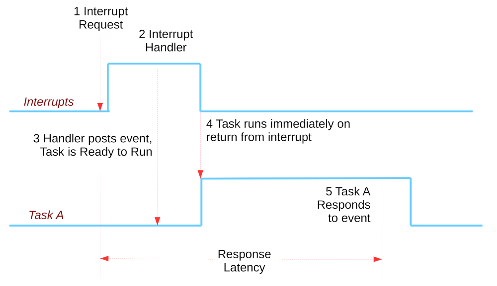
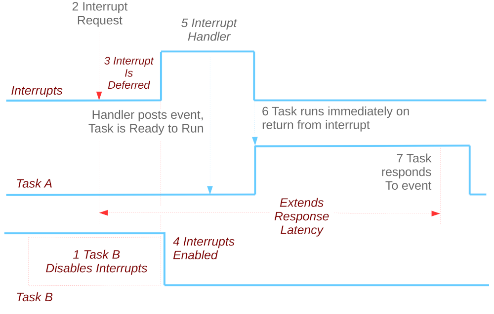
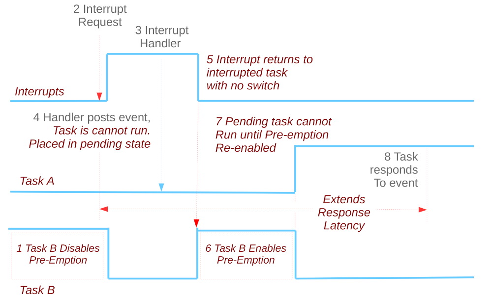

===============================
禁用中断或抢占对响应延迟的影响
===============================

.. note:: 本文档翻译自 NuttX 官方文档，如需查阅最新版本请访问 https://nuttx.apache.org/docs/latest/

速率单调调度
=========================

**假设**

  没有资源共享（进程不共享资源，例如硬件资源、队列或任何类型的信号量阻塞或非阻塞（忙等待））。

  维基百科"速率单调调度"

**现实世界**

我们必须用某种锁来保护共享资源。最激进的方式：

#. 禁用中断，以及
#. 禁用抢占。

当此假设被违反时，对实时性能有什么影响？

正常中断处理
---------------------------

禁用中断的影响
------------------------------

禁用抢占的影响
-------------------------------

