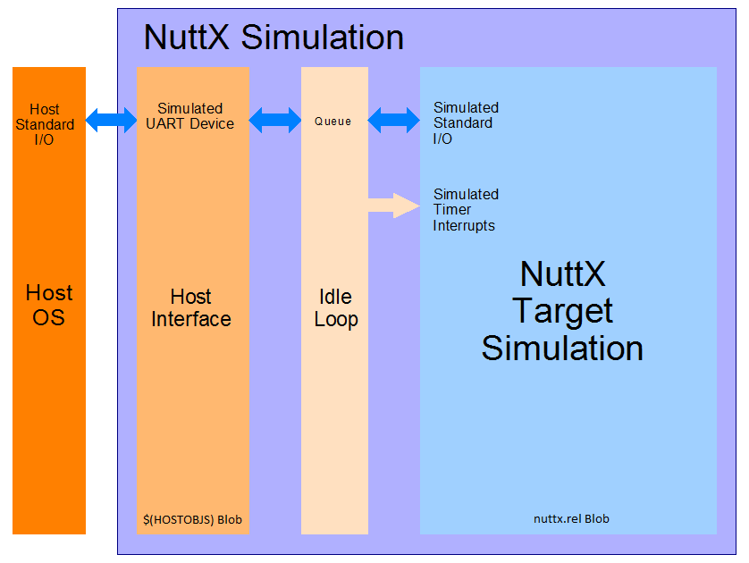

====================
NuttX 模拟
====================

.. note:: 本文档翻译自 NuttX 官方文档，如需查阅最新版本请访问 https://nuttx.apache.org/docs/latest/

NuttX 模拟是将 NuttX 移植为在 Linux 或 Cygwin 以及可能其他 POSIX 环境下作为进程运行的端口。

参考：``sim`` 配置文件 :doc:`/platforms/sim/sim/index`。

模拟器是如何构建的
==========================

模拟器不是虚拟机或类似的东西。它只是一个单线程，使用 ``setjmp``/``longjmp`` 来执行上下文切换，实现了 NuttX 的非抢占版本。

nuttx.rel 块
==================

您首先需要了解的是模拟是如何构建的。
查看 ``arch/sim/src/Makefile``。此目标构建 NuttX 可执行文件（为清晰起见而简化）：

    .. code-block:: console

      nuttx$(EXEEXT): nuttx.rel $(HOSTOBJS)
          $(CC) $(CCLINKFLAGS) $(LIBPATHS) -o $(TOPDIR)/$@ nuttx.rel $(HOSTOBJS) $(DRVLIB) $(STDLIBS)

秘密在于 ``nuttx.rel``。这是一个包含整个 NuttX 模拟的二进制块。
它是这样构建的：

    .. code-block:: console

        nuttx.rel : libarch$(LIBEXT) board/libboard$(LIBEXT) $(HOSTOS)-names.dat $(LINKOBJS)
            $(LD) -r $(LDLINKFLAGS) $(RELPATHS) $(EXTRA_LIBPATHS) -o $@ $(REQUIREDOBJS) --start-group $(RELLIBS) $(EXTRA_LIBS) --end-group
            $(OBJCOPY) --redefine-syms=$(HOSTOS)-names.dat $@

第一个 ``$(LD)`` 构建一个部分链接的、可重定位的对象（因此扩展名为 ``.rel``）。这包含了所有的 NuttX 对象。所以 ``nuttx.rel`` 是 NuttX 模拟所在的整个"鱼缸"。

第二个 ``$(OBJCOPY)`` 行是不可逆转地将 NuttX "鱼缸"与主机环境分离的操作。它重命名 ``nuttx.rel`` 中的大多数符号，使它们不会与主机系统使用的符号冲突。查看 ``arch/sim/src/nuttx-names.dat``。因此 ``open()`` 变为 ``NXopen()``，``close()`` 变为 ``NXclose()``，read 变为 ``NXread()``，等等。

$(HOSTOBJ) 块
===================

``$(HOSTOBJS)`` 包含最终的主机接口。这是主机 PC 的二进制块，在这个块中，没有重命名：``open()`` 调用真正的系统 ``open()``，``close()`` 调用真正的系统 ``close()``，等等。当这两个二进制块在最终的 ``$(CC`` 中链接在一起时，您就得到了模拟。

使用 FIFO 访问主机设备？
===================================

基本概念
----------------

当您在模拟中编写代码时，它运行在 NuttX 二进制块中，只能与 NuttX 接口交互。它不能直接与主机系统交互。它不能 ``open()``、``close()``、``read()`` 或以任何方式访问主机设备驱动程序（因为它无法到达主机系统命名空间）。

更复杂的是，模拟中的任何东西都不能调用阻塞的主机接口。为什么？因为这不是 NuttX 阻塞调用，这是主机系统阻塞调用。它不仅阻塞那个 NuttX 线程；它阻塞整个模拟！

但您可以在 NuttX 和主机二进制块之间添加特殊的低级接口，以便它们可以通信。主机二进制块可以以某种方式访问主机设备，并以某种方式为模拟提供一些真正的 NuttX 驱动程序接口。

如果您想访问主机设备驱动程序，那么执行该操作的代码必须驻留在主机二进制块中（即在 ``$(HOSTOS`` 中）。只有在那里它才能与主机操作系统交互。在那里，您可以创建主机 pthread 来服务设备接口。该 pthread 可以等待 I/O 而不阻塞主线程上的整个模拟（这就是模拟控制台 I/O 的工作方式，例如）。

走向通用设计
=======================

目前没有从模拟访问主机设备的设计。然而，以下是一些值得研究的方向。

也许您可以在 NuttX 二进制块中创建一个 NuttX FIFO。它可能驻留在 NuttX VFS 中的 ``/dev/mydevice``。也许这个 FIFO 可以在 NuttX 世界中用作您的字符设备？也许它可以通过 FIFO 读写来调解与主机 PC 设备的交互？

在 NuttX 侧，目标逻辑将调用 ``open()``、``close()``、``read()``... 来访问 FIFO。这些当然是真正的 ``NXopen()``、``NXclose()``、``NXread()``...

在主机 PC 侧，它将调用 ``open()``、``close()``、``read()``.. 来访问主机设备驱动程序。这些是真正的主机设备访问。但主机二进制块中的一些代码也应该能够调用 ``NXopen()``、``NXclose()``、``NXwrite()`` 等来访问 NuttX FIFO。因此，主机二进制块中可能有一个 pthread 执行以下操作：

1. 使用 open() 以 O_RDONLY 打开真正的 PC 设备
2. 使用 NXopen() 打开 FIFO
3. 使用 read() 从设备读取。这会阻塞，但只阻塞调解 I/O 的主机 pthread。
4. 当获取到读取数据时，调用 NXwrite() 将数据写入 NuttX FIFO
5. 等等。

通过这种方式，主机二进制块中的 pthread 将成为将主机设备映射到 NuttX FIFO 的管道。在 NuttX 二进制块中，模拟逻辑应该能够打开、关闭、读取 FIFO，就像它是真正的设备一样。

    NuttX 目标代码 <--->NuttX FIFO<--->主机接口<---->主机驱动

这有什么问题？
========================

有一个大问题：如果主机二进制块中的逻辑调用 ``NXwrite()``，可能会导致 NuttX 上下文切换。记住上下文切换实际上是一个 ``setjmp()``（保存当前上下文）后跟一个 ``longjmp()``（切换到新上下文）。这一切都必须在模拟的主线程上发生。

但如果 ``NXwrite()`` 导致上下文切换，那么切换将发生在主机设备处理程序的 pthread 上！这将非常糟糕。在所有 NuttX 任务最终终止之前，主机驱动程序无法返回。需要避免这种情况。

NuttX 串行控制台接口面临所有这些相同的问题：它使用主机的 ``stdin`` 和 ``stdout`` 模拟 NuttX 设备 ``/dev/console``。它如何避免这个问题？不是以一种非常漂亮的方式。它将接收到的数据放入 FIFO；当所有 NuttX 任务变为空闲时，模拟的 IDLE 线程运行，它将排队的数据排空到控制台，这可以导致上下文切换。但现在这是可以的，因为 IDLE 线程正确地在模拟的主线程上运行。

非常笨拙。这迫切需要一个更好的解决方案。如果模拟支持中断就好了...

模拟中断
====================

当前的 NuttX 主机模拟没有中断，因此是不可抢占的。此外，没有模拟中断，就不可能有高保真的模拟设备驱动程序或精确的定时器中断。

目前，所有时序和串行输入都在 IDLE 循环中模拟：当模拟中没有活动时，IDLE 循环运行并伪造定时器和 UART 事件。

中断的模拟需要一些思考。一个可能的解决方案可能如下：

  * 在最早的初始化中，模拟器可以启动一个主机模拟中断线程并在主线程上设置信号处理程序来捕获信号。一个信号，比如 ``SIGUSER`` 可以指示上下文切换。这将是 ``SA_SIGINFO`` 类型，上下文切换信息将在 ``siginfo`` 的 ``sival_t`` 字段中提供。

  * 中断逻辑可以在主机 pthread 上实现。主机 pthread 就像硬件中断一样，在操作系统之外异步执行。中断线程可以等待主机信号或主机消息，收到后执行模拟中断逻辑。

  * ``up_interrupt_context()`` 需要被实现；它现在只是一个存根。这可能可以通过一个简单的全局布尔值完成，例如：

    .. code-block:: console

        bool g_in_interrupt;
        xcpt_reg_t g_context_regs;

模拟中断处理逻辑将在进入时设置 ``g_in_interrupt`` 并在退出时清除它（也许有一个计数器在中断进入时递增并在退出时递减会更好？）。中断处理程序还需要在进入时清除 ``g_context_regs``。``up_interrupt_contest()`` 然后只报告布尔值的状态。

  * 所有上下文切换函数也需要检查此布尔值（``up_block_task()``、``up_unblock_task()``、``up_reprioritize_rtr()``、``up_releasepending()`` 以及其他可能的函数）。如果设置了，它们不应执行上下文切换。相反，它们应将 ``g_context_regs`` 设置为上下文切换寄存器数组。

   * 在*返回*之前和清除 ``g_in_interrupt`` 之前，主机模拟中断逻辑将检查 ``g_context_regs``。如果非 NULL，那么在从模拟中断*返回*时需要上下文切换。在这种情况下，模拟线程将使用 ``SIGUSER`` 信号通知主线程。

   * ``SIGUSER`` 信号处理程序将执行上下文切换，逻辑类似于以下：

   .. code-block:: c

     struct tcb_s *rtcb = sched_self();              /* 获取当前执行线程的 TCB */
     xcpt_reg_t *regs = siginfo->si_value.sival_ptr; /* 要实例化的新寄存器状态 */
     if (!up_setjump(rtcb->xcp.regs)                 /* 保存当前上下文 */
       {
         up_longjmp(regs);                           /* 实例化新上下文 */
       }

当我们切换回此线程时，它将显示为 ``up_setjmp()`` 的另一个返回，但这次返回值非零。

线程处理有点令人费解。信号处理程序需要在主线程的上下文中运行。主线程实际上使用分配的 NuttX 栈并执行 NuttX 代码。当信号处理程序执行时，它应该在添加到当前执行的 NuttX 任务的栈上的栈帧上执行。

当 ``up_longjmp()`` 执行时，操作将在主线程下继续，但对于新的 NuttX 线程，上下文（包括栈）是不同的。当上下文最终切换回此线程时，它将显示为 ``up_setjmp()`` 的返回，返回值非零。在这种情况下，信号处理程序将只返回，被抢占的 NuttX 任务的正常执行将恢复。

**问题**。我唯一真正的技术问题涉及信号屏蔽。当 ``SIGUSER`` 信号处理程序执行时，``SIGUSER`` 中断将被屏蔽。这将阻止在信号处理程序返回之前的任何进一步上下文切换。我们可以简单地*取消屏蔽* ``SIGUSER`` 信号以获得更多上下文切换吗？这个细节需要通过实验来澄清。

支持的设备
=================

串行控制台
--------------

模拟的串行控制台通过包装主机的 *stdin* 和 *stdout* 提供，使其看起来像 ``/dev/console``。来自主机 *stdin* 的串行数据在 IDLE 循环中采样。如果串行数据可用，IDLE 循环将*发布*模拟的 UART 活动。当 UART 数据可用时，此模拟的保真度可以通过模拟中断来提高。

主机文件系统访问
-----------------------

主机文件系统访问通过 *nxfuse* 用户空间文件系统支持，您可以在 NuttX https://bitbucket.org/nuttx/tools/src/master/nxfuse/ 仓库中找到。有关使用 *nxfuse* 文件系统的说明可以在该仓库目录的 https://bitbucket.org/nuttx/tools/src/master/nxfuse/README.txt 中找到。

网络
----------

网络通过 Linux 下的 TUN/TAP 接口或 Windows 下的 WPCap 支持模拟。在 :doc:`/platforms/sim/sim/index` 中提供了在 Linux 下设置 TUN/TAP 接口的说明的 README 文件。网络再次由模拟器中的 IDLE 循环处理，可以从模拟中断中受益。

USB
---

曾经有一个在 GitHub 上的努力，将 ``libusb`` 移植到 NuttX 中以支持模拟中的 USB 设备。尽管这仍然是一个非常好的主意，但该努力从未完成。

LCD
---

X11 帧缓冲区可用于模拟 NuttX 图形帧缓冲区设备。这些同样在 IDLE 循环中管理。

SMP
---

有一个模拟器配置对 SMP 测试有基本支持。模拟通过创建多个 pthread 来支持多个 CPU 的模拟，每个 pthread 在相同的进程地址空间中运行模拟的副本。

目前，SMP 模拟尚未完全功能：它确实对模拟的 CPU 线程进行了几次上下文切换，然后在 setjmp() 操作期间失败。怀疑这不是 NuttX SMP 逻辑的问题，而更可能是 pthread 控制中的某些混乱。在其他使用信号处理程序中的 setjmp/longjmp 的时候也看到了类似奇怪的行为。例如，在使用信号实现模拟中断时。

显然，如果从信号处理程序的上下文中调用 longjmp，结果是未定义的：http://www.open-std.org/jtc1/sc22/wg14/www/docs/n1318.htm

您可以通过启用以下内容为 ostest 配置启用 SMP：

.. code-block:: bash

    添加：     CONFIG_SPINLOCK=y
    添加：     CONFIG_SMP=y
    添加：     CONFIG_SMP_NCPUS=2
    添加：     CONFIG_SMP_IDLETHREAD_STACKSIZE=2048

您还必须启用近实时性能，否则即使很长的超时也会在 CPU 线程有机会执行之前过期。

.. code-block:: bash

    移除：  # CONFIG_SIM_WALLTIME is not set
    添加：     CONFIG_SIM_WALLTIME=y

您可以通过以下方式启用一些额外的调试输出：

.. code-block:: bash

    移除：  # CONFIG_DEBUG_SCHED is not set
    添加：     CONFIG_DEBUG_SCHED=y
    
    移除：  # CONFIG_SCHED_INSTRUMENTATION is not set
    添加：     CONFIG_SCHED_INSTRUMENTATION=y

SMP 配置将运行：

.. code-block:: bash

    CONFIG_SMP_NCPUS=1

在这种情况下，当然没有多 CPU 处理，但这确实验证了一些基本 SMP 逻辑在更简单环境中的正确性。

NSH 配置也可以强制运行 SMP，但受到相同古怪行为的困扰。如果您修改 ``arch/sim/src/up_idle.c`` 使 IDLE 循环只在 CPU0 上运行，它可以变得可靠。否则，``simuart_post()`` 经常会从 CPU1 调用，它会尝试在 CPU0 上重新启动 NSH，再次出现相同的古怪行为。

但例如，此命令：

.. code-block:: bash

    nsh> sleep 1 &

将在 CPU1 上执行 sleep 命令，每次测试都成功。
