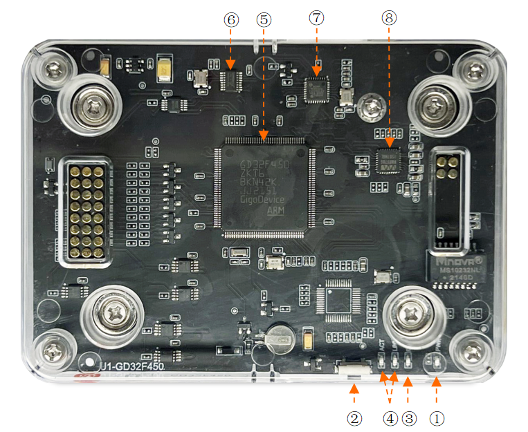

==================
gd32f450zk-aiotbox
==================

.. note::
   本文档翻译自 NuttX 官方文档，如需查阅最新版本请访问 https://nuttx.apache.org/docs/latest/

The GD32F450Z-AIOTBOX board is a Xiaomi AIoT development platform U1
control board that uses the GD32F450ZK chip as the core. 

