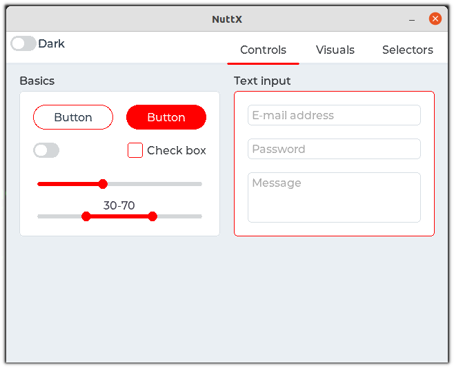
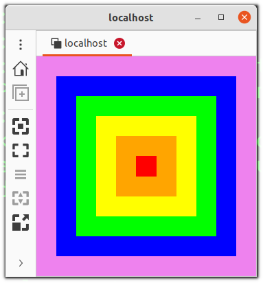

===
SIM
===

.. note:: 本文档翻译自 NuttX 官方文档，如需查阅最新版本请访问 https://nuttx.apache.org/docs/latest/

可以在名为 ``sim`` 的模拟器中运行 NuttX，但部分功能
目前仅在 Linux 主机上支持（例如：蓝牙、I2C、SPI 等）。

使用 ``sim`` 你无需支持的开发板即可测试 NuttX 的许多功能。
支持的功能示例：Audio、Bluetooth、ELF、I2C、SPI、LVGL、Flash
文件系统、NX 服务器、NX 演示、NX 窗口管理器、ROMFS、网络：TCP、
UDP、IP、6LoWPAN 等等。

工具链
===

你只需要确保机器上的 ``gcc`` 正常工作即可。

编译
==

你只需选择所需的开发板配置文件
(see: nuttx/sim/sim/sim/configs for the listing) ::

    $ make distclean

    $ ./tools/configure.sh sim:nsh

    $ make

运行
==

编译完成后将生成 ``nuttx`` 二进制文件，然后运行它：

    $ ./nuttx 

    NuttShell (NSH) NuttX-12.10.0
    nsh> ?
    help usage:  help [-v] [<cmd>]

      .         cd        echo      hexdump   mkfatfs   pwd       source    unset     
      [         cp        exec      kill      mkrd      readlink  test      usleep    
      ?         cmp       exit      losetup   mount     rm        time      xd        
      basename  dirname   false     ln        mv        rmdir     true      
      break     dd        free      ls        poweroff  set       uname     
      cat       df        help      mkdir     ps        sleep     umount    

    Builtin Apps:
      sh     hello  nsh    
    nsh> uname -a
    NuttX 10.1.0 508215581f Sep  3 2021 10:47:34 sim sim
    nsh>

运行 LVGL
=======

可以直接在 NuttX 模拟器中运行 LVGL 演示：

    $ make distclean

    $ ./tools/configure.sh sim:lvgl_fb

    $ make -j

    $ ./nuttx

你将看到一个触摸校准窗口，然后是 LVGL 演示：

   LVGL Demo running in the NuttX's simulator

运行 VNC 服务器
==========

NuttX 支持 VNC 服务器，这意味着即使没有 LCD 显示屏的开发板
也可以通过网络导出显示接口。你还可以在 NuttX 模拟器上测试它，
然后再在开发板上运行，只需按照以下步骤操作：

    $ make distclean

    $ ./tools/configure.sh sim:vncserver

    $ make -j

    $ ./nuttx

Open a new terminal and execute ::

    $ remmina -c vnc://localhost

You should see some squares in different colors displayed in remmina:

   remmina connected to sim's VNC Server

运行模拟 CAN
========

模拟器通过主机上的 SocketCAN 支持 CAN。
主机的 CAN 接口需要正确配置：

  ip link set can0 type can bitrate 1000000
  ip link set can0 up

也可以使用虚拟 CAN 接口：

  ip link add dev can0 type vcan
  ifconfig can0 up

支持的开发板
======

.. toctree::
   :glob:
   :maxdepth: 1

   boards/*/*
