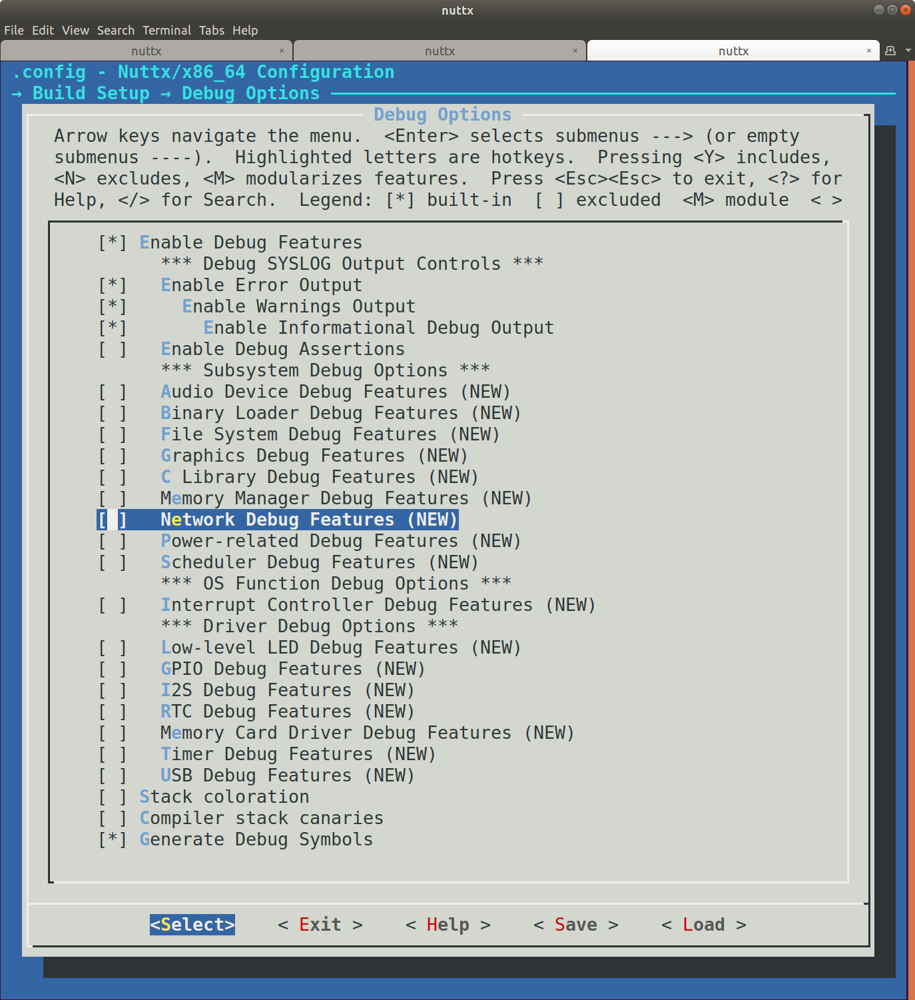

.. include:: /substitutions.rst
.. _debugging:

=========
调试
=========

查找和修复 Bug 是软硬件开发过程中的重要部分。有时您还需要使用调试技术来
理解系统的工作原理。两个有用的工具是调试日志和使用 GNU 调试器（gdb）进行调试。

调试日志
=============

NuttX 有一个强大的系统日志设施（syslog），具有 ``info``、``warn`` 和 ``error`` 级别。
您可以使用 ``menuconfig`` 系统为您的构建启用子系统或功能的调试。

调试选项位于 :menuselection:`Build Setup --> Debug Options` 下。您很可能需要启用
以下选项：

* :menuselection:`Enable Debug Features` — 选择此项将开启子系统级别的调试选项，
  它们将在下方的页面中变得可见。然后您可以选择需要的选项。
* :menuselection:`Enable Error Output` — 这将只记录错误。
* :menuselection:`Enable Warnings Output` — 这将记录警告和错误。
* :menuselection:`Enable Informational Debug Output` — 这将产生信息性输出、警告和错误。

然后您可以从可用的子系统中选择，如网络、调度器、USB 等。请注意，您需要在
``menuconfig`` 系统的其他位置单独启用相应的子系统。要查看设置了哪个 ``CONFIG`` 定义，
使用方向键高亮子系统（例如 :menuselection:`Network Debug Features`）并输入 :kbd:`?`。
这将显示设置的 C 宏名为 ``CONFIG_DEBUG_NET``。``nuttx/debug.h`` 定义了 ``netinfo()``
日志函数，如果设置了此宏，将记录输出。您可以在源代码中搜索 ``netinfo`` 来查看
它是如何使用的。

请注意，启用所有这些将产生大量日志输出。启用您需要的级别和
您感兴趣的区域，保持其余部分禁用，保存配置，然后重新编译。
您可以在文件
`debug.h <https://github.com/apache/nuttx/blob/master/include/nuttx/debug.h>`__
中查看完整的调试功能日志函数列表。

Syslog 时间戳可以在配置中的 :menuselection:`Device Drivers --> System Logging --> Prepend
timestamp to syslog message`（``CONFIG_SYSLOG_TIMESTAMP``）处启用。

您可能需要进行一些实验来找到适合您问题的日志设置组合。
有关可用的调试设置，请参见文件 `debug.h <https://github.com/apache/nuttx/blob/master/include/nuttx/debug.h>`_。

还有一些子系统可以启用 USB 跟踪调试，如果需要日志比控制台输出更快，
您也可以将日志记录到内存中。

使用 ``openocd`` 和 ``gdb`` 调试
======================================

要使用嵌入式 SWD 调试适配器调试我们的 Nucleo 开发板，
使用以下命令启动 ``openocd``：

.. code-block:: console

  $ openocd -f interface/stlink-v2.cfg -f target/stm32f1x.cfg

这将启动一个 ``gdb`` 服务器。然后，使用以下命令启动 ``gdb``：

.. code-block:: console

  $ cd nuttx/
  $ gdb-multiarch nuttx/nuttx

在 ``gdb`` 控制台内，连接到 ``gdb`` 服务器：

.. code-block::

  (gdb) target extended-remote :3333

现在您可以使用标准的 ``gdb`` 命令。例如，要复位开发板：

.. code-block::

  (gdb) mon reset

要暂停开发板：

.. code-block::

  (gdb) mon halt

要设置断点：

.. code-block::

  (gdb) breakpoint nsh_main

最后启动 NuttX：

.. code-block::

  (gdb) continue
  Continuing.

  Breakpoint 1, nsh_main (argc=1, argv=0x200ddfac) at nsh_main.c:208
  208	  sched_getparam(0, &param);
  (gdb) continue
  Continuing.

.. tip::

  您可以缩写 ``gdb`` 命令：``info b`` 是 ``information breakpoints`` 的快捷方式；
  ``c`` 与 ``continue`` 等效，依此类推。

NuttX 感知调试
---------------------

由于 NuttX 实际上是一个 RTOS，让 ``gdb`` 感知正在运行的不同任务/线程是很有用的。
有两种方式可以实现：通过 ``openocd`` 本身或通过 ``gdb``。
请注意，在这两种情况下，您都需要启用调试符号（``CONFIG_DEBUG_SYMBOLS``）。

通过 openocd
~~~~~~~~~~~~

``openocd`` 直接支持各种 RTOS，包括 NuttX。它通过读取 NuttX 内部符号来工作，
这些符号定义了活动任务及其属性。因此，``gdb`` 服务器将直接将每个任务
识别为不同的 `线程`。这种方法的缺点是它取决于您如何构建 NuttX，
因为某些选项在 opencd 中是硬编码的。默认情况下，它假设：

  * ``CONFIG_DISABLE_MQUEUE=y``
  * ``CONFIG_LEGACY_PAGING=n``

如果您需要将这些选项设置为不同的值，您将需要编辑 ``openocd`` 中的
``./src/rtos/nuttx_header.h``，更改相应的设置然后重新构建。

最后，要启用 NuttX 集成，您需要提供一个额外的 ``openocd`` 参数：

.. code-block:: console

  $ openocd -f interface/stlink-v2.cfg -f target/stm32f1x.cfg -c '$_TARGETNAME configure -rtos nuttx'

由于 ``openocd`` 还需要知道某些数据结构的内存布局，您需要在加载 ``nuttx``
二进制文件后让 ``gdb`` 运行以下命令：

.. code-block::

  eval "monitor nuttx.pid_offset %d", &((struct tcb_s *)(0))->pid
  eval "monitor nuttx.xcpreg_offset %d", &((struct tcb_s *)(0))->xcp.regs
  eval "monitor nuttx.state_offset %d", &((struct tcb_s *)(0))->task_state
  eval "monitor nuttx.name_offset %d", &((struct tcb_s *)(0))->name
  eval "monitor nuttx.name_size %d", sizeof(((struct tcb_s *)(0))->name)

一种方法是定义一个 gdb `hook` 函数，在运行 ``file`` 命令时会被调用：

.. code-block::

  define hookpost-file
    eval "monitor nuttx.pid_offset %d", &((struct tcb_s *)(0))->pid
    eval "monitor nuttx.xcpreg_offset %d", &((struct tcb_s *)(0))->xcp.regs
    eval "monitor nuttx.state_offset %d", &((struct tcb_s *)(0))->task_state
    eval "monitor nuttx.name_offset %d", &((struct tcb_s *)(0))->name
    eval "monitor nuttx.name_size %d", sizeof(((struct tcb_s *)(0))->name)
  end

您将看到 ``openocd`` 在其输出中接收到的内存偏移：

.. code-block::

  Open On-Chip Debugger 0.10.0+dev-01514-ga8edbd020-dirty (2020-11-20-14:23)
  Licensed under GNU GPL v2
  For bug reports, read
	  http://openocd.org/doc/doxygen/bugs.html
  Info : auto-selecting first available session transport "swd". To override use 'transport select <transport>'.
  Info : target type name = cortex_m
  Info : Listening on port 6666 for tcl connections
  Info : Listening on port 4444 for telnet connections
  15:41:23: Debugging starts
  Info : CMSIS-DAP: SWD  Supported
  Info : CMSIS-DAP: FW Version = 1.10
  Info : CMSIS-DAP: Interface Initialised (SWD)
  Info : SWCLK/TCK = 1 SWDIO/TMS = 1 TDI = 0 TDO = 0 nTRST = 0 nRESET = 1
  Info : CMSIS-DAP: Interface ready
  Info : clock speed 1000 kHz
  Info : SWD DPIDR 0x2ba01477
  Info : nrf52.cpu: hardware has 6 breakpoints, 4 watchpoints
  Info : starting gdb server for nrf52.cpu on 3333
  Info : Listening on port 3333 for gdb connections
  Info : accepting 'gdb' connection on tcp/3333
  Error: No symbols for NuttX
  Info : nRF52832-QFAA(build code: B0) 512kB Flash, 64kB RAM
  undefined debug reason 8 - target needs reset
  Warn : Prefer GDB command "target extended-remote 3333" instead of "target remote 3333"
  Info : pid_offset: 12
  Info : xcpreg_offset: 132
  Info : state_offset: 26
  Info : name_offset: 208
  Info : name_size: 32
  target halted due to debug-request, current mode: Thread
  xPSR: 0x01000000 pc: 0x000000dc msp: 0x20000cf0
  target halted due to debug-request, current mode: Thread xPSR: 0x01000000 pc: 0x000000dc msp: 0x20000cf0

.. note:: 您可能会在启动时看到一次 ``Error: No symbols for NuttX`` 错误。
  除非您每次单步调试时都看到此错误，否则这是正常的。如果是后者，则意味着您没有启用调试符号。

现在，您可以检查线程：

.. code-block::

  (gdb) info threads
    Id   Target Id         Frame
  * 1    Remote target     nx_start_application () at init/nx_bringup.c:261
  (gdb) info registers
  r0             0x0                 0
  r1             0x2f                47
  r2             0x0                 0
  r3             0x0                 0
  r4             0x0                 0
  r5             0x0                 0
  r6             0x0                 0
  r7             0x20000ca0          536874144
  r8             0x0                 0
  r9             0x0                 0
  r10            0x0                 0
  r11            0x0                 0
  r12            0x9                 9
  sp             0x20000c98          0x20000c98
  lr             0x19c5              6597
  pc             0x1996              0x1996 <nx_start_application+10>
  xPSR           0x41000000          1090519040
  fpscr          0x0                 0
  msp            0x20000c98          0x20000c98
  psp            0x0                 0x0 <_vectors>
  primask        0x0                 0
  basepri        0xe0                -32
  faultmask      0x0                 0
  control        0x0                 0

通过 GDB
~~~~~~~~

您也可以使用 ``gdb`` 脚本支持进行 NuttX 感知调试。
好处是它也适用于 sim 构建，而 ``openocd`` 在此场景下不适用。
为此，您需要启用 PROC 文件系统支持，它将暴露所需的任务信息
（``CONFIG_FS_PROCFS=y``）。

要使用此方法，您可以加载 ``nuttx/tools/pynuttx/gdbinit.py`` 文件。
一个简单的方法是添加一个额外的命令：

.. code-block:: console

  $ gdb nuttx -ix=tools/pynuttx/gdbinit.py

gdb 可能需要设置当前 elf 支持的架构，例如，前缀为 arm-ebai-none-。

.. code-block::

  (gdb) info threads
  Id   Thread                Info                                                                             Frame
  *0   Thread 0x20000398     (Name: Idle Task, State: Running, Priority: 0, Stack: 1000)                      0x80001ac __start() at chip/stm32_start.c:111
  1    Thread 0x10000188     (Name: nsh_main, State: Waiting,Semaphore, Priority: 100, Stack: 2000)           0x800aa06 sys_call2() at /home/ajh/work/vela_all/nuttx/include/arch/syscall.h:187

.. code-block::

  (gdb) (gdb) nxgcore -r 0x40200000,0x48000000,0x07
  Saved corefile nuttx.core
  Please run gdbserver.py to parse nuttx.core

该 Python 脚本扩展了许多命令，如 ``thread <id>``、
``thread apply <all|id list> cmd``、``nxsetargs`` 等。
您可以使用 ``help <command>`` 获取帮助。

请注意，如果您在使用 thread 命令后需要继续调试，
请使用 ``c`` 而不是 ``continue``，因为 thread 会强制设置寄存器，
而 ``c`` 命令会在继续之前恢复寄存器。
